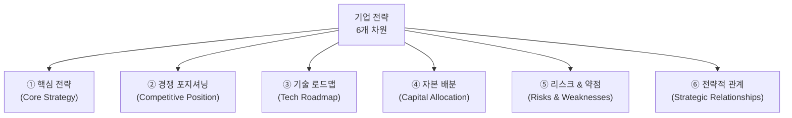
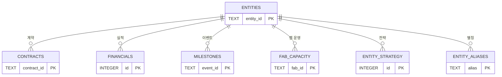

# [기업 전략 데이터 통합 방안] 각 회사의 전략적 포지셔닝을 시스템에 담는 방법
**문서 버전**: v1.0.0  
**작성일자**: 2026-09-10  
**프로젝트 코드명**: `b_0910_memory_claude`

---

## 1. 문제 제기: 숫자는 있는데 "왜?"가 없다

현재 시스템은 **WHAT**(무엇을 했는가)은 추적하지만, **WHY**(왜 그런 결정을 했는가)는 추적하지 않습니다.

| 현재 추적 가능 | 현재 추적 불가 |
| :--- | :--- |
| 구글 Capex $76.7B (숫자) | **왜** $76.7B인가? 전년 대비 왜 늘렸는가? |
| 구글-앤트로픽 $200B 계약 (사실) | **왜** 앤트로픽이고 오픈AI가 아닌가? 구글의 AI 전략에서 앤트로픽의 역할은? |
| TSMC CoWoS 캐파 12만장 (수치) | **왜** 이 속도로 증설하는가? TSMC의 2nm 전략과 CoWoS의 관계는? |
| 삼성 HBM4 수율 55% (데이터) | **왜** SK하이닉스(85%)보다 낮은가? 삼성의 메모리 전략에서 HBM은 어떤 위치? |

> **숫자만으로는 미래를 예측할 수 없습니다. 전략을 알아야 숫자의 방향을 예측할 수 있습니다.**

---

## 2. 전략 데이터의 6가지 차원

각 기업의 전략을 **6개 차원**으로 구조화합니다:



| 차원 | 답하는 질문 | 예시 (엔비디아) |
| :--- | :--- | :--- |
| **① 핵심 전략** | "이 기업은 무엇으로 이기려 하는가?" | CUDA 생태계 락인 + 풀스택 플랫폼 (칩→소프트웨어→클라우드) |
| **② 경쟁 포지셔닝** | "경쟁사 대비 어디가 강하고 약한가?" | GPU 90% 점유 (강), ASIC 커스텀 칩 대응 불가 (약) |
| **③ 기술 로드맵** | "다음 세대에 뭘 준비하고 있는가?" | Blackwell→Rubin→Feynman (매년 세대 교체) |
| **④ 자본 배분** | "돈을 어디에 쓰고 있는가?" | R&D 70%, 자사주매입 25%, M&A 5% |
| **⑤ 리스크** | "무엇이 이 전략을 실패하게 만들 수 있는가?" | TSMC 단일 파운드리 의존, 빅테크 ASIC 전환 |
| **⑥ 전략적 관계** | "누구와 손잡고, 누구와 싸우는가?" | TSMC(동맹), 코어위브(유통), AMD(경쟁), 브로드컴(잠재적 위협) |

---

## 3. 기업별 전략 프로파일 예시

### 3.1 하이퍼스케일러 계층

#### 구글 (Alphabet)

| 차원 | 내용 |
| :--- | :--- |
| **① 핵심 전략** | **수직 통합**: 자체 AI 칩(TPU) + 자체 모델(Gemini) + 자체 클라우드(GCP). 엔비디아 의존도를 줄이면서 AI 풀스택을 내재화. 앤트로픽 $200B 투자는 "외부 최고 모델도 구글 인프라 위에서 돌아가게" 하는 양면 전략. |
| **② 경쟁 포지셔닝** | AI 모델(Gemini) + 검색 트래픽(배포 채널) + TPU(자체 칩). 3가지를 동시에 가진 유일한 기업. 약점: 클라우드 시장 3위(AWS, Azure 뒤). |
| **③ 기술 로드맵** | TPU v6 Trillium → v7 → 커스텀 Arm CPU(Axion). 브로드컴과 ASIC 공동 설계 심화. |
| **④ 자본 배분** | Capex $76.7B의 80%+ = AI 데이터센터. 연구 중심 문화 유지 (DeepMind 투자 지속). |
| **⑤ 리스크** | 검색 광고 매출(전체 80%)에 AI가 가져오는 **자기잠식 위험**. AI가 검색을 대체하면 광고 수익 모델 흔들림. |
| **⑥ 전략적 관계** | 앤트로픽(투자+클라우드 고객), 브로드컴(TPU 설계), TSMC(파운드리), 애플(iOS 검색 기본값 — 연 $200B+ 지불) |

#### 아마존 (AWS)

| 차원 | 내용 |
| :--- | :--- |
| **① 핵심 전략** | **클라우드 인프라 지배력 유지**: AWS가 AI 시대에도 "기본 인프라"로 남는 것. 자체 칩(Trainium, Graviton) + 앤트로픽 투자(Claude를 AWS 독점 모델로) + Bedrock(모델 마켓플레이스). |
| **② 경쟁 포지셔닝** | 클라우드 1위(점유율 31%). 그러나 AI 모델 자체 경쟁력은 구글·오픈AI 대비 약함 → 앤트로픽에 의존. |
| **③ 기술 로드맵** | Trainium2 → Trainium3 (학습 칩), Inferentia3 (추론 칩). 자체 ARM CPU(Graviton4). |
| **④ 자본 배분** | Capex 대부분 DC 인프라. 앤트로픽 $12B = 외부 AI 역량 확보. |
| **⑤ 리스크** | AI 모델 자체 경쟁력 부재. 앤트로픽이 구글 인프라로 이탈하면 AWS의 AI 스토리 약화. |
| **⑥ 전략적 관계** | 앤트로픽(투자+클라우드 고객), 엔비디아(GPU 대량 구매자이자 경쟁자 — Trainium으로 대체 시도) |

---

### 3.2 AI 프론티어 랩 계층

#### 앤트로픽

| 차원 | 내용 |
| :--- | :--- |
| **① 핵심 전략** | **안전한 AI + 최고 성능**: "Responsible Scaling Policy"로 차별화. 안전성을 마케팅 포인트로 활용하면서 성능은 GPT-4/Gemini와 동등 이상 유지. **양다리 전략**: 구글·아마존 모두에서 투자받으며 독립성 유지. |
| **② 경쟁 포지셔닝** | 코딩·분석 분야 Claude 3.5 Sonnet이 실질적 1위. 기업 B2B API 시장에서 오픈AI와 직접 경쟁. 약점: 소비자 브랜드 인지도 오픈AI 대비 낮음. |
| **③ 기술 로드맵** | Claude 4 → Claude 5 (에이전트 특화). "Computer Use" 등 에이전트 능력 확장. 자체 학습 인프라 확보 시도. |
| **④ 자본 배분** | 대부분 GPU 컴퓨트 임대 비용. 자체 데이터센터 없이 구글·아마존 클라우드에 의존. |
| **⑤ 리스크** | **컴퓨트 종속**: 자체 인프라 없이 구글·아마존의 크레딧에 의존. 두 기업이 자체 모델에 집중하면 앤트로픽의 컴퓨트 우선순위 하락 가능. 비상장이므로 자금 조달 지속성 불확실. |
| **⑥ 전략적 관계** | 구글(투자자+GCP 인프라), 아마존(투자자+AWS 인프라), 두 기업이 경쟁 관계이므로 앤트로픽은 **양쪽의 균형 유지**가 생존 전략. |

#### 오픈AI

| 차원 | 내용 |
| :--- | :--- |
| **① 핵심 전략** | **소비자 플랫폼 + 기업 API 양면**: ChatGPT라는 소비자 브랜드 + API를 통한 B2B. 2025년 비영리→영리 전환으로 IPO 가능 구조 확보. |
| **② 경쟁 포지셔닝** | 소비자 AI 1위(ChatGPT MAU 3억+). 기업 API는 앤트로픽과 접전. GPT-5/o3의 추론 능력이 차별화 포인트. |
| **③ 기술 로드맵** | GPT-5 → GPT-6. o-시리즈(추론 체인). 멀티모달(Sora 비디오, 음성). 자체 칩 설계 팀 신설. |
| **④ 자본 배분** | MS Azure 크레딧이 컴퓨트의 대부분. $10B+ 매출이지만 비용이 더 큼 (적자). |
| **⑤ 리스크** | **MS 종속**: 컴퓨트·유통·투자 모두 MS 의존. 경영진 이탈 리스크 (2024 사태 재현 가능성). 규제 리스크 (EU AI Act, 미국 행정명령). |
| **⑥ 전략적 관계** | MS(최대 투자자+Azure 인프라 = 사실상 종속), 아마존(최근 계약으로 AWS 포트폴리오 진입 — MS 견제). |

---

### 3.3 컴퓨팅 & 가속기 계층

#### 엔비디아

| 차원 | 내용 |
| :--- | :--- |
| **① 핵심 전략** | **풀스택 AI 플랫폼**: 칩(GPU) + 소프트웨어(CUDA, NeMo, NIM) + 클라우드(DGX Cloud). 단순 GPU 판매자가 아닌 "AI 공장의 건축가". 매년 세대 교체(Hopper→Blackwell→Rubin)로 업그레이드 사이클 고착화. |
| **② 경쟁 포지셔닝** | 데이터센터 GPU 90%+ 독점. CUDA 생태계가 최대 해자. 약점: ASP $30,000+으로 고객 불만 누적 → 빅테크가 ASIC(브로드컴) 대안 모색. |
| **③ 기술 로드맵** | Blackwell(2024) → Rubin(2026) → Feynman(2028). GPU + NVLink + 네트워킹(Spectrum-X/ConnectX) 통합. 로보틱스(Isaac), 자율주행(DRIVE) 확장. |
| **④ 자본 배분** | R&D $12B+/년 (풀스택 확장). 자사주매입 $25B. M&A 보수적 (ARM 인수 실패 후 대형 M&A 자제). |
| **⑤ 리스크** | TSMC 단일 파운드리 의존 (지정학). 빅테크 4사가 자체 ASIC으로 전환 시 TAM 축소. 중국 수출 규제 (매출 20%+ 영향). |
| **⑥ 전략적 관계** | TSMC(유일한 파운드리, 핵심 동맹), 코어위브(GPU 유통 파트너), SK하이닉스(HBM 1순위 공급사), 빅테크 4사(최대 고객이자 잠재적 이탈자). |

---

### 3.4 파운드리 & 메모리 계층

#### TSMC

| 차원 | 내용 |
| :--- | :--- |
| **① 핵심 전략** | **순수 파운드리 독점**: 자체 칩을 만들지 않으므로 모든 팹리스의 신뢰를 얻음. 선단공정(2nm/A16)과 첨단패키징(CoWoS)에서 **경쟁 불가능한 기술 격차** 유지. |
| **② 경쟁 포지셔닝** | 선단공정 점유율 90%+. 유일한 경쟁자 삼성 파운드리는 수율·고객 신뢰 모두 열세. 인텔 파운드리는 아직 미지수. |
| **③ 기술 로드맵** | N3E(양산) → N2(2025 양산) → A16(2026) → A14(2028). 매 2년 세대 교체. CoWoS-L → SoIC 3D 패키징 진화. |
| **④ 자본 배분** | Capex $35B+/년, 90%가 선단공정. 해외 팹(Arizona, 구마모토, 독일) 지정학 분산. |
| **⑤ 리스크** | **대만 지정학**: 전 세계 선단칩 90%가 대만 한 곳에서 생산. 중국 군사 위협 시 글로벌 공급망 마비. 미국 CHIPS Act로 해외 이전 압박. |
| **⑥ 전략적 관계** | 애플(최대 고객, 최신 공정 1순위), 엔비디아(2순위 고객, AI 칩 최대 물량), ASML(EUV 장비 유일 공급사 — 상호 의존). |

#### 삼성전자

| 차원 | 내용 |
| :--- | :--- |
| **① 핵심 전략** | **HBM 턴어라운드**: 2024년 HBM3E 퀄 실패의 트라우마에서 벗어나, HBM4로 "제대로 된 2등"이 되는 것. 파운드리 사업은 2nm GAA로 재기 시도. 메모리+파운드리+시스템LSI 3사업부 통합 시너지가 장기 목표. |
| **② 경쟁 포지셔닝** | HBM: SK하이닉스에 밀리는 2위. 파운드리: TSMC에 크게 밀리는 2위. DRAM: 1위 유지. 강점은 **메모리+파운드리 겸업**으로 HBM 패키징 내재화 가능. |
| **③ 기술 로드맵** | HBM4 16단(2026) → HBM4E 24단(2027). 파운드리 2nm GAA → 1.4nm. |
| **④ 자본 배분** | 메모리 Capex 비중 상향(HBM 전용 라인 증설). 파운드리 투자는 테일러 팹(미국)으로 분산. |
| **⑤ 리스크** | HBM4 수율(55%)이 70% 이상으로 올라오지 않으면, 엔비디아 물량 배분에서 계속 SK하이닉스에 밀림. 파운드리 2nm 고객 확보 실패 시 투자 회수 불가. |
| **⑥ 전략적 관계** | 엔비디아(HBM 2순위 공급), 퀄컴(파운드리 잠재 고객), SK하이닉스(HBM 최대 경쟁자), ASML(EUV 장비 공급). |

#### SK하이닉스

| 차원 | 내용 |
| :--- | :--- |
| **① 핵심 전략** | **HBM 세계 1위 수성**: 엔비디아와의 밀착 관계를 무기로 HBM 점유율 50%+ 유지. 용인 클러스터 $120B 투자로 2028년 이후 메가 캐파 확보. "HBM의 TSMC"가 되겠다는 야심. |
| **② 경쟁 포지셔닝** | HBM 1위(점유율 50%+), DRAM 2위. 강점: 엔비디아 최초 검증 파트너 + 수율 85% 업계 최고. |
| **③ 기술 로드맵** | HBM3E 12단(현재) → HBM4 16단(2026) → HBM4E 24단(2027). TSMC와 CoWoS 공동 최적화. |
| **⑤ 리스크** | HBM 의존도가 너무 높으면, AI 투자 사이클 둔화 시 타격 큼. 용인 클러스터 건설 지연 시 2028년 캐파 목표 미달. |
| **⑥ 전략적 관계** | 엔비디아(최우선 고객, HBM 1순위 검증), TSMC(CoWoS 패키징 파트너), 삼성(HBM 경쟁자). |

---

## 4. DB 통합 방안: `entity_strategy` 테이블

### 4.1 스키마 설계

```sql
CREATE TABLE IF NOT EXISTS entity_strategy (
    id                  INTEGER PRIMARY KEY AUTOINCREMENT,
    entity_id           TEXT NOT NULL REFERENCES entities(entity_id),
    dimension           TEXT NOT NULL,
        -- CORE_STRATEGY: 핵심 전략
        -- COMPETITIVE_POSITION: 경쟁 포지셔닝
        -- TECH_ROADMAP: 기술 로드맵
        -- CAPITAL_ALLOCATION: 자본 배분
        -- RISKS: 리스크 & 약점
        -- STRATEGIC_RELATIONSHIPS: 전략적 관계
    summary             TEXT NOT NULL,       -- 핵심 요약 (1~2문장)
    detail              TEXT,                -- 상세 설명
    confidence          TEXT DEFAULT 'C3',   -- C1~C5 신뢰도
    as_of_date          TEXT NOT NULL,       -- 이 분석의 기준 시점
    source              TEXT,                -- 출처 (어닝콜, 리포트, 사용자 분석)
    raw_source          TEXT,                -- 99.raw/ 원천 파일
    created_at          TEXT DEFAULT (datetime('now')),
    updated_at          TEXT DEFAULT (datetime('now'))
);

CREATE INDEX IF NOT EXISTS idx_strategy_entity ON entity_strategy(entity_id);
CREATE INDEX IF NOT EXISTS idx_strategy_dimension ON entity_strategy(dimension);
```

### 4.2 시드 데이터 예시

```sql
INSERT INTO entity_strategy (entity_id, dimension, summary, detail, confidence, as_of_date, source) VALUES
('NVIDIA', 'CORE_STRATEGY',
 'CUDA 생태계 락인 + 풀스택 AI 플랫폼 (칩→소프트웨어→클라우드)',
 '단순 GPU 판매자가 아닌 AI 공장의 건축가. 매년 세대 교체로 업그레이드 사이클 고착화.',
 'C4', '2026-09', '2026 Q2 어닝콜 + Computex 키노트'),

('NVIDIA', 'RISKS',
 'TSMC 단일 파운드리 의존(지정학), 빅테크 ASIC 전환 위험',
 '빅테크 4사가 브로드컴 ASIC으로 GPU 의존도 줄이는 중. 중국 수출 규제로 매출 20%+ 영향.',
 'C3', '2026-09', '업계 분석');
```

### 4.3 뷰: 기업별 전략 요약 카드

```sql
CREATE VIEW IF NOT EXISTS v_strategy_card AS
SELECT
    e.name_ko,
    e.layer,
    GROUP_CONCAT(
        CASE WHEN s.dimension = 'CORE_STRATEGY' THEN s.summary END
    ) AS core_strategy,
    GROUP_CONCAT(
        CASE WHEN s.dimension = 'COMPETITIVE_POSITION' THEN s.summary END
    ) AS competitive_position,
    GROUP_CONCAT(
        CASE WHEN s.dimension = 'RISKS' THEN s.summary END
    ) AS risks
FROM entities e
LEFT JOIN entity_strategy s ON e.entity_id = s.entity_id
GROUP BY e.entity_id
ORDER BY e.layer;
```

---

## 5. 99.raw/ 입력 방법

### 5.1 새 디렉터리

```text
99.raw/
├── contracts/
├── financials/
├── milestones/
├── fab_capacity/
└── strategy/              ← 신규 추가
    ├── NVIDIA_strategy.md
    ├── GOOGLE_strategy.md
    ├── SAMSUNG_strategy.md
    └── ...
```

### 5.2 Markdown Frontmatter 포맷

```markdown
---
entity_id: NVIDIA
as_of_date: 2026-09
source: "2026 Q2 어닝콜 + Computex 키노트 + SemiAnalysis"
---

## ① 핵심 전략 (CORE_STRATEGY)
CUDA 생태계 락인 + 풀스택 AI 플랫폼. 매년 세대 교체로 업그레이드 사이클 고착화.

## ② 경쟁 포지셔닝 (COMPETITIVE_POSITION)
데이터센터 GPU 90%+ 독점. CUDA가 최대 해자. ASIC 대안(브로드컴) 부상이 약점.

## ③ 기술 로드맵 (TECH_ROADMAP)
Blackwell(2024) → Rubin(2026) → Feynman(2028). NVLink + 네트워킹 통합 확장.

## ④ 자본 배분 (CAPITAL_ALLOCATION)
R&D $12B+/년. 자사주매입 $25B. M&A 보수적.

## ⑤ 리스크 (RISKS)
TSMC 단일 의존. 빅테크 ASIC 전환. 중국 수출 규제.

## ⑥ 전략적 관계 (STRATEGIC_RELATIONSHIPS)
- TSMC: 유일한 파운드리 (동맹)
- 코어위브: GPU 유통 파트너
- SK하이닉스: HBM 1순위 공급사
- 빅테크 4사: 최대 고객이자 잠재적 이탈자
```

validator.py가 이 마크다운을 파싱하여 `entity_strategy` 테이블에 차원별로 INSERT.

---

## 6. 산출물 반영: 전략이 추가되면 무엇이 달라지는가

### 6.1 기업 팩트시트 강화 (웹 대시보드 화면 D)

현재 팩트시트: 숫자(매출, Capex, 계약)만 표시.

전략 추가 후:

```
┌─────────────────────────────────────────────┐
│  🟢 NVIDIA 팩트시트                          │
│                                              │
│  ▸ 핵심 전략: CUDA 락인 + 풀스택 플랫폼      │
│  ▸ 해자: GPU 90% 독점, CUDA 소프트웨어       │
│  ▸ 위험: TSMC 단일 의존, ASIC 전환 위협      │
│  ──────────────────────────────────────────  │
│  매출 $48B | Capex $8.5B | HBM 수주 $18B    │
│  [Sankey] [타임라인] [Fab 캐파]              │
└─────────────────────────────────────────────┘
```

### 6.2 미래 예측 테이블의 근거 강화

| 예측 | 숫자만 있을 때 | 전략 추가 후 |
| :--- | :--- | :--- |
| "삼성 2027 HBM 점유율 45%" | 근거 없는 숫자 | "HBM4 수율 개선(전략①) + 평택 P3/P4 캐파(Fab) + 엔비디아 듀얼소싱 전략(관계⑥) → **45% 도달 가능**" |
| "AMD GPU 점유율 15%" | 왜? | "TSMC N3 사용(기술③) + 오라클·MS의 분산 전략(관계⑥) + MI400 성능 향상(기술③) → **15% 가능**" |

### 6.3 Sankey 다이어그램의 해석력 향상

현재: 자본 흐름의 **굵기만** 보임.  
전략 추가 후: 각 흐름선에 **왜 이 돈이 여기로 흐르는지** 툴팁 표시.

```
구글 ──[$200B]──→ 앤트로픽
       툴팁: "구글의 핵심 전략: 외부 최고 모델도 GCP 위에서 운영.
              앤트로픽의 양다리 전략: 구글·아마존 모두에서 투자 수용.
              실질 현금 $80B, 나머지 클라우드 크레딧."
```

### 6.4 옵시디언 기업 노트 강화

```markdown
---
tags: [company, L3_COMPUTE]
aliases: [엔비디아, NVDA]
strategy_updated: 2026-09
---
# NVIDIA

## 전략 요약
- **이기는 법**: CUDA 생태계 락인 + 풀스택 AI 플랫폼
- **가장 큰 위험**: TSMC 단일 의존, 빅테크 ASIC 전환
- **주시할 관계**: 코어위브 의존도, 브로드컴 ASIC 성장

## 실적·계약·Fab
![[financials_matrix_table.md#NVIDIA]]
```

---

## 7. 전략 데이터 관리 시 고려사항

### 7.1 업데이트 주기

| 차원 | 변화 속도 | 업데이트 주기 |
| :--- | :--- | :--- |
| ① 핵심 전략 | 느림 (연 1~2회 변경) | 반기 1회 |
| ② 경쟁 포지셔닝 | 보통 (분기별 변동) | 분기 1회 (어닝콜 후) |
| ③ 기술 로드맵 | 보통 (제품 발표 시) | 이벤트 발생 시 |
| ④ 자본 배분 | 느림 (연간 가이던스) | 연 1~2회 |
| ⑤ 리스크 | 빠름 (수시 변동) | 수시 |
| ⑥ 전략적 관계 | 보통 (계약 발생 시) | 이벤트 발생 시 |

### 7.2 전략 변경 시 히스토리 보존

```sql
-- 전략 변경 시 data_revisions에도 기록
INSERT INTO data_revisions (table_name, record_id, field_name, old_value, new_value, revision_date, reason)
VALUES (
    'entity_strategy',
    'SAMSUNG-CORE_STRATEGY',
    'summary',
    'HBM3E 퀄 실패 만회, HBM4로 2등 수성',
    'HBM4 퀄 통과 + 수율 70% 달성, 1등 경쟁 진입',
    '2026-Q3',
    '2026-Q2 삼성 HBM4 엔비디아 퀄 최종 통과 공식 확인'
);
```

### 7.3 주관성 관리

전략 분석은 본질적으로 **주관적**입니다. Confidence 등급을 적극 활용:

| 출처 | Confidence | 예시 |
| :--- | :---: | :--- |
| CEO 공식 발언 (어닝콜, 키노트) | **C4** | "우리의 전략은 풀스택 AI 플랫폼입니다" |
| 증권사 전략 보고서 | **C3** | "엔비디아의 ASIC 대응 전략은 소프트웨어 차별화" |
| 업계 전문 매체 분석 (SemiAnalysis 등) | **C3** | "삼성의 HBM4 전략은 수율 회복에 올인" |
| 사용자 본인의 분석·가설 | **C1~C2** | "내 판단: 브로드컴 ASIC이 2028년까지 GPU의 30%를 대체할 것" |

---

## 8. 업데이트된 전체 DB 구조 (6개 테이블 + 1보조)



| 테이블 | 역할 | 추적하는 것 |
| :--- | :--- | :--- |
| `entities` | 기업 마스터 | WHO (누구) |
| `contracts` | 계약·투자 | WHAT (무슨 계약) |
| `financials` | 실적·Capex | HOW MUCH (얼마) |
| `milestones` | 과거·미래 이벤트 | WHEN (언제) |
| `fab_capacity` | 공장 증산·수율 | WHERE & HOW MANY (어디서 얼마나) |
| `entity_strategy` | **전략·포지셔닝** ← 신규 | **WHY (왜)** |
| `entity_aliases` | 이름 별칭 (보조) | 입력 편의 |
