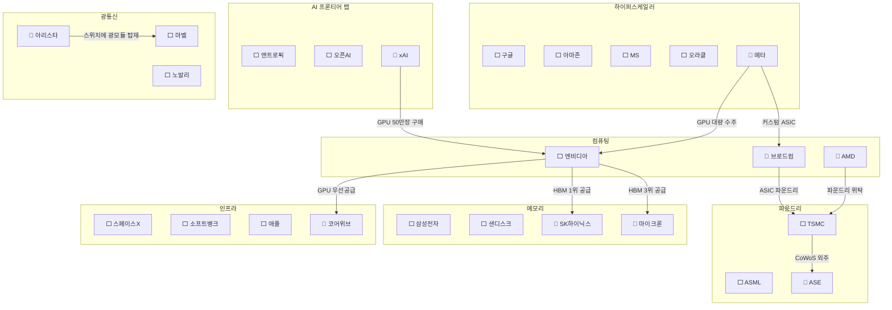

# [산업·기업 확장 검토서] Memory Claude 추적 대상 갭 분석 및 추가 제안
**문서 버전**: v1.0.0  
**작성일자**: 2026-09-10  
**프로젝트 코드명**: `b_0910_memory_claude`  
**기반 문서**: [docs/human.md](file:///Users/chansoojeon/Library/CloudStorage/Dropbox/03_code/b_0910_memory_claude/docs/human.md)

---

## 1. 현재 추적 유니버스 (human.md 기준 16개사)

| 계층 | 현재 포함 기업 | 기업 수 |
| :--- | :--- | :---: |
| AI 프론티어 랩 | 앤트로픽, 오픈AI | 2 |
| 하이퍼스케일러 | 구글, 아마존, 마이크로소프트, 오라클 | 4 |
| 컴퓨팅 & 가속기 | 엔비디아 | 1 |
| 파운드리 & 장비 | TSMC, ASML | 2 |
| 메모리 & 스토리지 | 삼성전자, 샌디스크/WDC | 2 |
| 광통신 | 마벨, 코히어런트/노발리 | 2 |
| 인프라 & 특수 | 스페이스X, 소프트뱅크, 애플 | 3 |
| **합계** | | **16개사** |

---

## 2. 갭 분석: 현재 유니버스에서 빠진 핵심 연결고리

human.md의 핵심 질문은 *"각각 회사의 계약을 통해서 2026, 2027, 2028년의 업황과 자본과 기술의 흐름을 읽어낼 수 있을까"*입니다. 이 질문에 제대로 답하려면 **자본이 흘러가는 경로에 빈 곳(gap)이 없어야** 합니다.

### 🔴 Critical Gap (필수 추가 — 빠지면 분석 불가)

| # | 누락 기업 | 왜 Critical인가 | 현재 유니버스와의 연결 |
| :---: | :--- | :--- | :--- |
| **G1** | **SK하이닉스** | human.md가 *"hbm이 가장 큰 비중"*이라고 말하는데, **HBM 세계 1위(점유율 ~50%) 기업이 빠져 있음**. 삼성전자의 HBM 경쟁 상대이자 엔비디아의 최대 HBM 공급사. 이 기업 없이는 HBM 자본 흐름 추적이 반쪽짜리가 됨. | 엔비디아 ← HBM 공급, 삼성 ↔ 경쟁 |
| **G2** | **마이크론 (Micron)** | HBM 3대 제조사 중 하나. 미국 유일의 메모리 반도체 기업. 삼성·SK하이닉스와의 3강 구도를 이해하려면 필수. | 엔비디아 ← HBM 공급, 삼성·SK하이닉스 ↔ 경쟁 |
| **G3** | **메타 (Meta)** | **5대 하이퍼스케일러 중 하나**인데 빠져 있음. 2026년 Capex 약 $55B으로 오라클보다 2.5배 큼. 엔비디아 GPU 최대 구매자 중 하나이며, Llama 오픈소스 모델로 AI 생태계에 막대한 영향. | 엔비디아 ← GPU 대량 수주, 브로드컴 ← 커스텀 ASIC |
| **G4** | **AMD** | 엔비디아의 **유일한 경쟁자**. MI300/MI350 시리즈로 데이터센터 GPU 시장 점유율 10%+ 돌파. 오라클·MS가 엔비디아 의존도 분산을 위해 AMD를 적극 도입 중. 엔비디아만 추적하면 GPU 경쟁 구도를 읽을 수 없음. | 하이퍼스케일러 ← GPU 공급, TSMC ← 파운드리 |
| **G5** | **브로드컴 (Broadcom)** | 구글 TPU, 메타 MTIA 등 **빅테크 커스텀 AI ASIC을 설계하는 유일한 기업**. 하이퍼스케일러가 엔비디아 의존도를 줄이려는 핵심 경로. ASIC 매출이 2026년 기준 $40B+로 급성장. | 구글·메타 ← 커스텀 칩, TSMC ← 파운드리 위탁 |

> **Critical Gap 요약**: SK하이닉스·마이크론이 빠지면 HBM 흐름이 안 보이고, 메타가 빠지면 Capex 30%가 누락되고, AMD·브로드컴이 빠지면 GPU/ASIC 경쟁 구도가 안 보입니다.

---

### 🟡 High Gap (강력 권장 — 분석 깊이에 큰 차이)

| # | 누락 기업 | 왜 중요한가 | 현재 유니버스와의 연결 |
| :---: | :--- | :--- | :--- |
| **G6** | **xAI** | 일론 머스크의 AI 랩. 콜로서스 슈퍼컴(GPU 10만~50만장)을 자체 구축하는 3번째 프론티어 AI 랩. 엔비디아 GPU의 초대형 바이어이자, 멤피스에 기가와트급 데이터센터 건설 중. | 엔비디아 ← GPU 대량 수주, 전력 인프라 병목 |
| **G7** | **코어위브 (CoreWeave)** | human.md에 *"네오클라우드 공급계약"*이 언급되어 있는데, 그 네오클라우드의 대표 기업이 빠져 있음. 엔비디아가 우선 공급하는 GPU 클라우드 렌탈 기업. MS·오픈AI의 오버플로우 컴퓨트도 담당. | 엔비디아 ← GPU 우선공급, MS ← 클라우드 위탁 |
| **G8** | **아리스타 네트웍스 (Arista Networks)** | AI 데이터센터의 **백본 네트워크 스위치** 독점 기업. 마벨·코히어런트의 광트랜시버가 실제로 꽂히는 스위치를 만듦. 광통신 계층의 완결성을 위해 필요. | 마벨·코히어런트 ← 광모듈 탑재, 하이퍼스케일러 ← 스위치 공급 |
| **G9** | **ASE 그룹 (ASE Technology)** | 글로벌 1위 OSAT(반도체 패키징 외주). TSMC의 CoWoS 캐파 병목 시 대체 경로. human.md가 말하는 *"대만 업체"*의 핵심 누락 기업. | TSMC ← CoWoS 외주 수탁, 엔비디아 ← 칩 패키징 |

---

### 🟢 Medium Gap (선택적 추가 — 새로운 분석 차원 확보)

| # | 누락 산업/기업 | 왜 고려할 만한가 |
| :---: | :--- | :--- |
| **G10** | **전력·에너지 인프라** | 2027~2028년 데이터센터의 최대 병목은 **반도체가 아니라 전력**. 소형원전(SMR) 기업들(NuScale, Oklo), 전력 인프라(Constellation Energy, Vistra) 추적 시 에너지 병목 시나리오 분석에 핵심 데이터 제공. |
| **G11** | **냉각·열관리 인프라** | 기가와트급 AI 데이터센터에서 액체냉각(Liquid Cooling)은 필수. **Vertiv**, **Schneider Electric** 등이 핵심 수혜 기업. |
| **G12** | **EDA·칩 설계 도구** | 모든 AI 칩(엔비디아, 브로드컴, AMD)의 설계에 **Synopsys**, **Cadence** 소프트웨어가 독점적으로 사용됨. 칩 설계 병목의 숨겨진 레이어. |
| **G13** | **엣지 AI 칩셋** | 애플 이외에 **Qualcomm** (스냅드래곤 NPU), **MediaTek** (Dimensity AI)이 온디바이스 AI 칩 시장을 양분. 클라우드→엣지 전환 추적 시 필요. |
| **G14** | **AI 로보틱스** | **Tesla** (Optimus 휴머노이드), **Figure AI** 등 AI 컴퓨트가 로봇 형태로 물리 세계에 진입하는 새로운 수요처. 2028년 이후 GPU 수요의 새로운 동인. |
| **G15** | **인텔 (Intel)** | 과거 반도체 1위 기업. 파운드리 사업(Intel 18A), Gaudi AI 가속기로 재도전 중이지만 고전. TSMC·엔비디아의 독점을 깨는 와일드카드이며, 미국 정부의 CHIPS Act 보조금 최대 수혜자. |

---

## 3. 추가 시 유니버스 구성 제안

### 옵션 A: 핵심 보강 (21개사) — 권장

Critical Gap 5개사만 추가하여 **밸류체인 완결성**을 확보합니다.

| 계층 | 기존 | 추가 | 합계 |
| :--- | :--- | :--- | :---: |
| AI 프론티어 랩 | 앤트로픽, 오픈AI | - | 2 |
| 하이퍼스케일러 | 구글, 아마존, MS, 오라클 | **+ 메타** | 5 |
| 컴퓨팅 & 가속기 | 엔비디아 | **+ AMD, + 브로드컴** | 3 |
| 파운드리 & 장비 | TSMC, ASML | - | 2 |
| 메모리 & 스토리지 | 삼성전자, 샌디스크 | **+ SK하이닉스, + 마이크론** | 4 |
| 광통신 | 마벨, 코히어런트 | - | 2 |
| 인프라 & 특수 | 스페이스X, 소프트뱅크, 애플 | - | 3 |
| **합계** | 16 | **+5** | **21** |

### 옵션 B: 완전 체계 (25개사)

Critical + High Gap 9개사를 모두 추가하여 **분석 사각지대 제거**.

| 계층 | 기존 | 추가 | 합계 |
| :--- | :--- | :--- | :---: |
| AI 프론티어 랩 | 앤트로픽, 오픈AI | **+ xAI** | 3 |
| 하이퍼스케일러 | 구글, 아마존, MS, 오라클 | **+ 메타** | 5 |
| 컴퓨팅 & 가속기 | 엔비디아 | **+ AMD, + 브로드컴** | 3 |
| 파운드리 & 장비 | TSMC, ASML | **+ ASE 그룹** | 3 |
| 메모리 & 스토리지 | 삼성전자, 샌디스크 | **+ SK하이닉스, + 마이크론** | 4 |
| 광통신 & 네트워킹 | 마벨, 코히어런트 | **+ 아리스타** | 3 |
| 인프라 & 특수 | 스페이스X, 소프트뱅크, 애플 | **+ 코어위브** | 4 |
| **합계** | 16 | **+9** | **25** |

### 옵션 C: 확장 체계 (30개사+)

Critical + High + Medium Gap 일부를 추가. 전력·냉각·EDA·엣지까지 포괄하여 **새로운 분석 차원(에너지 병목, 칩 설계, 엣지 전환)** 확보.

---

## 4. 추가 산업(신규 계층) 상세 검토

### 4.1 🔌 전력·에너지 인프라 (Power & Energy)

**왜 새로운 계층이 필요한가:**

human.md에서 *"2026, 2027, 2028년의 업황"*을 예측하려면, 2027~2028년의 **최대 병목이 반도체가 아니라 전력**이라는 점을 반드시 고려해야 합니다.

- 엔비디아 Rubin GPU 1대의 전력 소모: ~1,000W
- 10만 GPU 클러스터의 전력: **100MW** (소도시 전력량)
- 2028년까지 빅테크가 필요한 추가 전력: **수 GW(기가와트)급**
- 미국 전력망은 이미 과부하 상태 → 소형원전(SMR), 천연가스, 재생에너지 경쟁

| 후보 기업 | 역할 | 추적 가치 |
| :--- | :--- | :--- |
| **Constellation Energy** | 미국 최대 원전 운영사, MS와 Three Mile Island 원전 재가동 계약 | 데이터센터 전력 공급 핵심 |
| **NuScale Power** | 소형모듈원전(SMR) 선도 기업, 오라클 DC 전력원 | SMR 상용화 시점이 2028년 예측에 핵심 변수 |
| **Vistra Corp** | 미국 최대 독립 발전사, AI DC향 전력 공급 급증 | 전력 인프라 투자 지표 |

### 4.2 ❄️ 냉각·열관리 인프라 (Cooling & Thermal)

| 후보 기업 | 역할 | 추적 가치 |
| :--- | :--- | :--- |
| **Vertiv Holdings** | AI 데이터센터 전력·냉각 솔루션 글로벌 1위 | 액체냉각 수주가 DC 증설의 선행지표 |
| **Schneider Electric** | 데이터센터 전력 분배·관리 시스템 | DC 인프라 Capex의 숨은 수혜자 |

### 4.3 🖥️ EDA·칩 설계 도구 (Design Automation)

| 후보 기업 | 역할 | 추적 가치 |
| :--- | :--- | :--- |
| **Synopsys** | 칩 설계 소프트웨어 글로벌 1위 (EDA 양대 산맥) | 모든 AI 칩의 설계에 사용, 2nm 설계 키트 |
| **Cadence Design** | EDA 양대 산맥의 나머지 한 축 | 검증·시뮬레이션 툴 독점 |

### 4.4 📱 엣지 AI 칩셋 (Edge AI)

| 후보 기업 | 역할 | 추적 가치 |
| :--- | :--- | :--- |
| **Qualcomm** | 스냅드래곤 NPU, 안드로이드 온디바이스 AI 독점 | 클라우드→엣지 전환의 핵심 플레이어 |
| **MediaTek** | Dimensity AI 칩, 중저가 스마트폰 AI 칩 | 글로벌 AI 칩 보급률 확대 지표 |

---

## 5. 추가 기업의 자본 흐름 연결도

아래 다이어그램은 추가 제안 기업(🔴)이 기존 유니버스(⬜)와 어떻게 연결되는지 보여줍니다:

---

## 6. 최종 권장 사항

| 항목 | 권장 |
| :--- | :--- |
| **최소 필수 추가** | 🔴 **SK하이닉스, 마이크론, 메타, AMD, 브로드컴** (5개사) → 21개사 체제 |
| **이유** | HBM 시장(SK·마이크론 없이 분석 불가), Capex 전체상(메타 누락 시 30% 실종), GPU/ASIC 경쟁(AMD·브로드컴 없이 독점 구도만 보임) |
| **강력 권장 추가** | 🔴 **xAI, 코어위브, 아리스타, ASE** (4개사) → 25개사 체제 |
| **선택적 확장** | 전력(Constellation Energy), 냉각(Vertiv), EDA(Synopsys) 등 → 2028년 병목 분석 시 |

> **핵심**: human.md가 묻는 *"자본과 기술의 흐름을 읽어낼 수 있을까"*에 답하려면, **자본이 실제로 흘러가는 곳(SK하이닉스의 HBM, 메타의 GPU 구매, 브로드컴의 ASIC)**이 추적 대상에 반드시 포함되어야 합니다.
