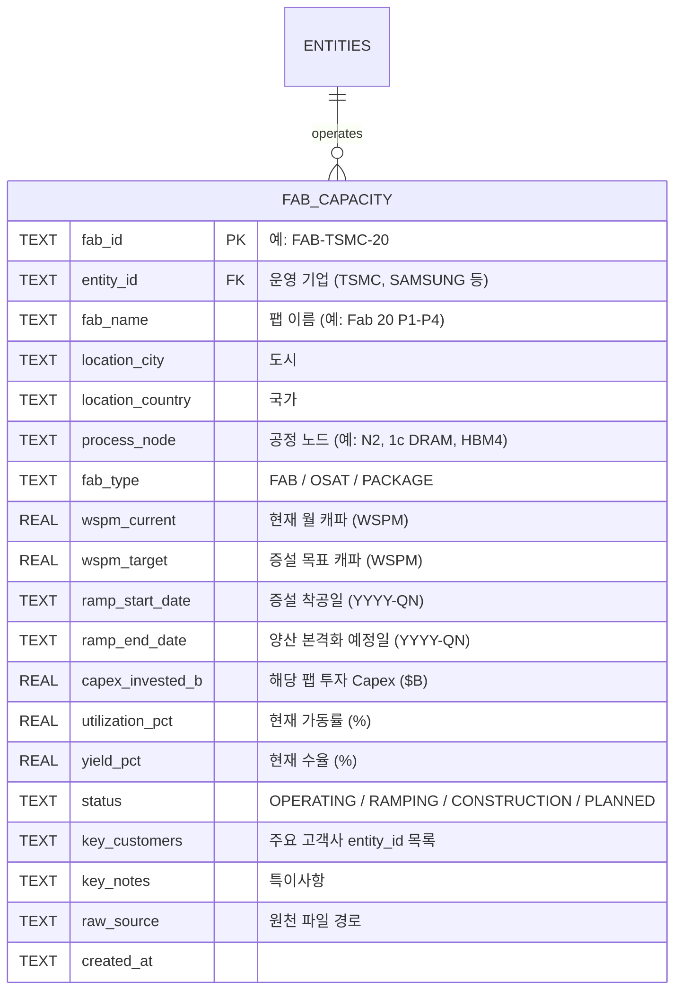
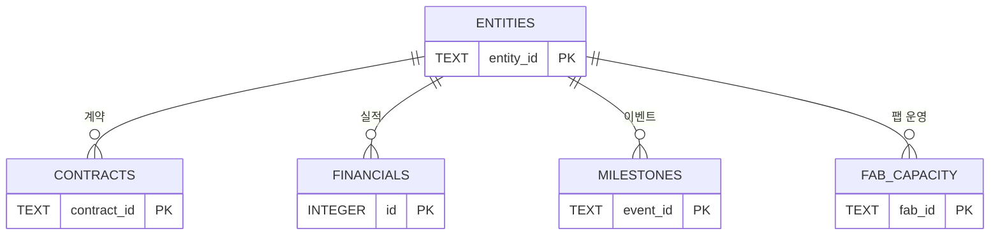

# [Fab Capacity 설계서] 공장 증산·생산 캐파 데이터 통합 명세
**문서 버전**: v1.0.0  
**작성일자**: 2026-09-10  
**작성 시각**: 10:06  
**프로젝트 코드명**: `b_0910_memory_claude`  
**기반 요청**: *"데이터 집어 넣을 때 추가 고민 — 공장 증산에 대한 데이터 추가, 공장 사이즈 fab"*

---

## 1. 왜 Fab Capacity 데이터가 필요한가

현재 시스템은 **자본(Capex)과 계약(Contract)**은 추적하지만, 그 결과물인 **실제 생산 능력(Capacity)**은 추적하지 않습니다.

```
[현재]  Capex 투입 → ??? → 매출 발생
[개선]  Capex 투입 → Fab 증설 → Wafer/Chip 생산량 증가 → 매출 발생
```

Fab Capacity 데이터를 추가하면:
- **병목의 물리적 실체**를 파악 가능: "TSMC CoWoS 월 8만 장인데, 수요는 월 12만 장" → 4만 장 부족
- **공급 제약 타임라인** 예측: 신규 팹 완공 시점이 언제인지 = HBM/GPU 공급 확대 시점
- **Capex와 실제 캐파 증가 사이의 시차** (일반적으로 18~36개월) 분석
- 미래 예측 테이블의 근거 강화: 숫자로 증명되는 예측

### 핵심 Fab Capacity 지표 정의

| 지표명 | 단위 | 설명 |
| :--- | :--- | :--- |
| **Wafer Starts** | WSPM (Wafer Starts Per Month) | 월별 웨이퍼 투입량. 팹 가동률의 기본 척도 |
| **Capacity Utilization** | % | 실제 가동률 (Utilization Rate) |
| **Yield Rate** | % | 양품 비율 (불량 제외 정상 제품 비율) |
| **WSPM (Current)** | 장/월 | 현재 월 생산 캐파 |
| **WSPM (Target)** | 장/월 | 증설 완료 후 목표 캐파 |
| **Ramp Timeline** | YYYY-QN | 신규 캐파 양산 본격화 시점 |
| **Fab Location** | 도시, 국가 | 팹 물리적 위치 (지정학 리스크 분석에 활용) |
| **Process Node** | nm / 기술명 | 해당 팹이 사용하는 공정 (예: N2, HBM4 1c) |

---

## 2. 추적 대상: 기업별 핵심 Fab 목록

human.md 기반 16개사 중 **Fab을 운영하거나 직접 의존하는 기업**의 핵심 생산 거점:

### 2.1 파운드리 & 장비 (L4)

#### TSMC — 핵심 팹 목록

| 팹 이름 | 위치 | 공정 노드 | 현재 WSPM | 목표 WSPM | 증설 완료 시점 | 주요 고객 |
| :--- | :--- | :--- | :---: | :---: | :--- | :--- |
| Fab 18 (P6/P7/P8) | 대만 남과학단지 | N3 / N3E | 60,000 | 80,000 | 2026-Q2 | 애플, 엔비디아 |
| Fab 20 (P1~P4) | 대만 신주 | N2 / A16 | 20,000 | 60,000 | 2026-Q3 | 애플, 엔비디아, AMD |
| CoWoS 패키징 | 대만 통샤오 | CoWoS-L/S | 75,000 | 120,000 | 2026-Q4 | 엔비디아 H/B/R 시리즈 |
| Arizona Fab 21 | 미국 애리조나 | N4 → N2 | 5,000 | 20,000 | 2027-Q2 | 애플, 미국 국방부 |
| Japan Fab 23 | 일본 구마모토 | N12 → N6 | 20,000 | 40,000 | 2027-Q1 | 소니, 자동차 반도체 |

#### ASML — 노광 장비 출하 계획

| 장비 유형 | 대당 가격 | 2025 출하 | 2026 출하 | 2027 출하 | 주요 도입처 |
| :--- | :---: | :---: | :---: | :---: | :--- |
| EUV (NXE) | $150M | 60대 | 65대 | 70대 | TSMC, 삼성, SK |
| High-NA EUV (EXE) | $380M | 5대 | 12대 | 20대 | TSMC (N2/A16), 인텔 |

> High-NA EUV 1대 인도 = A16/1nm급 공정 양산 능력 +5,000 WSPM에 해당

---

### 2.2 메모리 & 스토리지 (L5)

#### 삼성전자 — HBM 전용 생산 거점

| 팹/캠퍼스 | 위치 | 공정 | 현재 HBM WSPM | 목표 WSPM | 시점 | 특이사항 |
| :--- | :--- | :--- | :---: | :---: | :--- | :--- |
| 평택 P3 (반도체) | 경기도 평택 | 1c DRAM | 30,000 | 50,000 | 2026-Q3 | HBM4 16단 전용 라인 |
| 평택 P4 | 경기도 평택 | 1c DRAM | 건설 중 | 60,000 | 2027-Q1 | 미래 HBM4E 대응 |
| 화성 S3/S5 | 경기도 화성 | 1b DRAM | 25,000 | 25,000 | 유지 | HBM3E 기존 공급 |
| 미국 텍사스 테일러 | 텍사스, 미국 | 2nm 파운드리 | 건설 중 | 25,000 | 2027-Q3 | CHIPS Act 보조금 $6.4B |

#### SK하이닉스 — HBM 세계 1위 생산 거점

| 팹 | 위치 | 공정 | 현재 WSPM | 목표 WSPM | 시점 | 특이사항 |
| :--- | :--- | :--- | :---: | :---: | :--- | :--- |
| M16 | 경기도 이천 | 1b DRAM | 50,000 | 50,000 | 유지 | HBM3E 주 생산 |
| M15X | 충북 청주 | 1c DRAM | 20,000 | 40,000 | 2026-Q2 | HBM4 양산 주력 |
| 용인 클러스터 (M17~M20) | 경기도 용인 | 1c/1d DRAM | 건설 중 | 100,000+ | 2028+ | 국내 최대 반도체 클러스터 |
| 미국 인디애나 | 인디애나, 미국 | HBM 패키징 | 건설 중 | 20,000 | 2028-Q1 | CHIPS Act 보조금 대상 |

#### 마이크론 — HBM 3위

| 팹 | 위치 | 공정 | 현재 WSPM | 목표 WSPM | 시점 |
| :--- | :--- | :--- | :---: | :---: | :--- |
| Fab 10X (히로시마) | 일본 히로시마 | 1-beta DRAM | 35,000 | 50,000 | 2026-Q2 |
| Fab 21 | 미국 아이다호 | 1-gamma EUV | 건설 중 | 40,000 | 2027-Q1 |

---

## 3. DB 스키마 확장: `fab_capacity` 테이블 추가

기존 `db_architecture.md`의 4개 테이블에 **`fab_capacity` 테이블**을 추가합니다.

### 3.1 ERD 업데이트



### 3.2 DDL (SQLite)

```sql
-- ============================================================
-- fab_capacity 테이블 — 공장 증산 및 Fab 규모 추적
-- ============================================================
CREATE TABLE IF NOT EXISTS fab_capacity (
    fab_id              TEXT PRIMARY KEY,       -- 예: FAB-TSMC-20, FAB-SAMSUNG-P3
    entity_id           TEXT NOT NULL REFERENCES entities(entity_id),
    fab_name            TEXT NOT NULL,           -- 팹 공식 이름
    location_city       TEXT,
    location_country    TEXT,
    process_node        TEXT,                   -- N2, 1c_DRAM, HBM4, CoWoS 등
    fab_type            TEXT DEFAULT 'FAB',     -- FAB, OSAT, PACKAGE, ASSEMBLY
    wspm_current        REAL,                   -- 현재 Wafer Starts Per Month
    wspm_target         REAL,                   -- 증설 완료 후 목표 WSPM
    ramp_start_date     TEXT,                   -- 착공/증설 시작 (YYYY-QN)
    ramp_end_date       TEXT,                   -- 양산 본격화 예정 (YYYY-QN)
    capex_invested_b    REAL,                   -- 투자된 Capex ($B)
    utilization_pct     REAL,                   -- 가동률 (%)
    yield_pct           REAL,                   -- 수율 (%)
    status              TEXT DEFAULT 'OPERATING',
        -- OPERATING: 현재 가동 중
        -- RAMPING: 증설 진행 중 (캐파 확장 중)
        -- CONSTRUCTION: 건설 중
        -- PLANNED: 계획 발표됨
    key_customers       TEXT,                   -- 주요 고객 entity_id (쉼표 구분)
    key_notes           TEXT,
    raw_source          TEXT,
    created_at          TEXT DEFAULT (datetime('now')),
    updated_at          TEXT DEFAULT (datetime('now'))
);

CREATE INDEX IF NOT EXISTS idx_fab_entity ON fab_capacity(entity_id);
CREATE INDEX IF NOT EXISTS idx_fab_status ON fab_capacity(status);
CREATE INDEX IF NOT EXISTS idx_fab_node ON fab_capacity(process_node);
CREATE INDEX IF NOT EXISTS idx_fab_ramp_end ON fab_capacity(ramp_end_date);

-- ============================================================
-- 뷰: 증설 중인 팹 목록 (Supply 증가 예측용)
-- ============================================================
CREATE VIEW IF NOT EXISTS v_fab_ramping AS
SELECT
    e.name_ko,
    f.fab_name,
    f.location_country,
    f.process_node,
    f.wspm_current,
    f.wspm_target,
    (f.wspm_target - f.wspm_current) AS wspm_increase,
    f.ramp_end_date,
    f.capex_invested_b,
    f.status
FROM fab_capacity f
JOIN entities e ON f.entity_id = e.entity_id
WHERE f.status IN ('RAMPING', 'CONSTRUCTION', 'PLANNED')
ORDER BY f.ramp_end_date;

-- ============================================================
-- 뷰: 기업별 총 Fab 캐파 집계
-- ============================================================
CREATE VIEW IF NOT EXISTS v_total_capacity_by_entity AS
SELECT
    e.name_ko,
    e.layer,
    f.process_node,
    SUM(f.wspm_current) AS total_wspm_current,
    SUM(f.wspm_target)  AS total_wspm_target,
    COUNT(*)            AS fab_count
FROM fab_capacity f
JOIN entities e ON f.entity_id = e.entity_id
GROUP BY f.entity_id, f.process_node
ORDER BY total_wspm_target DESC;
```

### 3.3 초기 시드 데이터 (핵심 팹)

```sql
-- TSMC 핵심 팹
INSERT INTO fab_capacity VALUES
('FAB-TSMC-18','TSMC','Fab 18 (P6~P8)','Tainan','Taiwan','N3/N3E','FAB',60000,80000,'2025-Q1','2026-Q2',25.0,95.0,80.0,'RAMPING','NVIDIA,AMD,APPLE','N3 주력 양산 팹','99.raw/fab/tsmc_fab18.csv',datetime('now'),datetime('now')),
('FAB-TSMC-20','TSMC','Fab 20 (P1~P4)','Hsinchu','Taiwan','N2/A16','FAB',20000,60000,'2025-Q3','2026-Q3',40.0,70.0,60.0,'RAMPING','NVIDIA,APPLE,AMD','N2 초기 양산, 2026 본격화','99.raw/fab/tsmc_fab20.csv',datetime('now'),datetime('now')),
('FAB-TSMC-COWOS','TSMC','CoWoS 패키징','Tongsiao','Taiwan','CoWoS-L/S','PACKAGE',75000,120000,'2025-Q2','2026-Q4',12.0,98.0,85.0,'RAMPING','NVIDIA,AMD,BROADCOM','AI 가속기 첨단 패키징 병목 핵심','99.raw/fab/tsmc_cowos.csv',datetime('now'),datetime('now')),
('FAB-TSMC-AZ','TSMC','Arizona Fab 21','Phoenix','USA','N4/N2','FAB',5000,20000,'2023-Q1','2027-Q2',40.0,50.0,55.0,'RAMPING','APPLE,US_DOD','CHIPS Act 수혜, 2nm 전환 예정','99.raw/fab/tsmc_fab21_az.csv',datetime('now'),datetime('now'));

-- 삼성전자 핵심 팹
INSERT INTO fab_capacity VALUES
('FAB-SAMSUNG-P3','SAMSUNG','평택 P3','Pyeongtaek','Korea','1c_DRAM_HBM4','FAB',30000,50000,'2025-Q4','2026-Q3',15.0,85.0,55.0,'RAMPING','NVIDIA','HBM4 16단 전용 라인 핵심','99.raw/fab/samsung_p3.csv',datetime('now'),datetime('now')),
('FAB-SAMSUNG-P4','SAMSUNG','평택 P4','Pyeongtaek','Korea','1c_DRAM_HBM4E','FAB',0,60000,'2025-Q2','2027-Q1',20.0,0.0,NULL,'CONSTRUCTION','NVIDIA','HBM4E 대응 미래 팹','99.raw/fab/samsung_p4.csv',datetime('now'),datetime('now'));

-- SK하이닉스 핵심 팹
INSERT INTO fab_capacity VALUES
('FAB-SKH-M16','SK_HYNIX','M16 이천','Icheon','Korea','1b_DRAM_HBM3E','FAB',50000,50000,NULL,NULL,NULL,98.0,88.0,'OPERATING','NVIDIA','HBM3E 독점 공급 주력 팹','99.raw/fab/skh_m16.csv',datetime('now'),datetime('now')),
('FAB-SKH-M15X','SK_HYNIX','M15X 청주','Cheongju','Korea','1c_DRAM_HBM4','FAB',20000,40000,'2025-Q3','2026-Q2',10.0,75.0,65.0,'RAMPING','NVIDIA','HBM4 양산 주력 라인','99.raw/fab/skh_m15x.csv',datetime('now'),datetime('now')),
('FAB-SKH-YONGIN','SK_HYNIX','용인 클러스터','Yongin','Korea','1c/1d_DRAM','FAB',0,100000,'2023-Q1','2028-Q1',120.0,0.0,NULL,'CONSTRUCTION','TBD','국내 최대 반도체 클러스터, 2028+','99.raw/fab/skh_yongin.csv',datetime('now'),datetime('now'));
```

---

## 4. 99.raw/ 입력 템플릿 확장

### 4.1 새 디렉터리 추가

```text
99.raw/
├── contracts/
├── financials/
├── milestones/
└── fab_capacity/              ← 신규 추가
    ├── fab_capacity.csv       # CSV 일괄 입력
    └── {YYYY}_{기업}_{팹명}.md  # 개별 팹 마크다운
```

### 4.2 CSV 입력 포맷

```csv
fab_id,entity_id,fab_name,location_city,location_country,process_node,fab_type,wspm_current,wspm_target,ramp_start_date,ramp_end_date,capex_invested_b,utilization_pct,yield_pct,status,key_customers,key_notes
FAB-TSMC-20,TSMC,Fab 20 P1-P4,Hsinchu,Taiwan,N2/A16,FAB,20000,60000,2025-Q3,2026-Q3,40.0,70.0,60.0,RAMPING,"NVIDIA,APPLE,AMD","N2 초기 양산 - 수율 안정화 중"
FAB-SAMSUNG-P3,SAMSUNG,평택 P3,Pyeongtaek,Korea,1c_DRAM_HBM4,FAB,30000,50000,2025-Q4,2026-Q3,15.0,85.0,55.0,RAMPING,NVIDIA,"HBM4 전용 라인 - 수율 55%로 개선 필요"
```

### 4.3 Markdown Frontmatter 포맷 (상세 기록 시)

```markdown
---
fab_id: FAB-TSMC-20
entity_id: TSMC
fab_name: Fab 20 (P1~P4)
location: Hsinchu, Taiwan
process_node: N2/A16
fab_type: FAB
wspm_current: 20000
wspm_target: 60000
ramp_start: 2025-Q3
ramp_end: 2026-Q3
capex_invested_b: 40.0
utilization_pct: 70.0
yield_pct: 60.0
status: RAMPING
key_customers: [NVIDIA, APPLE, AMD]
---

## 팹 현황 메모
- 2026-Q1 기준 N2 공정 수율 60% 달성. 양산 기준(80%) 미달이나 개선 중.
- 애플 A20/M5 칩 초기 물량 배정 확정. 엔비디아 Rubin은 Q3 배정.
- ASML High-NA EUV 3대 추가 발주. 2027년 A16 전환 준비.
```

---

## 5. 신규 산출물: Fab Capacity 현황 테이블

### 파일: `docs/fab_capacity_table.md`

DB `fab_capacity` 테이블 + `v_fab_ramping` 뷰를 기반으로 자동 생성되는 마크다운 테이블.

#### 구성 섹션

**섹션 1: 2026~2028 증설 로드맵 (착공 완료 시점 기준)**

```markdown
| 완공 시점 | 기업 | 팹 | 위치 | 공정 | 현재 WSPM | 목표 WSPM | +증가 | 투자 Capex |
| :--- | :--- | :--- | :--- | :--- | :---: | :---: | :---: | :---: |
| 2026-Q2 | SK하이닉스 | M15X 청주 | 한국 | 1c HBM4 | 20,000 | 40,000 | +20,000 | $10B |
| 2026-Q3 | TSMC | Fab 20 | 대만 | N2/A16 | 20,000 | 60,000 | +40,000 | $40B |
| 2026-Q3 | 삼성전자 | 평택 P3 | 한국 | 1c HBM4 | 30,000 | 50,000 | +20,000 | $15B |
| 2027-Q1 | 마이크론 | Fab 21 | 미국 | 1γ EUV | 0 | 40,000 | +40,000 | $15B |
| 2027-Q2 | TSMC | Arizona Fab 21 | 미국 | N2 | 5,000 | 20,000 | +15,000 | $40B |
| 2028-Q1 | SK하이닉스 | 용인 클러스터 | 한국 | 1c/1d | 0 | 100,000 | +100,000 | $120B |
```

**섹션 2: 수율(Yield) 추이 및 의미**

수율은 병목 예측의 핵심 변수입니다:

| 기업·팹 | 공정 | 2025 수율 | 2026 목표 수율 | 양산 기준 | 상태 |
| :--- | :--- | :---: | :---: | :---: | :--- |
| 삼성 평택 P3 | HBM4 1c | 40% | 70% | 80% | ⚠️ 개선 중 |
| SK하이닉스 M15X | HBM4 1c | 65% | 85% | 80% | ✅ 양산 가능 |
| TSMC Fab 20 | N2 | 60% | 80% | 80% | ⚠️ 경계 |
| 마이크론 히로시마 | HBM3E | 75% | 85% | 80% | ✅ 안정 |

**섹션 3: 지역별 캐파 집중도 (지정학 리스크)**

```markdown
| 국가 | 총 WSPM (현재) | 총 WSPM (2027 목표) | 핵심 위험 |
| :--- | :---: | :---: | :--- |
| 대만 | 195,000 | 320,000 | 대만 해협 지정학 리스크 집중 |
| 한국 | 125,000 | 265,000 | 상대적 안전 (HBM 메인) |
| 미국 | 10,000 | 80,000 | CHIPS Act 투자로 빠르게 확대 중 |
| 일본 | 55,000 | 90,000 | TSMC·마이크론 거점 |
```

---

## 6. 웹 대시보드 확장: Fab Capacity 시각화

현재 정의된 웹 대시보드(화면 A~D)에 **Fab Capacity 화면**을 추가:

### 화면 F: 글로벌 Fab 증설 타임라인 (신규)

```
2026-Q1 ───┬─── SK하이닉스 M15X HBM4 (청주) +20,000 WSPM
           │
2026-Q3 ───┼─── TSMC Fab20 N2 (대만) +40,000 WSPM
           ├─── 삼성전자 P3 HBM4 (평택) +20,000 WSPM
           │
2027-Q1 ───┼─── 마이크론 Fab21 1γ (미국) +40,000 WSPM
2027-Q2 ───┼─── TSMC Arizona N2 (미국) +15,000 WSPM
           │
2028-Q1 ───┴─── SK하이닉스 용인 클러스터 +100,000 WSPM

→ 각 바 위에 마우스 오버 시: 공정, Capex 규모, 주요 고객사 툴팁
→ 우측: 누적 글로벌 HBM WSPM / 파운드리 N2 WSPM 실시간 합산
```

### 화면 G: 수율 × 캐파 매트릭스 (신규)

```
      낮은 수율 (<60%)        높은 수율 (>80%)
      ┌────────────────────┬────────────────────┐
큰    │ ⚠️ 병목 위험       │ ✅ 안정 공급       │
캐파  │ 삼성 P3 HBM4 초기  │ SK하이닉스 HBM3E   │
      ├────────────────────┼────────────────────┤
작은  │ 🔴 문제 팹        │ 🟡 소규모 안정     │
캐파  │ (아직 없음)        │ 마이크론 히로시마  │
      └────────────────────┴────────────────────┘
```

---

## 7. 분석 파생 지표: Fab Capacity 기반 계산값

DB에 저장된 Fab 데이터로부터 자동 계산되는 **파생 지표**:

| 파생 지표 | 계산식 | 의미 |
| :--- | :--- | :--- |
| **HBM 공급 가능 물량** | `wspm × yield_pct × 30일 × 스택 수` | 월별 최대 HBM 스택 출하 가능량 |
| **공급 부족 갭** | `(수요 추정치) - (전체 공급 가능량)` | 병목 정량화 |
| **캐파 증가 속도** | `(wspm_target - wspm_current) / ramp_months` | 증설 속도 (월 WSPM 증가량) |
| **투자 효율성** | `wspm_increase / capex_invested_b` | $1B 투자당 추가 WSPM |
| **지정학 집중도** | `대만 WSPM / 전체 WSPM` | 대만 의존도 비율 |
| **수율-캐파 실효 지수** | `wspm_current × yield_pct × utilization_pct` | 실제 유효 생산 능력 |

---

## 8. 업데이트된 전체 DB 구조 (5개 테이블)



| 테이블 | 역할 | 핵심 분석 |
| :--- | :--- | :--- |
| `entities` | 기업 마스터 | 16~25개사 식별 코드 |
| `contracts` | 계약·투자 | 자본 흐름 추적 |
| `financials` | 실적·Capex | 실적 매트릭스 |
| `milestones` | 과거·미래 이벤트 | 타임라인 테이블 |
| `fab_capacity` | **공장 증산·수율** ← 신규 | **물리적 공급 능력** |

---

## 9. 수기 입력 시 추가 고민 사항

Fab 데이터를 `99.raw/`에 넣을 때 특별히 주의할 점:

### ✅ 반드시 기록할 것
1. **WSPM 숫자의 출처**: 어닝콜 발언인지, 리서치 보고서 추정치인지 명시 (`is_forecast: TRUE/FALSE`)
2. **수율(Yield)의 신뢰도**: 공식 발표인지, 업계 루머인지 구분 (`status: CONFIRMED/RUMORED`)
3. **기준 시점**: WSPM은 시점마다 달라지므로 `as_of_date` 기록 필수
4. **대상 제품**: HBM3E인지 HBM4인지, 어떤 공정 노드인지 명확히

### ⚠️ 흔한 실수
- **WSPM vs 월 출하량 혼동**: WSPM은 투입량, 실제 출하는 `WSPM × 수율 × 가동률`
- **총 캐파 vs HBM 전용 캐파 혼동**: 삼성 평택 P3는 총 DRAM 캐파가 아니라 HBM 전용 라인 캐파
- **장비 출하 ≠ 캐파 즉시 증가**: ASML 장비 인도 후 설치·검증·수율 안정화까지 6~12개월 추가 소요
