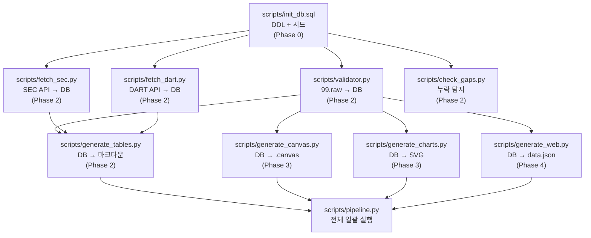

# [구현 추가 고려사항] Memory Claude 실행 단계 기술·운영·데이터 검토서
**문서 버전**: v1.0.0  
**작성일자**: 2026-09-10  
**프로젝트 코드명**: `b_0910_memory_claude`

---

## 1. 이 문서의 목적

설계 문서 10개와 구현 계획도가 완성되었습니다. 이제 **실제로 코드를 작성하고 데이터를 넣기 시작할 때** 부딪히는 현실적 문제들을 검토합니다.

크게 5가지 영역으로 나눕니다:

| 영역 | 핵심 질문 |
| :--- | :--- |
| **A. 기술 환경** | 어떤 Python 버전? 어떤 라이브러리? 로컬에서 바로 되는가? |
| **B. 데이터 운영** | 데이터가 쌓이면 어떻게 관리? 백업은? 충돌은? |
| **C. 데이터 품질** | 틀린 데이터가 들어가면? 중복은? 누락 탐지는? |
| **D. 옵시디언 연동** | 볼트 구조는? 옵시디언 특유의 제약은? |
| **E. 개발 워크플로우** | 혼자 개발·운영할 때 지속 가능한 습관은? |

---

## 2. 영역 A: 기술 환경 고려사항

### A1. Python 환경

| 항목 | 권장 | 이유 |
| :--- | :--- | :--- |
| **Python 버전** | 3.10+ | f-string, match/case, sqlite3 내장 |
| **가상환경** | `venv` (표준 라이브러리) | 추가 설치 없음, 프로젝트 격리 |
| **패키지 관리** | `requirements.txt` | pip freeze 기반, 재현 가능 |

```bash
# 프로젝트 초기 셋업
python3 -m venv .venv
source .venv/bin/activate
pip install -r requirements.txt
```

### A2. 필요 라이브러리 (최소)

```text
# requirements.txt — Phase 0~2 기준
# (Phase 별로 점진적 추가)

# Phase 0: 없음 (표준 라이브러리만)
# sqlite3, csv, json, pathlib — 전부 내장

# Phase 2: API 수집
requests>=2.31.0          # SEC EDGAR API 호출
yfinance>=0.2.28          # Yahoo Finance 보조
feedparser>=6.0.10        # Google News RSS 파싱

# Phase 3: 시각화 (선택)
# matplotlib — SVG 차트 생성 시

# Phase 5: LLM 연동 (선택)
# anthropic — Claude API 호출 시
```

**핵심**: Phase 0~1은 **외부 라이브러리 설치 없이** Python 표준 라이브러리(sqlite3, csv, json, pathlib)만으로 구현 가능. 의존성 최소화.

### A3. SQLite 버전 및 제약

| 항목 | 내용 |
| :--- | :--- |
| **macOS 내장 SQLite** | 보통 3.39+ (충분) |
| **최대 DB 크기** | 이론적 281TB, 실제로 수년 데이터 쌓아도 수 MB 수준 |
| **동시 접근** | 단일 사용자이므로 문제 없음. WAL 모드 활성화 권장 |
| **CLI 도구** | `sqlite3` 터미널 명령으로 즉시 조회 가능 |

```sql
-- WAL 모드 활성화 (성능 + 안전성)
PRAGMA journal_mode = WAL;
PRAGMA foreign_keys = ON;
```

### A4. .gitignore 설정

```gitignore
# .gitignore
.venv/
__pycache__/
*.pyc
.DS_Store

# DB 파일은 Git에 포함 (소규모이므로)
# 대규모로 커지면 data/ 를 .gitignore에 추가하고 별도 백업
```

**판단**: `data/memory_claude.db`는 수 MB이므로 **Git에 포함하는 것을 권장**합니다. 버전 히스토리 자체가 데이터 변경 이력 역할.

---

## 3. 영역 B: 데이터 운영 고려사항

### B1. 백업 전략

| 방식 | 방법 | 주기 | 장점 |
| :--- | :--- | :--- | :--- |
| **Git 커밋** | DB 포함 전체 프로젝트 커밋 | 데이터 변경 시마다 | 변경 이력 + 롤백 가능 |
| **Dropbox 자동** | 현재 프로젝트가 Dropbox 안에 있음 | 실시간 | 별도 작업 없이 자동 |
| **SQLite dump** | `sqlite3 .dump > backup.sql` | 주 1회 | 텍스트 백업, 복원 용이 |

```bash
# 주간 SQL 덤프 백업 (cron 또는 수동)
sqlite3 data/memory_claude.db .dump > data/backup_$(date +%Y%m%d).sql
```

**현재 프로젝트 경로가 Dropbox 안**(`/Users/chansoojeon/Library/CloudStorage/Dropbox/03_code/`)이므로, **Dropbox 자동 동기화가 1차 백업 역할**을 이미 수행합니다. Git 커밋을 2차 백업으로 활용하면 충분.

### B2. SQLite + Dropbox 충돌 주의

> ⚠️ **중요**: SQLite DB 파일을 Dropbox로 동기화할 때, **두 기기에서 동시에 DB를 열면 충돌**이 발생할 수 있습니다.

| 상황 | 위험도 | 대응 |
| :--- | :--- | :--- |
| 한 대의 맥에서만 사용 | ✅ 안전 | 문제 없음 |
| 두 대의 맥에서 동시 사용 | ⚠️ 위험 | 한쪽에서 DB를 닫고 동기화 완료 후 다른 쪽에서 열기 |
| iOS 옵시디언에서 마크다운 편집 + 맥에서 DB 변경 | ✅ 안전 | 마크다운과 DB는 별도 파일이므로 충돌 없음 |

**대응 방법**: 여러 기기에서 사용할 경우, DB 직접 편집은 **한 대에서만** 하고, 다른 기기에서는 **산출물(마크다운)만 열람**.

### B3. 데이터 증가 예측

| 기간 | 예상 레코드 수 | DB 크기 | 관리 부담 |
| :--- | :--- | :---: | :---: |
| 1개월 | 60건 (entities + 초기 시드) | < 100KB | 없음 |
| 6개월 | 300건 (분기 실적 2회 + 계약 + 이벤트) | < 500KB | 없음 |
| 1년 | 600건 | < 1MB | 없음 |
| 3년 | 2,000건 | < 5MB | 없음 |

**결론**: SQLite 단일 파일로 **수년간 운영해도 성능 문제 없음**. 일일 주가 데이터 같은 고빈도 시계열을 추가하지 않는 한.

---

## 4. 영역 C: 데이터 품질 고려사항

### C1. 입력 데이터 검증 규칙

`validator.py`가 수행해야 할 검증:

| 검증 항목 | 규칙 | 대응 |
| :--- | :--- | :--- |
| **entity_id 존재** | `entities` 테이블에 없는 entity_id → 거부 | "GOOGL" 오타 → "GOOGLE" 교정 제안 |
| **금액 단위 통일** | 모든 금액은 $B (십억 달러) 단위 | 원화 입력 시 환율 변환 필드 필수 |
| **날짜 형식** | `YYYY-MM-DD` 또는 `YYYY-QN` | "2026년 3분기" → "2026-Q3" 자동 변환 |
| **중복 체크** | 같은 contract_id / event_id → 경고 | UPDATE 또는 거부 선택 |
| **필수 필드 누락** | entity_id, period 없으면 거부 | 경고 메시지 출력 |
| **숫자 범위** | Capex가 음수이거나 비현실적 ($500B+) → 경고 | 입력 확인 요청 |

```python
# validator.py 핵심 로직 (개념)
def validate_financial(row, db_cursor):
    errors = []
    
    # entity_id 검증
    db_cursor.execute("SELECT 1 FROM entities WHERE entity_id=?", (row['entity_id'],))
    if not db_cursor.fetchone():
        errors.append(f"unknown entity_id: {row['entity_id']}")
    
    # 금액 범위 검증
    if row.get('capex_usd_b') and float(row['capex_usd_b']) > 200:
        errors.append(f"Capex ${row['capex_usd_b']}B — abnormally large")
    
    # 중복 검증
    db_cursor.execute("SELECT 1 FROM financials WHERE entity_id=? AND period=?",
                      (row['entity_id'], row['period']))
    if db_cursor.fetchone():
        errors.append(f"duplicate: {row['entity_id']} {row['period']} already exists")
    
    return errors
```

### C2. entity_id 별칭(Alias) 처리

사용자가 수기로 입력할 때 **같은 기업을 다른 이름으로 쓸 가능성**:

| 입력될 수 있는 값 | 정규 entity_id |
| :--- | :--- |
| 구글, Google, Alphabet, GOOGL, 알파벳 | `GOOGLE` |
| 삼성, Samsung, 삼성전자, SEC, 005930 | `SAMSUNG` |
| 하이닉스, SK Hynix, SKH, SK하이닉스 | `SK_HYNIX` |
| 엔비디아, Nvidia, NVDA, nvidia | `NVIDIA` |

**대응**: `entity_aliases` 보조 테이블 추가.

```sql
CREATE TABLE IF NOT EXISTS entity_aliases (
    alias       TEXT PRIMARY KEY,
    entity_id   TEXT NOT NULL REFERENCES entities(entity_id)
);

INSERT INTO entity_aliases VALUES ('구글', 'GOOGLE');
INSERT INTO entity_aliases VALUES ('Google', 'GOOGLE');
INSERT INTO entity_aliases VALUES ('Alphabet', 'GOOGLE');
INSERT INTO entity_aliases VALUES ('GOOGL', 'GOOGLE');
INSERT INTO entity_aliases VALUES ('삼성', 'SAMSUNG');
INSERT INTO entity_aliases VALUES ('삼성전자', 'SAMSUNG');
INSERT INTO entity_aliases VALUES ('Samsung', 'SAMSUNG');
```

validator.py가 입력 데이터의 entity_id를 먼저 `entity_aliases`에서 조회 → 정규 entity_id로 자동 변환.

### C3. 데이터 누락 탐지

시스템이 **어떤 데이터가 비어 있는지** 스스로 감지하는 쿼리:

```sql
-- 실적 데이터가 없는 기업·기간 조합 찾기
SELECT e.entity_id, e.name_ko, p.period
FROM entities e
CROSS JOIN (
    SELECT '2024-FY' AS period UNION
    SELECT '2025-FY' UNION
    SELECT '2026-FY'
) p
LEFT JOIN financials f ON e.entity_id = f.entity_id AND p.period = f.period
WHERE f.id IS NULL
ORDER BY e.entity_id, p.period;
```

이 쿼리를 `scripts/check_gaps.py`로 만들어 놓으면, 데일리 브리핑이나 주간 리포트에 자동 포함 가능.

---

## 5. 영역 D: 옵시디언 연동 고려사항

### D1. 볼트(Vault) 구조 결정

**권장: 프로젝트 폴더 자체를 옵시디언 볼트로 사용.**

```
b_0910_memory_claude/         ← 이 폴더를 옵시디언 볼트로 열기
├── docs/                     ← 옵시디언에서 바로 열람
├── 99.raw/                   ← 수기 입력도 옵시디언에서 가능
├── data/                     ← .db 파일은 옵시디언이 무시
└── scripts/                  ← .py 파일은 옵시디언이 무시
```

가장 단순하고, `scripts/`와 `data/`는 옵시디언이 알아서 무시(`.md`와 `.canvas`만 표시).

### D2. 옵시디언 설정 고려

| 설정 항목 | 권장 값 | 이유 |
| :--- | :--- | :--- |
| **파일 및 링크 → 새 링크 포맷** | 상대 경로 | 프로젝트 이동 시 링크 깨짐 방지 |
| **파일 및 링크 → 삭제 시** | 시스템 휴지통으로 이동 | 실수 삭제 복구 가능 |
| **커뮤니티 플러그인 → Dataview** | 설치 권장 | 마크다운 테이블 동적 쿼리에 필수 |
| **커뮤니티 플러그인 → Templater** | 선택 | 99.raw/ 입력 템플릿 자동 생성 시 유용 |

### D3. Dataview 활용 예시

Dataview 플러그인이 있으면, 마크다운 프론트매터를 **실시간 쿼리**할 수 있습니다:

```
dataview 쿼리 예시:
TABLE source_entity AS "발주", target_entity AS "수주",
      amount_usd_b AS "금액($B)", date AS "날짜"
FROM "99.raw/contracts"
WHERE contract_type
SORT date DESC
LIMIT 10
```

`99.raw/contracts/`에 마크다운 파일을 추가할 때마다 **자동으로 테이블이 갱신**됩니다.

### D4. 옵시디언 Canvas 파일 제약

| 제약 | 내용 | 대응 |
| :--- | :--- | :--- |
| `.canvas` 파일은 JSON 포맷 | 수동 편집 가능하지만 복잡 | `generate_canvas.py`로 자동 생성 |
| 카드 위치 좌표 필요 | x, y 좌표를 직접 계산해야 함 | 계층별(L1~L7) y좌표 자동 배치 알고리즘 |
| 연결선(Edge) 색상 | JSON의 `color` 필드로 지정 | 자본(녹색), 칩(파란), 메모리(주황) |

---

## 6. 영역 E: 개발 워크플로우 고려사항

### E1. 혼자 운영하는 시스템의 지속성

가장 큰 위험은 **"만들어 놓고 안 쓰는 것"**입니다.

| 위험 패턴 | 현실 시나리오 | 예방 방법 |
| :--- | :--- | :--- |
| **초기 열정 소진** | 2주 열심히 → 3주째 귀찮음 | Phase를 작게 나눠 작은 성취감 반복 |
| **입력 부담** | 뉴스 볼 때마다 CSV 편집은 귀찮음 | 퀵 입력 포맷 (`@GOOGLE $76.7B capex #financial`) |
| **산출물 안 봄** | 테이블 만들어도 안 열어봄 | 옵시디언 홈 대시보드에 임베드 → 볼트 열면 자동 노출 |
| **데이터 오래됨** | 3개월 미갱신 | `check_gaps.py` 경고 + 분기별 업데이트 루틴 |

### E2. 최소 운영 루틴 제안

| 주기 | 작업 | 소요 시간 |
| :--- | :--- | :---: |
| **일상** | 뉴스에서 중요 계약/실적 발견 시 → `99.raw/`에 메모 | 5분 |
| **주간** | `python3 scripts/validator.py` 실행 → 테이블 갱신 확인 | 10분 |
| **분기** (어닝 시즌) | 주요 기업 어닝콜 후 실적 데이터 일괄 업데이트 | 2시간 |
| **분기** | `check_gaps.py` 실행 → 누락 데이터 확인 → 보충 | 1시간 |
| **반기** | 미래 예측 테이블 리뷰 → 빗나간 예측 수정 + 사유 기록 | 2시간 |

**연간 총 투입 시간**: 약 **30~40시간** (주당 ~1시간 미만)

### E3. 코드 작성 순서 (스크립트별 의존 관계)



**의존성 핵심**: `init_db.sql`이 가장 먼저, `pipeline.py`가 가장 나중. 나머지는 DB만 있으면 독립적으로 개발 가능.

### E4. 테스트 전략

| 구분 | 방법 | 도구 |
| :--- | :--- | :--- |
| **DDL 검증** | DB 생성 후 `.tables` + `.schema` 확인 | sqlite3 CLI |
| **시드 데이터 검증** | INSERT 후 `SELECT count(*)` + 샘플 조회 | sqlite3 CLI |
| **validator 검증** | 의도적으로 오류 데이터(잘못된 entity_id, 누락 필드) 입력 → 거부 확인 | Python unittest |
| **테이블 생성 검증** | 생성된 .md 파일을 옵시디언에서 열어 렌더링 확인 | 눈으로 확인 |
| **웹 대시보드 검증** | `python3 -m http.server 8089` → 브라우저에서 확인 | 브라우저 |

---

## 7. 추가 고려사항 체크리스트 (실행 전 최종 확인)

### Phase 0 실행 전 확인

- [ ] Python 3.10+ 설치 확인: `python3 --version`
- [ ] SQLite 설치 확인: `sqlite3 --version`
- [ ] 프로젝트 경로가 Dropbox 내에 있음 확인 (자동 백업)
- [ ] Git 초기화 여부 결정: `git init` 할 것인가?

### Phase 1 진입 전 확인

- [ ] 추적 기업 수 확정: 16개사(human.md 기준) vs 21개사(Critical 5개 추가) vs 25개사
- [ ] Confidence 등급 체계 지금 반영할 것인가, Phase 5까지 미룰 것인가?
- [ ] 환율 기준 확정: 고정 환율(1,350원/$) vs 매 입력 시 환율 기록?

### 통째로 결정해야 할 사항

| 결정 사항 | 옵션 A | 옵션 B | 권장 |
| :--- | :--- | :--- | :---: |
| **기업 수** | 16개사 (human.md 그대로) | 21개사 (Critical 추가) | **21개사** |
| **Git 사용** | 사용 (변경 이력 추적) | 미사용 (Dropbox만) | **사용** |
| **옵시디언 볼트** | 프로젝트 폴더 = 볼트 | 기존 볼트에 연결 | **프로젝트=볼트** |
| **Phase 0 범위** | DB만 (최소) | DB + 시드 + 99.raw 템플릿 | **DB+시드+템플릿** |
| **Confidence 적용 시점** | Phase 0부터 | Phase 5에서 | **Phase 0부터** |
