# [구현 계획도] Memory Claude 단계별 실행 로드맵
**문서 버전**: v1.0.0  
**작성일자**: 2026-09-10  
**프로젝트 코드명**: `b_0910_memory_claude`

---

## 1. 전체 구현 조감도

설계 문서 9개를 **실제 동작하는 시스템**으로 전환하는 전체 로드맵입니다.

```mermaid
graph TD
    subgraph NOW ["📄 현재 상태 (설계만 존재)"]
        DOCS["문서 9개<br/>코드 0줄 · 데이터 0건<br/>가치 = 0"]
    end

    subgraph P0 ["⚡ Phase 0: 가치 0→1 (15분)"]
        DIR["99.raw/ 디렉터리 생성"]
        DB["SQLite DB + 5개 테이블"]
        SEED["시드 데이터 투입<br/>16~21개사 + 3개 계약"]
    end

    subgraph P1 ["🧱 Phase 1: 기초 데이터 (2주)"]
        MANUAL["수기 데이터 대량 투입<br/>Capex · 실적 · 계약"]
        TABLE1["실적 매트릭스 테이블<br/>첫 버전 수동 생성"]
    end

    subgraph P2 ["🔧 Phase 2: 자동화 (1개월)"]
        API["SEC/DART API 자동 수집"]
        VALID["validator.py<br/>99.raw → SQLite 자동 정제"]
        GEN["generate_tables.py<br/>마크다운 테이블 자동 생성"]
    end

    subgraph P3 ["🎨 Phase 3: 시각화 (2개월)"]
        CANVAS["옵시디언 캔버스 자동 생성"]
        MERMAID["Mermaid 다이어그램"]
        CHART["SVG 차트 이미지"]
        FAB["Fab Capacity 데이터 입력"]
    end

    subgraph P4 ["🌐 Phase 4: 웹 대시보드 (3~6개월)"]
        SANKEY["Sankey 자본 흐름도"]
        SLIDER["타임라인 슬라이더"]
        SIM["병목 시뮬레이터"]
        FACT["기업 팩트시트"]
    end

    subgraph P5 ["🤖 Phase 5: 인텔리전스 (6~12개월)"]
        LLM["어닝콜 LLM 요약"]
        ALERT["뉴스 알림 봇"]
        CORR["상관관계 엔진"]
        AGENT["AI 에이전트 통합"]
    end

    NOW -->|"15분"| P0
    P0 -->|"2주"| P1
    P1 -->|"1개월"| P2
    P2 -->|"2개월"| P3
    P3 -->|"3~6개월"| P4
    P4 -->|"6~12개월"| P5
```

---

## 2. Phase 0 상세: 가치가 0에서 1로 바뀌는 순간

### 2.1 현재 vs Phase 0 완료 후

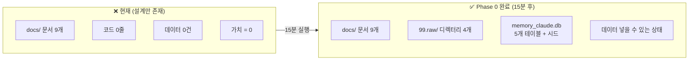

### 2.2 Phase 0 실행 체크리스트

| 순서 | 작업 | 명령/내용 | 소요 | 결과물 |
| :---: | :--- | :--- | :---: | :--- |
| **0-1** | 99.raw/ 폴더 구조 생성 | `mkdir -p 99.raw/{contracts,financials,milestones,fab_capacity}` | 1분 | 빈 디렉터리 4개 |
| **0-2** | data/ 폴더 생성 | `mkdir -p data` | 1분 | DB 저장 위치 |
| **0-3** | scripts/ 폴더 생성 | `mkdir -p scripts` | 1분 | 스크립트 저장 위치 |
| **0-4** | SQLite DB 생성 + DDL 실행 | `sqlite3 data/memory_claude.db < scripts/init_db.sql` | 2분 | 빈 5개 테이블 |
| **0-5** | entities 시드 INSERT | 16~21개사 기업 마스터 데이터 | 5분 | 기업 식별 코드 체계 |
| **0-6** | contracts 시드 INSERT | human.md 계약 3건 (구글-앤트로픽 $200B 등) | 3분 | 첫 계약 데이터 |
| **0-7** | financials 시드 INSERT | 구글 Capex $76.7B | 2분 | 첫 실적 데이터 |
| | **합계** | | **15분** | |

### 2.3 Phase 0 파일 트리 (완료 후)

```text
b_0910_memory_claude/
├── docs/                              ← 설계 문서 (기존)
│   ├── human.md
│   ├── requirements_spec.md
│   ├── db_architecture.md
│   ├── data_sources.md
│   └── 2026-09-10_*.md (5개)
│
├── 99.raw/                            ← ✅ 신규 생성
│   ├── contracts/                     ← 수기 계약 데이터 입력
│   │   └── contracts.csv              ← 시드 3건
│   ├── financials/                    ← 수기 실적 데이터 입력
│   │   └── financials.csv             ← 시드 1건
│   ├── milestones/                    ← 수기 이벤트 입력
│   │   └── (빈 템플릿)
│   └── fab_capacity/                  ← 수기 Fab 데이터 입력
│       └── (빈 템플릿)
│
├── data/                              ← ✅ 신규 생성
│   └── memory_claude.db               ← SQLite DB (5개 테이블 + 시드)
│
└── scripts/                           ← ✅ 신규 생성
    └── init_db.sql                    ← DDL + 시드 데이터
```

---

## 3. Phase 1~5 상세 계획

### Phase 1: 기초 데이터 축적 (2주)

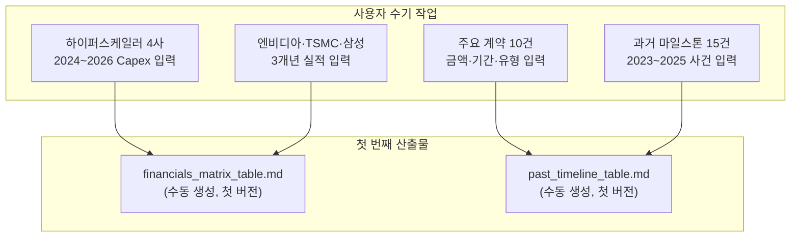

**Phase 1 완료 기준**: DB에 **실적 30건 + 계약 10건 + 마일스톤 15건** 이상 축적. 첫 번째 테이블이 옵시디언에서 열람 가능.

---

### Phase 2: 자동화 파이프라인 (1개월)

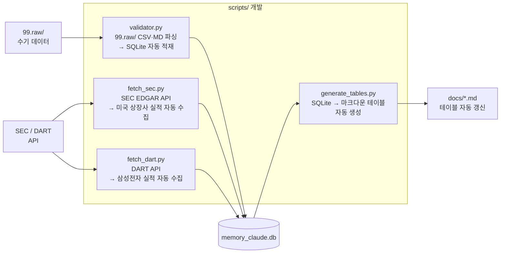

**Phase 2 완료 기준**: `python3 scripts/validator.py && python3 scripts/generate_tables.py` 한 줄로 **99.raw/ → DB → 마크다운 테이블** 전체 파이프라인 자동 실행.

---

### Phase 3: 시각화 & Fab 데이터 (2개월)

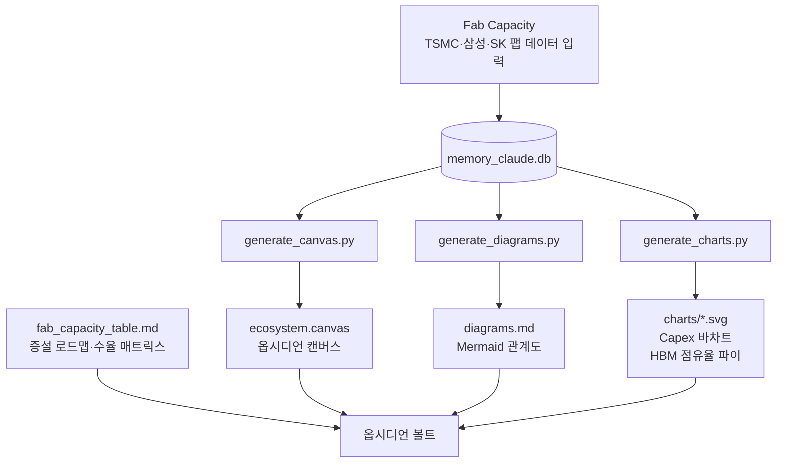

**Phase 3 완료 기준**: 옵시디언을 열면 **캔버스(기업 네트워크) + 다이어그램(관계도) + 차트(Capex 추이) + Fab 테이블(증설 로드맵)**이 즉시 열람 가능.

---

### Phase 4: 웹 대시보드 (3~6개월)

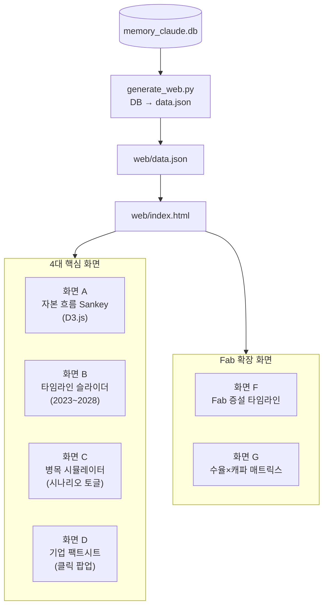

**기술 스택**: HTML5 + Vanilla CSS (다크모드 네온) + Vanilla JS + D3.js (Sankey) + Chart.js

---

### Phase 5: 인텔리전스 자동화 (6~12개월)

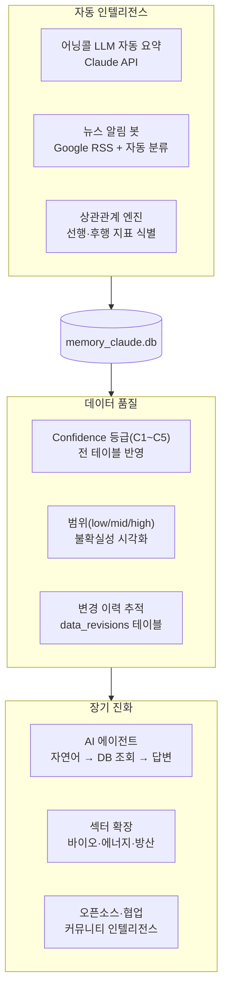

---

## 4. Phase별 투입 시간 & 누적 가치

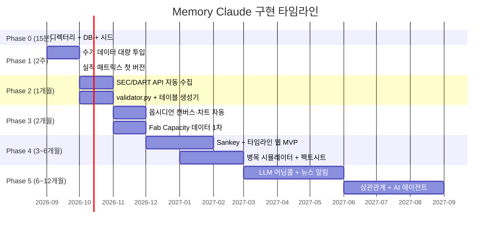

---

## 5. 각 Phase 완료 시 시스템 상태 비교

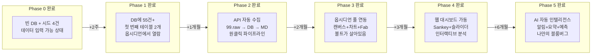

---

## 6. 설계 문서 → 구현 매핑

지금까지 작성한 **문서 9개**가 어느 Phase에서 실현되는지:

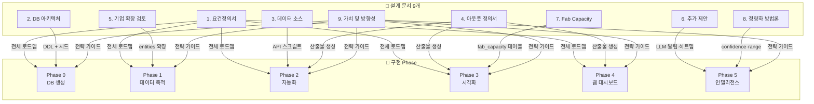

---

## 7. Phase 0 실행 판단 기준

**Phase 0을 지금 실행해야 하는 이유:**

| 질문 | 답변 |
| :--- | :--- |
| 추가 설계가 필요한가? | ❌ 문서 9개로 충분. 더 쓰면 과잉 설계 |
| 기술적 위험이 있는가? | ❌ SQLite + 폴더 생성. 실패 가능성 0% |
| 되돌릴 수 있는가? | ✅ 언제든 삭제 가능. 비가역적 작업 없음 |
| 선행 조건이 있는가? | ❌ 없음. 지금 바로 가능 |
| 소요 시간은? | **15분** |

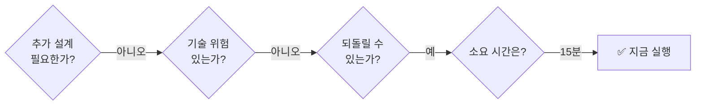

---

## 8. Phase 0 실행 시 구체적 명령어

```bash
# 0-1. 디렉터리 구조 생성
mkdir -p 99.raw/{contracts,financials,milestones,fab_capacity}
mkdir -p data
mkdir -p scripts
mkdir -p web

# 0-2. DDL + 시드 SQL 작성 → 실행
sqlite3 data/memory_claude.db < scripts/init_db.sql

# 0-3. 확인
sqlite3 data/memory_claude.db ".tables"
# 출력: contracts  entities  fab_capacity  financials  milestones

sqlite3 data/memory_claude.db "SELECT count(*) FROM entities;"
# 출력: 21  (21개사 시드)

sqlite3 data/memory_claude.db "SELECT * FROM contracts;"
# 출력: 구글-앤트로픽, 아마존-앤트로픽, 오픈AI-아마존 3건
```

> **다음 단계**: Phase 0 실행 승인 시, `scripts/init_db.sql` 작성 → 실행 → 확인까지 즉시 진행합니다.
