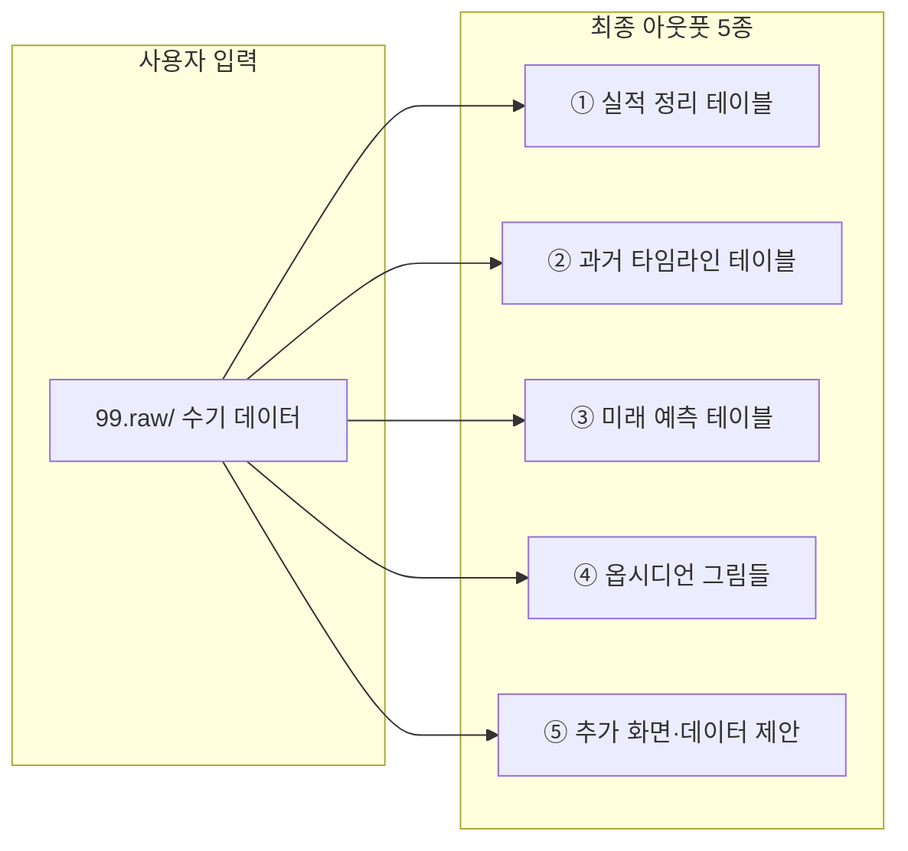
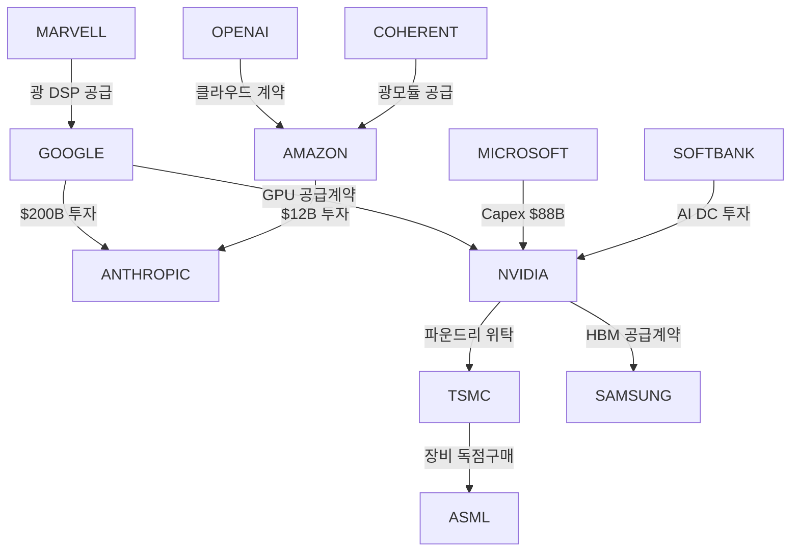
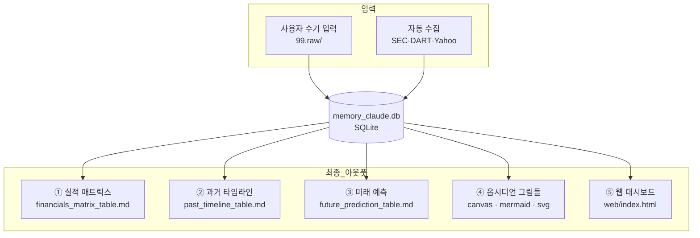

# [최종 아웃풋 정의서] Memory Claude 산출물 명세 및 설명
**문서 버전**: v1.0.0  
**작성일자**: 2026-09-10  
**프로젝트 코드명**: `b_0910_memory_claude`  
**기반 문서**: [docs/human.md](file:///Users/chansoojeon/Library/CloudStorage/Dropbox/03_code/b_0910_memory_claude/docs/human.md)

---

## 1. 아웃풋 전체 조감도

`human.md`에서 사용자가 명시한 최종 산출물은 **5가지 카테고리**입니다:



| # | human.md 원문 | 최종 아웃풋 | 파일 경로 |
| :---: | :--- | :--- | :--- |
| ① | *"실적 데이터를 정리하고"* | **실적 매트릭스 테이블** | `docs/financials_matrix_table.md` |
| ② | *"과거의 각각의 시간을 정리하는 테이블"* | **과거 타임라인 테이블** | `docs/past_timeline_table.md` |
| ③ | *"미래의 사건을 예측하는 테이블"* | **미래 예측 테이블** | `docs/future_prediction_table.md` |
| ④ | *"옵시디언에 뿌려주는 그림들"* | **옵시디언 캔버스·다이어그램·차트** | `docs/ecosystem.canvas` 외 |
| ⑤ | *"그리고 추가적인 화면과 데이터 제안"* | **인터랙티브 웹 대시보드** | `web/index.html` |

---

## 2. 아웃풋 ①: 실적 매트릭스 테이블

### 파일
`docs/financials_matrix_table.md`

### 정의
`human.md`에 언급된 16개 기업의 **연도별 핵심 실적(매출, 영업이익, Capex, HBM 비중)**을 한눈에 비교할 수 있는 정량적 매트릭스 테이블입니다.

### 포함 내용

| 섹션 | 상세 내용 |
| :--- | :--- |
| **하이퍼스케일러 Capex 집중 분석** | 구글·아마존·MS·오라클의 2024~2026년 Capex 추이. human.md 원문 *"2026년 capex 767억 달러"*를 기준으로 각 사의 Capex 규모와 투입 방향(HBM, 자체 칩, 데이터센터) 분석. |
| **16개사 전체 실적 매트릭스** | 기업별 3개년(2024 확정 / 2025 확정 / 2026 예상) 매출·영업이익·Capex·HBM 비중을 하나의 대형 테이블로 정리. |
| **HBM 시장 점유율 추이** | 삼성전자·SK하이닉스(human.md 미언급이나 삼성 대비 필수)·마이크론 간 HBM 점유율 변화. |

### 테이블 형태 예시

```markdown
| 기업 | 코드 | 기간 | 매출($B) | 영업이익($B) | Capex($B) | HBM 비중 | 핵심 동인 |
| :--- | :--- | :---: | :---: | :---: | :---: | :---: | :--- |
| 구글 | GOOGLE | 2026-FY | $425 | $132 | **$76.7** | - | Capex 767억$ 도달 |
| 삼성전자 | SAMSUNG | 2026-FY | $265 | $52 | $40 | 46% | HBM4 양산 턴어라운드 |
| ... | | | | | | | |
```

### 사용자 가치
- *"실적 데이터를 정리"* → 흩어진 뉴스·공시 속 숫자들을 **단일 비교 테이블**로 응축
- 옵시디언에서 Dataview 쿼리로 즉시 필터링·정렬 가능

---

## 3. 아웃풋 ②: 과거 타임라인 테이블

### 파일
`docs/past_timeline_table.md`

### 정의
2023~2025년에 발생한 **주요 계약, 제품 출시, 실적 발표, 기술 마일스톤**을 시간순으로 나열하는 연대기(Chronicle) 테이블입니다.

### 포함 내용

| 섹션 | 상세 내용 |
| :--- | :--- |
| **계약 연대기** | human.md에 언급된 계약들의 과거 버전 (아마존-앤트로픽 120억$ 등이 언제 시작되었는지) |
| **제품·기술 마일스톤** | GPU 세대 교체(Hopper→Blackwell), HBM 규격(HBM3→HBM3E), 파운드리 공정(4nm→3nm) |
| **실적 전환점** | 삼성전자 반도체 적자→흑자 전환, 엔비디아 매출 폭증 시점 등 |

### 테이블 형태 예시

```markdown
| 날짜 | 기업 | 사건명 | 카테고리 | 중요도 | 의미 |
| :--- | :--- | :--- | :--- | :---: | :--- |
| 2023-06-13 | NVIDIA | H100 매출 폭발 실적 발표 | COMPUTE | CRITICAL | AI GPU 시대 본격 개막 |
| 2024-03-18 | TSMC | CoWoS 캐파 증설 발표 | FOUNDRY | HIGH | 패키징 병목 해소 시작 |
| 2025-11-20 | AMAZON | 앤트로픽 120억$ 추가 투자 | CONTRACT | HIGH | AI 랩 투자 경쟁 본격화 |
| ... | | | | | |
```

### 사용자 가치
- *"과거의 각각의 시간을 정리"* → 지금의 업황이 어떤 과거 결정의 결과인지 **인과관계 추적**
- 미래 예측 테이블(③)과 연결하면 과거→현재→미래의 **연속적 내러티브** 구성 가능

---

## 4. 아웃풋 ③: 미래 예측 테이블

### 파일
`docs/future_prediction_table.md`

### 정의
2026~2028년에 **확정된 계약 이행, 예정된 제품 출시, 예측 가능한 업황 전환점**을 시간순으로 정리하는 미래 로드맵 테이블입니다.

### 포함 내용

| 섹션 | 상세 내용 |
| :--- | :--- |
| **확정/예정 계약 로드맵** | 구글-앤트로픽 2000억$ 집행 일정, 엔비디아 GPU 공급계약 인도 시점, TSMC-ASML 장비 인도 등 |
| **연도별 기술 전환 예측** | **2026**: 삼성 HBM4 양산, 엔비디아 Rubin 출시, TSMC 2nm 가동 / **2027**: 1.6T 광통신 / **2028**: AGI 접근, 에너지 병목 |
| **공급망 병목 스트레스 테스트** | 시나리오별(전력 부족, HBM 수율 병목, CoWoS 캐파 병목) 수혜·피해 기업 분석 |

### 테이블 형태 예시

```markdown
| 예측 시점 | 기업 | 사건명 | 카테고리 | 중요도 | 시나리오 설명 |
| :--- | :--- | :--- | :--- | :---: | :--- |
| 2026-Q2 | TSMC | 2nm 양산 개시 | FOUNDRY | CRITICAL | 애플·엔비디아 초기 캐파 배정 |
| 2026-Q3 | 삼성전자 | HBM4 16단 양산 인도 | MEMORY | CRITICAL | 엔비디아 Rubin향 메인 공급 |
| 2027-Q1 | 마벨/코히어런트 | 1.6T 광트랜시버 전면 배치 | OPTICAL | HIGH | 데이터센터 인터커넥트 세대교체 |
| 2028-H2 | OpenAI | AGI 수준 모델 학습 완료 | AI_MODEL | CRITICAL | 100만 GPU 클러스터 기반 |
```

### 사용자 가치
- *"미래의 사건을 예측하는 테이블"* → 확정된 계약 금액과 로드맵을 기반으로 **근거 있는 예측**
- human.md의 핵심 질문 *"2026, 2027, 2028년의 업황과 자본과 기술의 흐름을 읽어낼 수 있을까"*에 대한 직접적 답변

---

## 5. 아웃풋 ④: 옵시디언에 뿌려주는 그림들

### 파일들
| 산출물 | 파일 경로 | 형식 |
| :--- | :--- | :--- |
| **생태계 캔버스** | `docs/ecosystem.canvas` | 옵시디언 Canvas JSON |
| **Mermaid 관계 다이어그램** | `docs/diagrams.md` | Mermaid 코드 블록 |
| **Capex 추이 바차트** | `docs/charts/capex_trend.svg` | SVG 이미지 |
| **HBM 점유율 파이차트** | `docs/charts/hbm_share.svg` | SVG 이미지 |
| **자본 흐름 Sankey** | `docs/charts/capital_sankey.svg` | SVG 이미지 |

### 정의
옵시디언 볼트에 **바로 임베딩**되어 데이터를 시각적으로 소비할 수 있는 그래픽 산출물입니다.

### 상세 산출물 설명

#### 5-1. 생태계 캔버스 (`ecosystem.canvas`)

16개 기업을 **계층별 카드**로 배치하고, 기업 간 **자본·부품 흐름을 화살표**로 연결하는 옵시디언 Canvas 파일.

```text
┌─────────────────────────────────────────────────────────┐
│                    [AI 프론티어 랩]                       │
│            ┌──────────┐  ┌──────────┐                   │
│            │ 앤트로픽  │  │  오픈AI  │                    │
│            └────┬─────┘  └────┬─────┘                   │
│      $200B ↑    │    계약  ↑  │                          │
│  ┌─────────┴────┴────────┴───┴──────────┐              │
│  │          [하이퍼스케일러]               │              │
│  │  구글  │  아마존  │  MS  │  오라클     │              │
│  └──┬──────┬──────┬──────┬───────────────┘              │
│     │ GPU  │      │      │ Capex $76.7B+                │
│  ┌──┴──────┴──────┴──────┴───┐                          │
│  │     [컴퓨팅] 엔비디아      │                          │
│  └──────────┬────────────────┘                          │
│    파운드리  │  HBM                                      │
│  ┌──────────┴──┐  ┌───────────────┐  ┌────────────────┐│
│  │[파운드리]   │  │[메모리]       │  │[광통신]        ││
│  │TSMC · ASML  │  │삼성 · 샌디스크│  │마벨 · 노발리   ││
│  └─────────────┘  └───────────────┘  └────────────────┘│
│  ┌─────────────────────────────────────────────────────┐│
│  │   [인프라 특수] 스페이스X · 소프트뱅크 · 애플        ││
│  └─────────────────────────────────────────────────────┘│
└─────────────────────────────────────────────────────────┘
```

- **녹색 화살표**: 자본 지출 (Capex 흐름)
- **파란색 화살표**: 칩·GPU 공급
- **주황색 화살표**: 메모리(HBM)·장비 납품
- **보라색 화살표**: 광통신·인터커넥트 공급

#### 5-2. Mermaid 관계 다이어그램 (`diagrams.md`)



옵시디언에서 마크다운 노트에 삽입하면 자동 렌더링됩니다.

#### 5-3. 차트 이미지 (SVG/PNG)

| 차트명 | 시각화 내용 | 활용 |
| :--- | :--- | :--- |
| **Capex 추이 바차트** | 구글·아마존·MS·오라클의 2024→2025→2026 Capex 막대 그래프 | 투자 규모 직관적 비교 |
| **HBM 점유율 파이차트** | 삼성전자 vs SK하이닉스 vs 마이크론 연도별 점유율 | 메모리 세력 변화 시각화 |
| **자본 흐름 Sankey** | 하이퍼스케일러→칩→파운드리→메모리 자본 흐름 | 돈의 물줄기를 한 장으로 |

옵시디언에서 `![[capex_trend.svg]]`로 바로 삽입 가능합니다.

---

## 6. 아웃풋 ⑤: 추가 화면 및 데이터 제안 (웹 대시보드)

### 파일
`web/index.html` (로컬 브라우저에서 실행)

### 정의
human.md에서 *"추가적인 화면과 데이터 제안"*이라고 명시한 부분에 해당합니다. 옵시디언 마크다운의 한계를 넘어, **인터랙티브하게 데이터를 탐색**할 수 있는 웹 대시보드입니다.

### 4대 핵심 화면

#### 화면 A: 자본 폭포수 Sankey Diagram

| 항목 | 설명 |
| :--- | :--- |
| **목적** | 하이퍼스케일러 Capex가 최종적으로 **누구의 지갑으로 흘러가는지** 추적 |
| **구조** | 좌측(발주처: 구글·아마존·MS) → 중앙(설계사: 엔비디아) → 우측(제조사: TSMC·삼성·마벨) |
| **인터랙션** | 마우스 호버 시 계약명과 금액 툴팁 (예: "구글-앤트로픽 $200B") |
| **데이터 원천** | DB `contracts` 테이블의 `amount_usd_b` 필드 |

#### 화면 B: 2023~2028 시간여행 슬라이더

| 항목 | 설명 |
| :--- | :--- |
| **목적** | human.md 핵심 질문 *"2026, 2027, 2028년의 업황과 자본과 기술의 흐름"*을 **시간 축을 드래그하며** 체험 |
| **동적 변화** | GPU 아키텍처, HBM 규격, 통신 속도, 파운드리 공정이 슬라이더 위치에 따라 전환 |
| **데이터 원천** | DB `milestones` 테이블 (is_future = 0/1) |

#### 화면 C: 공급망 병목 시뮬레이터

| 항목 | 설명 |
| :--- | :--- |
| **목적** | 미래 불확실성 시나리오를 **토글 스위치**로 켜고 끄며 수혜/피해 기업 확인 |
| **시나리오** | A: 데이터센터 전력 부족 / B: HBM4 수율 병목 / C: TSMC CoWoS 캐파 병목 |
| **데이터 원천** | DB `milestones` 테이블 + 사용자 시나리오 가설 (99.raw) |

#### 화면 D: 기업별 팩트시트 팝업

| 항목 | 설명 |
| :--- | :--- |
| **목적** | 16개 기업 중 하나를 클릭하면 **실적·계약·역할**을 요약한 카드가 팝업 |
| **포함 정보** | 3개년 실적 미니 차트, 주요 계약 리스트, 밸류체인 내 위치 |
| **데이터 원천** | DB `entities` + `financials` + `contracts` 테이블 조인 |

### 기술 스택

| 구분 | 기술 |
| :--- | :--- |
| **구조** | HTML5 |
| **스타일** | Vanilla CSS (다크모드 네온 하이테크 테마) |
| **로직** | Vanilla JavaScript |
| **시각화** | D3.js (Sankey), Chart.js (바·파이차트) |
| **실행** | `python3 -m http.server 8089` 또는 브라우저에서 직접 열기 |

---

## 7. 아웃풋 간 데이터 흐름 요약



---

## 8. 전체 파일 트리 (최종 아웃풋 중심)

```text
b_0910_memory_claude/
├── docs/
│   ├── human.md                        # 사용자 원본 요구사항
│   ├── ask.md                          # 작업 요청
│   ├── requirements_spec.md            # 요건정의서
│   ├── db_architecture.md              # DB 아키텍처
│   ├── data_sources.md                 # 데이터 소스 정의
│   ├── 2026-09-10_output_spec.md       # 최종 아웃풋 정의서 (본 문서)
│   │
│   │── financials_matrix_table.md      # ← 아웃풋 ①
│   │── past_timeline_table.md          # ← 아웃풋 ②
│   │── future_prediction_table.md      # ← 아웃풋 ③
│   │── ecosystem.canvas                # ← 아웃풋 ④-1
│   │── diagrams.md                     # ← 아웃풋 ④-2
│   └── charts/                         # ← 아웃풋 ④-3
│       ├── capex_trend.svg
│       ├── hbm_share.svg
│       └── capital_sankey.svg
│
├── web/                                # ← 아웃풋 ⑤
│   ├── index.html
│   ├── style.css
│   ├── app.js
│   └── data.json
│
├── data/
│   └── memory_claude.db                # SQLite (중간 처리)
│
├── 99.raw/                             # 입력 (수기)
│   ├── contracts/
│   ├── financials/
│   └── milestones/
│
└── scripts/                            # 파이프라인
    ├── validator.py
    ├── generate_tables.py
    ├── generate_canvas.py
    ├── generate_web.py
    └── pipeline.py
```
