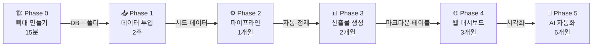
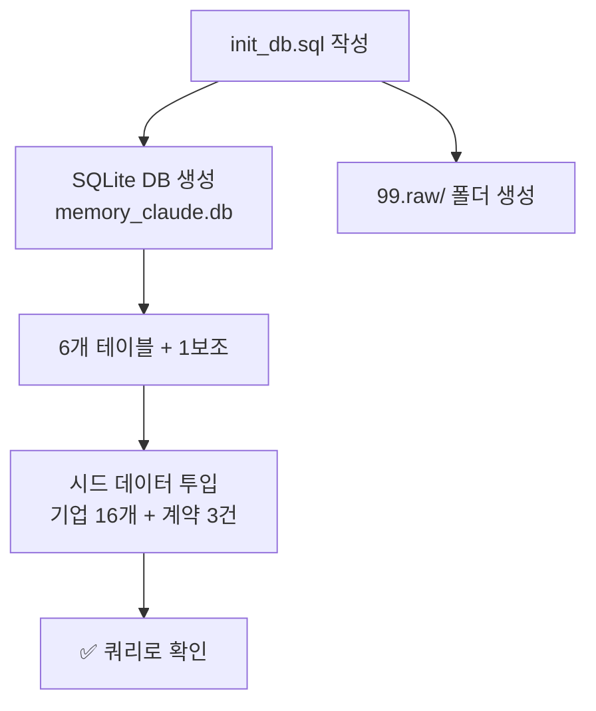
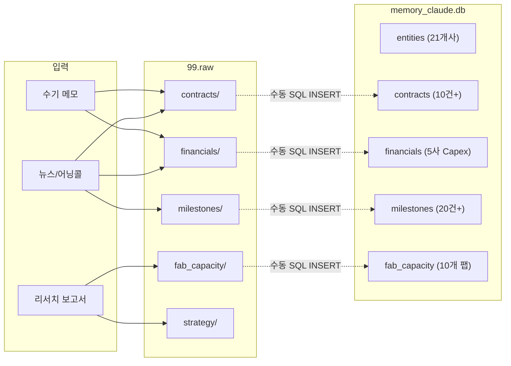
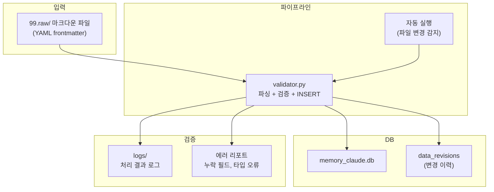
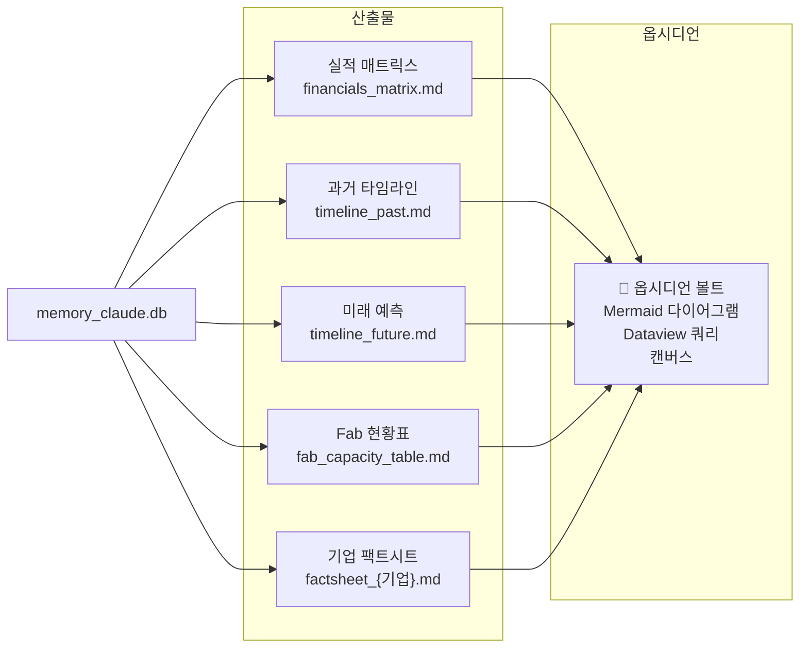
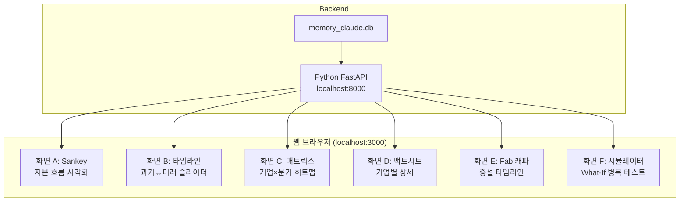
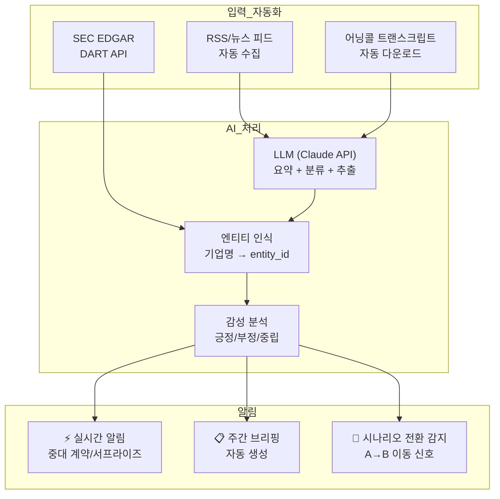
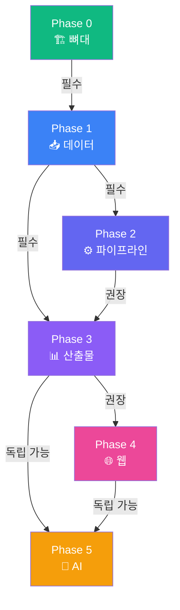

# [Phase별 구현 설계도] Memory Claude 단계별 구현 블루프린트
**작성일자**: 2026-09-10  
**원칙**: 각 Phase는 **독립적으로 동작**해야 함. 다음 Phase 없이도 가치가 있어야 함.

---

## 전체 구조 한눈에 보기



```
투입 시간 누적:
P0 ████░░░░░░░░░░░░░░░░░░░░░░░░░░  15분
P1 ████████░░░░░░░░░░░░░░░░░░░░░░  2주
P2 ████████████████░░░░░░░░░░░░░░  1개월
P3 ████████████████████████░░░░░░  2개월
P4 ████████████████████████████░░  3개월
P5 ██████████████████████████████  6개월
```

---

## Phase 0: 뼈대 만들기 (15분)

> **목표**: 빈 집의 골조를 세운다. DB + 폴더 구조 + 시드 데이터 3건.

### 만들어지는 것

```
b_0910_memory_claude/
├── docs/                    ← 이미 있음 (문서 13개)
├── data/
│   └── memory_claude.db     ← 🆕 SQLite DB (6테이블)
├── scripts/
│   └── init_db.sql          ← 🆕 DDL + 시드 데이터
├── 99.raw/
│   ├── contracts/           ← 🆕 수기 입력 폴더
│   ├── financials/
│   ├── milestones/
│   ├── fab_capacity/
│   └── strategy/
└── .gitignore
```

### 구현 내용



| 작업 | 소요 시간 | 산출물 |
| :--- | :---: | :--- |
| `scripts/init_db.sql` 작성 | 5분 | DDL 6테이블 + entity_aliases |
| `sqlite3 data/memory_claude.db < scripts/init_db.sql` | 1분 | DB 파일 |
| entities 시드 (16개사) | 5분 | 기업 마스터 데이터 |
| contracts 시드 (3건) | 3분 | 구글-앤트로픽, 아마존-앤트로픽, 오픈AI-아마존 |
| `99.raw/` 폴더 5개 생성 | 1분 | 수기 입력 준비 완료 |

### 완료 기준

```sql
-- 이 쿼리가 16행 반환되면 Phase 0 완료
SELECT entity_id, name_ko, layer FROM entities ORDER BY layer;

-- 이 쿼리가 3행 반환되면 시드 데이터 완료
SELECT contract_id, buyer_id, seller_id, value_b FROM contracts;
```

---

## Phase 1: 데이터 투입 (2주)

> **목표**: 16→21개사 확정, 핵심 데이터 수기 입력. DB에 실제 데이터가 쌓인다.

### 데이터 흐름



### 주간 작업표

| 주차 | 작업 | 데이터량 |
| :--- | :--- | :--- |
| **1주차** | Critical 5사 추가 (SK하이닉스, 마이크론, 메타, AMD, 브로드컴) → 21개사 | entities +5행 |
| **1주차** | 하이퍼스케일러 Capex 입력 (2024~2026, 5사) | financials +15행 |
| **1주차** | 주요 계약 7건 추가 (엔비디아-코어위브, 메타-브로드컴 등) | contracts +7행 |
| **2주차** | 핵심 Fab 10개 입력 (TSMC 4, 삼성 2, SK 3, 마이크론 1) | fab_capacity +10행 |
| **2주차** | 과거 마일스톤 15건 + 미래 예측 5건 | milestones +20행 |

### 완료 기준

```sql
-- entities: 21개사
SELECT COUNT(*) FROM entities;  -- = 21

-- contracts: 10건+
SELECT COUNT(*) FROM contracts;  -- >= 10

-- 간단한 관계 확인
SELECT e.name_ko, COUNT(c.contract_id) AS 계약수
FROM entities e LEFT JOIN contracts c ON e.entity_id = c.buyer_id
GROUP BY e.entity_id HAVING 계약수 > 0;
```

---

## Phase 2: 파이프라인 자동화 (1개월)

> **목표**: 99.raw/ → DB 자동 변환. 수기 입력의 부담을 줄인다.

### 시스템 구조



### 만들어지는 파일

```
scripts/
├── init_db.sql          ← Phase 0에서 생성
├── validator.py         ← 🆕 99.raw/ → DB 자동 변환
├── export_tables.py     ← 🆕 DB → 마크다운 테이블 출력
└── check_data.py        ← 🆕 데이터 품질 점검 (누락, 오래된 데이터)
```

### validator.py 핵심 로직

```
1. 99.raw/ 하위 폴더 스캔
2. 각 .md 파일의 YAML frontmatter 파싱
3. 필수 필드 검증 (entity_id 존재 여부, 날짜 포맷 등)
4. DB에 UPSERT (있으면 업데이트, 없으면 삽입)
5. 변경 사항 → data_revisions에 기록
6. 처리 결과 로그 출력
```

### 완료 기준

```bash
# 99.raw/contracts/ 에 마크다운 파일 하나 넣고
echo "---
contract_id: TEST-001
buyer_id: GOOGLE
seller_id: NVIDIA
---
테스트 계약" > 99.raw/contracts/test.md

# validator.py 실행하면 DB에 자동 반영
python scripts/validator.py

# DB에서 확인
sqlite3 data/memory_claude.db "SELECT * FROM contracts WHERE contract_id='TEST-001';"
```

---

## Phase 3: 산출물 생성 (2개월)

> **목표**: DB 데이터를 사람이 읽을 수 있는 마크다운 테이블·차트로 변환. 옵시디언에서 바로 볼 수 있게.

### 산출물 흐름



### 5개 산출물 요약

| # | 산출물 | 생성 방법 | 포맷 |
| :--- | :--- | :--- | :--- |
| ① | **실적 매트릭스** | `export_tables.py --type matrix` | 기업×분기 피벗 테이블 |
| ② | **과거 타임라인** | `export_tables.py --type past` | 날짜순 이벤트 목록 |
| ③ | **미래 예측** | `export_tables.py --type future` | 예측 이벤트 + Confidence |
| ④ | **Fab 현황표** | `export_tables.py --type fab` | 팹별 WSPM·수율·증설 시점 |
| ⑤ | **기업 팩트시트** | `export_tables.py --type factsheet` | 기업별 1페이지 요약 |

### 완료 기준

```bash
# 스크립트 한 번 실행으로 5개 산출물 자동 생성
python scripts/export_tables.py --all

# docs/ 에 산출물 파일이 생성됨
ls docs/generated/
# financials_matrix.md
# timeline_past.md
# timeline_future.md
# fab_capacity_table.md
# factsheet_NVIDIA.md
# factsheet_TSMC.md
# ...
```

---

## Phase 4: 웹 대시보드 (3개월)

> **목표**: 브라우저에서 인터랙티브하게 데이터를 탐색. Sankey 다이어그램 + 타임라인 슬라이더.

### 시스템 구조



### 화면 스케치

```
┌─────────────────────────────────────────────────────────────┐
│  Memory Claude Dashboard                    [A] [B] [C] [D] │
├─────────────────────────────────────────────────────────────┤
│                                                             │
│  [화면 A: Sankey 자본 흐름]                                  │
│                                                             │
│  구글 ──$76.7B──→ 엔비디아 ──$35B──→ TSMC ──$12B──→ ASML   │
│  아마존 ─$65B──→            ──$18B──→ SK하이닉스             │
│  메타 ──$55B──→             ──$14B──→ 삼성전자               │
│  MS ────$60B──→                                             │
│                                                             │
│  ◄── 2025 ────── 2026 ────── 2027 ────── 2028 ──►          │
│          ▲ 타임라인 슬라이더 (드래그로 시점 이동)              │
│                                                             │
├─────────────────────────────────────────────────────────────┤
│  필터: [전체] [하이퍼스케일러] [컴퓨팅] [메모리] [파운드리]    │
└─────────────────────────────────────────────────────────────┘
```

### 기술 스택

| 구분 | 기술 | 이유 |
| :--- | :--- | :--- |
| 백엔드 | Python + FastAPI | DB와 같은 언어, 가볍고 빠름 |
| 프론트엔드 | HTML + Vanilla JS + D3.js | Sankey·타임라인에 D3 필수 |
| 차트 | D3.js (Sankey, 타임라인), Chart.js (바/히트맵) | 유연한 커스텀 시각화 |
| 배포 | localhost 전용 | 개인 사용, 외부 배포 불필요 |

---

## Phase 5: AI 자동화 (6개월)

> **목표**: 시스템이 능동적으로 인사이트를 제안. 수동 → 반자동 → 자동.

### 자동화 흐름



### 자동화 단계

| 단계 | 내용 | 수동 비중 |
| :--- | :--- | :---: |
| **5-1** | 어닝콜 자동 요약 (LLM) → 99.raw/ 에 자동 저장 | 70% → 30% |
| **5-2** | 뉴스 RSS 자동 분류 + 태깅 | 50% → 10% |
| **5-3** | 주간 브리핑 자동 생성 (마크다운) | 80% → 5% |
| **5-4** | 시나리오 전환 신호 자동 감지 + 알림 | 90% → 10% |
| **5-5** | 대화형 에이전트 ("삼성 HBM4 전망은?") | 100% → 0% |

---

## Phase 간 의존성 요약



| 관계 | 의미 |
| :--- | :--- |
| **필수** | 앞 Phase 없으면 진행 불가 |
| **권장** | 없어도 수동으로 가능하지만, 있으면 훨씬 편함 |
| **독립 가능** | 앞 Phase 없이도 별도 진행 가능 |

---

## 지금 바로 할 일: Phase 0 시작

```bash
# 1. 디렉터리 생성
mkdir -p 99.raw/{contracts,financials,milestones,fab_capacity,strategy}
mkdir -p data scripts

# 2. init_db.sql 작성 → 실행
sqlite3 data/memory_claude.db < scripts/init_db.sql

# 3. 확인
sqlite3 data/memory_claude.db "SELECT entity_id, name_ko FROM entities LIMIT 5;"
```

> **Phase 0이 끝나면, 이 프로젝트는 "문서 프로젝트"에서 "동작하는 시스템"으로 전환됩니다.**
