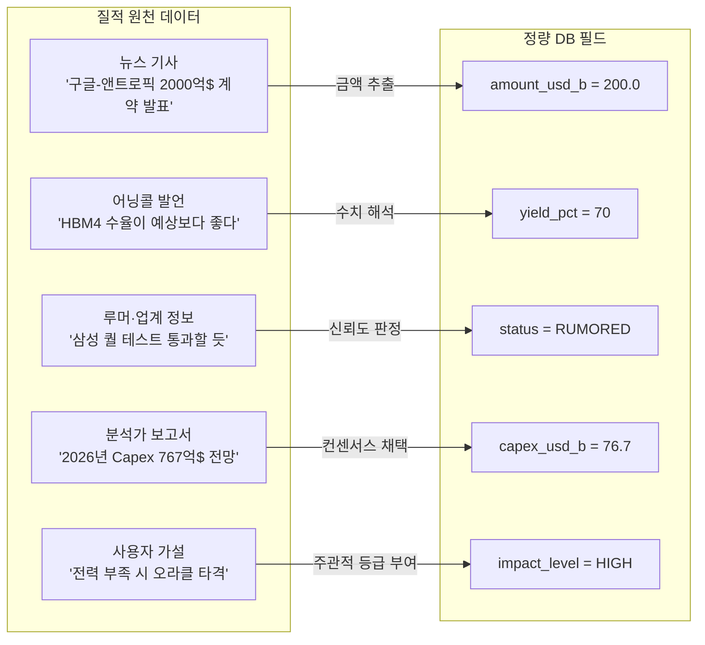
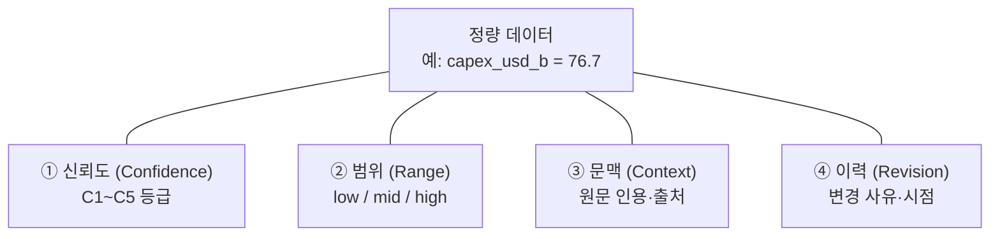

# [정량화 방법론] 질적 데이터의 정량적 전환 체계 및 추가 고려사항
**문서 버전**: v1.0.0  
**작성일자**: 2026-09-10  
**작성 시각**: 10:16  
**프로젝트 코드명**: `b_0910_memory_claude`  
**기반 문서**: 프로젝트 내 전체 문서 (human.md, 요건정의서, DB 아키텍처, 데이터 소스, Fab Capacity, 추가 제안)

---

## 1. 문제 제기: 질적 데이터가 정량화되는 과정에서 무엇이 사라지는가

현재 시스템은 **질적 정보(뉴스, 루머, 어닝콜 발언, 분석가 의견)**를 DB의 **정량 필드(달러, WSPM, 수율%, 중요도)**에 담습니다. 이 과정에서 반드시 짚어야 할 질문이 있습니다:

> **"숫자로 바꿀 때 무엇이 왜곡되고, 무엇이 누락되는가?"**

---

## 2. 현재 시스템의 질적→정량적 전환 지도

### 2.1 전환이 이루어지는 5가지 경로



### 2.2 전환 경로별 정량화 현황 및 문제점

| # | 질적 원천 | 현재 정량화 방식 | 정량화 정밀도 | 핵심 문제 |
| :---: | :--- | :--- | :---: | :--- |
| ① | 계약 금액 뉴스 | 기사에서 **달러 숫자 직접 추출** → `amount_usd_b` | ★★★★★ 높음 | **숫자는 정확하지만 맥락이 사라짐**. "2000억$"이 5년 분할인지, 클라우드 크레딧 포함인지, 지분 투자인지에 따라 실질 가치가 크게 다름 |
| ② | 어닝콜 수율 발언 | CEO/CFO 발언에서 **수치 해석** → `yield_pct` | ★★★☆☆ 보통 | **"예상보다 좋다"는 몇 %인지 모름**. "on track"이 70%인지 85%인지는 맥락에 따라 다름 |
| ③ | 루머·선행 지표 | `status` 필드에 CONFIRMED/RUMORED 2단계 분류 | ★★☆☆☆ 낮음 | **2단계 분류로는 신뢰도 스펙트럼을 못 담음**. "99% 확실한 루머"와 "업계 추측"이 같은 RUMORED로 처리됨 |
| ④ | 분석가 전망치 | 컨센서스 중앙값을 **단일 숫자**로 채택 → `capex_usd_b` | ★★★☆☆ 보통 | **분산(range)이 사라짐**. 컨센서스 $76.7B이지만, 실제 애널리스트 추정치 범위가 $65B~$90B일 수 있음 |
| ⑤ | 사용자 시나리오 가설 | 3단계 `impact_level` (CRITICAL/HIGH/MEDIUM) | ★★☆☆☆ 낮음 | **주관적 판단이 객관적 등급으로 위장됨**. 같은 사건도 사용자에 따라 HIGH↔MEDIUM 왔다갔다 |

---

## 3. 정량화 정밀도를 높이기 위한 개선 제안

### 3.1 제안 ①: 신뢰도 5단계 등급 체계 (Confidence Level)

**현재 문제**: `status` 필드가 CONFIRMED/RUMORED 2단계 뿐.

**개선**: 모든 정량 데이터에 **5단계 신뢰도(confidence)**를 부여.

| 등급 | 코드 | 정의 | 예시 |
| :---: | :--- | :--- | :--- |
| **C5** | `OFFICIAL` | 정부 공시·SEC 제출·기업 공식 IR 발표 | SEC 10-Q에 기재된 Capex $76.7B |
| **C4** | `CONFIRMED` | 복수 언론이 보도한 공식 계약·실적 | "구글-앤트로픽 2000억$ 계약" (복수 보도) |
| **C3** | `CREDIBLE` | 신뢰할 만한 단일 소스 (SemiAnalysis, The Information) | "삼성 HBM4 퀄 통과 임박" — SemiAnalysis 단독 보도 |
| **C2** | `ESTIMATED` | 분석가 추정·컨센서스·모델 기반 계산 | 증권사 리포트의 삼성전자 2026 영업이익 전망 |
| **C1** | `SPECULATIVE` | 사용자 가설·업계 루머·SNS 정보 | "원전 SMR이 2년 지연될 수 있다" |

**DB 반영**: 모든 테이블에 `confidence` TEXT 필드 추가.

```sql
ALTER TABLE contracts ADD COLUMN confidence TEXT DEFAULT 'C4';
ALTER TABLE financials ADD COLUMN confidence TEXT DEFAULT 'C2';
ALTER TABLE milestones ADD COLUMN confidence TEXT DEFAULT 'C2';
ALTER TABLE fab_capacity ADD COLUMN confidence TEXT DEFAULT 'C3';
```

**산출물 반영**: 테이블 출력 시 신뢰도에 따라 시각적 표기.

```markdown
| 기업 | Capex($B) | 신뢰도 | 출처 |
| 구글 | $76.7 | C5 🟢 | SEC 10-Q |
| 삼성전자 | $40.0 | C2 🟡 | 증권사 컨센서스 |
| 앤트로픽 | $8.0 | C1 🔴 | 업계 추정 |
```

---

### 3.2 제안 ②: 숫자의 범위(Range) 보존

**현재 문제**: 모든 정량값이 **단일 포인트 추정치**. `capex_usd_b = 76.7`만 저장하면 불확실성의 폭을 알 수 없음.

**개선**: 핵심 수치에 **하한(low)·중앙(mid)·상한(high)** 3중 값을 저장.

```sql
-- financials 테이블 확장
ALTER TABLE financials ADD COLUMN revenue_low REAL;
ALTER TABLE financials ADD COLUMN revenue_high REAL;
ALTER TABLE financials ADD COLUMN capex_low REAL;
ALTER TABLE financials ADD COLUMN capex_high REAL;
ALTER TABLE financials ADD COLUMN op_income_low REAL;
ALTER TABLE financials ADD COLUMN op_income_high REAL;
```

**99.raw 입력 예시:**

```csv
entity_id,period,is_forecast,capex_usd_b,capex_low,capex_high,confidence,key_notes
GOOGLE,2026-FY,TRUE,76.7,70.0,85.0,C5,"SEC 가이던스 기반. 범위는 증권사 컨센서스"
SAMSUNG,2026-FY,TRUE,40.0,35.0,48.0,C2,"증권사 5곳 평균. 하한=보수적, 상한=HBM4 수율 상회 시"
```

**시각화**: 바차트에서 단일 막대가 아닌 **오차 막대(Error Bar)** 또는 **범위 밴드** 표시.

```
구글 Capex 2026: ████████████████████ $76.7B
                 [──── $70.0B ────────── $85.0B ────]
삼성 Capex 2026: ████████████ $40.0B
                 [── $35.0B ────── $48.0B ──]
```

---

### 3.3 제안 ③: 계약 금액의 실질 가치 분해 (Contract Decomposition)

**현재 문제**: "구글-앤트로픽 2000억$"이 `amount_usd_b = 200.0`으로만 저장됨. 실체가 뭔지 모름.

**개선**: 대형 계약의 구성 요소를 분해하여 저장.

```sql
-- 계약 분해 테이블 (신규)
CREATE TABLE IF NOT EXISTS contract_components (
    id              INTEGER PRIMARY KEY AUTOINCREMENT,
    contract_id     TEXT NOT NULL REFERENCES contracts(contract_id),
    component_type  TEXT NOT NULL,
        -- CASH_INVESTMENT: 현금 지분 투자
        -- CLOUD_CREDIT: 클라우드 크레딧 (실제 현금 이동 아님)
        -- REVENUE_COMMITMENT: 최소 구매 보장
        -- EQUITY_STAKE: 지분 취득
        -- HARDWARE_SUPPLY: 하드웨어 납품 계약
    amount_usd_b    REAL,
    duration_years  INTEGER,
    annual_value_b  REAL,       -- 연환산 가치
    is_cash_outflow BOOLEAN,    -- 실제 현금 유출 여부
    notes           TEXT
);
```

**예시: 구글-앤트로픽 $200B 분해**

| 구성요소 | 유형 | 금액($B) | 기간 | 연환산 | 현금 유출? | 해석 |
| :--- | :--- | :---: | :---: | :---: | :---: | :--- |
| 클라우드 크레딧 | CLOUD_CREDIT | $120.0 | 5년 | $24.0 | ❌ 아님 | TPU 사용권이지 현금 이동이 아님 |
| 현금 지분 투자 | CASH_INVESTMENT | $40.0 | 즉시 | $40.0 | ✅ 현금 | 실제 구글→앤트로픽 현금 이전 |
| 최소 매출 보장 | REVENUE_COMMITMENT | $40.0 | 5년 | $8.0 | ✅ 현금 | 앤트로픽이 구글 API로 올리는 매출 보장 |
| **합계** | | **$200.0** | | | | **실제 현금 가치 $80B, 크레딧 $120B** |

**가치**: 헤드라인의 $200B과 실질 현금 $80B의 차이는 **2.5배**. 이 차이를 무시하면 자본 흐름도(Sankey)가 크게 왜곡됨.

---

### 3.4 제안 ④: 시간 가중 가치 (Time-Weighted Value)

**현재 문제**: 계약 금액이 계약 기간 전체 합산으로만 저장됨. 5년간 $200B인 계약과 2년간 $50B인 계약의 **연간 임팩트**가 다른데 구분 안 됨.

**개선**: `annual_value_b` (연환산 가치) 파생 필드 추가.

| 계약 | 총액($B) | 기간 | 연환산($B/yr) | 올바른 비교 |
| :--- | :---: | :---: | :---: | :--- |
| 구글-앤트로픽 | $200.0 | 5년 | **$40.0/yr** | 연간 400억$ |
| 아마존-앤트로픽 | $12.0 | 3년 | **$4.0/yr** | 연간 40억$ |
| 엔비디아-코어위브 | $15.0 | 2년 | **$7.5/yr** | 연간 75억$ |

헤드라인 금액만 보면 엔비디아-코어위브($15B)가 아마존-앤트로픽($12B)보다 약간 크지만, **연환산으로는 거의 2배** 차이. Sankey 다이어그램에서 연환산을 써야 실질적 자본 흐름이 정확해짐.

```sql
-- contracts 테이블에 파생 필드 추가 (또는 뷰로 계산)
CREATE VIEW IF NOT EXISTS v_annualized_contracts AS
SELECT
    *,
    CASE
        WHEN duration_years > 0 THEN amount_usd_b / duration_years
        ELSE amount_usd_b
    END AS annual_value_b
FROM contracts
WHERE amount_usd_b IS NOT NULL;
```

---

### 3.5 제안 ⑤: 정성적 컨텍스트 보존 필드 (Qualitative Context)

**현재 문제**: 숫자로 바꾸면서 **원래 문맥**이 사라짐.

**개선**: 모든 테이블에 `qual_context` 텍스트 필드를 추가. 숫자의 근거가 되는 원문 인용을 보존.

```sql
ALTER TABLE financials ADD COLUMN qual_context TEXT;
ALTER TABLE fab_capacity ADD COLUMN qual_context TEXT;
```

**입력 예시:**

```csv
entity_id,capex_usd_b,confidence,qual_context
GOOGLE,76.7,C5,"CEO Sundar Pichai, Q2 2026 어닝콜: 'We expect full-year capex of approximately $76 to $78 billion, with the majority going to technical infrastructure including AI-optimized data centers.'"
SAMSUNG,40.0,C2,"미래에셋 리포트 2026-08-15: '삼성전자 2026년 설비투자는 HBM4 양산 라인 확장을 반영하여 40조원(약 $40B)으로 전망하되, HBM4 수율이 70% 이상이면 $48B까지 상향 가능'"
```

**가치**: 나중에 숫자가 의심스러울 때, **왜 이 숫자가 들어왔는지** 원문을 추적 가능. 데이터 감사(Audit Trail)의 핵심.

---

### 3.6 제안 ⑥: 영향도 정량 스코어링 매트릭스 (Impact Scoring)

**현재 문제**: `impact_level`이 CRITICAL/HIGH/MEDIUM 3단계 주관적 분류. 사용자마다 다르게 판단.

**개선**: 4개 차원의 점수를 합산하여 **정량적 영향도 점수(0~100)**를 산출.

| 차원 | 가중치 | 1점 (낮음) | 3점 (보통) | 5점 (높음) |
| :--- | :---: | :--- | :--- | :--- |
| **자본 규모** | 30% | < $1B | $1B ~ $10B | > $10B |
| **기업 수 영향** | 25% | 1~2개사 | 3~5개사 | 6개사+ |
| **시간적 파급** | 25% | 1분기 이내 | 1~2년 | 3년 이상 |
| **대체 불가성** | 20% | 대체재 多 | 제한적 대체 | 독점/유일 |

**계산 예시:**

| 이벤트 | 자본 | 기업 수 | 시간 | 대체불가 | **총점** | 등급 |
| :--- | :---: | :---: | :---: | :---: | :---: | :---: |
| 구글-앤트로픽 $200B | 5 (30%) | 3 (25%) | 5 (25%) | 3 (20%) | **82** | CRITICAL |
| TSMC N2 양산 | 5 | 5 | 5 | 5 | **100** | CRITICAL |
| 삼성 HBM4 퀄 통과 | 3 | 3 | 3 | 3 | **60** | HIGH |
| 샌디스크 128TB SSD | 1 | 1 | 1 | 1 | **20** | LOW |

```sql
ALTER TABLE milestones ADD COLUMN impact_score INTEGER;
-- 계산: (capital_score*0.3 + entity_count_score*0.25 + time_horizon_score*0.25 + irreplaceability_score*0.2) * 20
```

**가치**: "이 이벤트가 얼마나 중요한가?"라는 질문에 주관적 느낌이 아닌 **재현 가능한 점수**로 답변.

---

### 3.7 제안 ⑦: 데이터 변경 이력 (Revision History)

**현재 문제**: 숫자가 바뀌어도 **이전 값이 사라짐**. 삼성전자 2026 영업이익 전망이 ₩48조에서 ₩52조로 상향되면, 왜 바뀌었는지 추적 불가.

**개선**: 핵심 수치 변경 시 이력을 별도 테이블에 보존.

```sql
CREATE TABLE IF NOT EXISTS data_revisions (
    id              INTEGER PRIMARY KEY AUTOINCREMENT,
    table_name      TEXT NOT NULL,       -- 'financials', 'contracts', 'fab_capacity'
    record_id       TEXT NOT NULL,       -- 해당 레코드의 PK
    field_name      TEXT NOT NULL,       -- 변경된 필드명
    old_value       TEXT,
    new_value       TEXT,
    revision_date   TEXT NOT NULL,
    reason          TEXT,                -- 변경 사유
    source          TEXT,                -- 변경 근거 출처
    created_at      TEXT DEFAULT (datetime('now'))
);
```

**예시:**

```
table: financials | record: SAMSUNG-2026-FY | field: op_income_usd_b
old: 48.0 → new: 52.0
reason: "2026-Q2 실적 서프라이즈, HBM4 수율 70% 달성으로 전망 상향"
source: "미래에셋 2026-08-20 리포트"
```

**가치**: 미래 예측 테이블의 숫자가 왜 바뀌었는지 **시간순 감사 추적**. 나중에 "내가 왜 이 숫자를 넣었지?"라는 질문에 답변 가능.

---

## 4. 추가로 고려해야 할 정량화 난제

### 4.1 비상장사 밸류에이션 추정의 한계

| 기업 | 문제 | 현실적 대안 |
| :--- | :--- | :--- |
| **앤트로픽** | 공시 의무 없음. 매출 $10.5B은 언론 보도 기반 추정 | 구글·아마존 투자 라운드 밸류에이션에서 역산 |
| **오픈AI** | 2025년 비영리→영리 전환 과정에서 회계 기준 변동 | 매출은 공개 발표 기준, 비용은 컴퓨트 크레딧 추정 |
| **스페이스X** | 스타링크 매출과 로켓 매출이 혼합, 분리 공시 없음 | 스타링크 가입자 수 × ARPU로 역산 |
| **코어위브** | 2025년 IPO 직후, 과거 데이터 부족 | IPO S-1 공시 기준 + 분기별 10-Q |

**제안**: 비상장사 데이터에는 반드시 `confidence = C1 또는 C2`를 부여하고, `qual_context`에 추정 방법론을 명시.

---

### 4.2 환율 변동의 영향

**문제**: 삼성전자·SK하이닉스는 원화(₩) 실적, 소프트뱅크는 엔화(¥) 실적. DB는 달러($B) 기준.

| 기업 | 원화 기준 | 적용 환율 | 달러 환산 | 환율 10% 변동 시 |
| :--- | :---: | :---: | :---: | :--- |
| 삼성전자 영업이익 | ₩52조 | 1,350원/$ | $38.5B | ±$3.5B 변동 |
| SK하이닉스 영업이익 | ₩28조 | 1,350원/$ | $20.7B | ±$1.9B 변동 |

**제안**:

```sql
ALTER TABLE financials ADD COLUMN original_currency TEXT DEFAULT 'USD';
ALTER TABLE financials ADD COLUMN exchange_rate REAL;
ALTER TABLE financials ADD COLUMN original_amount REAL;
```

원화 실적을 입력할 때 `original_currency = KRW`, `original_amount = 52000000000000`, `exchange_rate = 1350`을 함께 기록. 환율 변동 시 일괄 재계산 가능.

---

### 4.3 계약의 조건부 가치 (Contingent Value)

**문제**: 많은 계약이 **조건부**이지만, DB에는 단일 금액만 저장됨.

| 계약 | 헤드라인 금액 | 실제 조건 | 실현 확률 |
| :--- | :---: | :--- | :---: |
| 구글-앤트로픽 $200B | $200.0B | "5년간 최대 $200B, 연간 컴퓨트 사용량에 따라 정산" | 60~80% |
| 엔비디아-코어위브 $15B | $15.0B | "Rubin 출하 일정에 연동, 지연 시 감액 가능" | 85~95% |
| TSMC-ASML $8.5B | $8.5B | "High-NA EUV 양산 인증 통과 시" | 90~95% |

**제안**: `contracts` 테이블에 실현 확률 필드 추가.

```sql
ALTER TABLE contracts ADD COLUMN realization_pct REAL DEFAULT 100.0;
ALTER TABLE contracts ADD COLUMN conditions TEXT;  -- 조건 텍스트
```

Sankey 다이어그램에서 **기대 가치 = 금액 × 실현 확률**로 표시하면 더 현실적인 자본 흐름도 생성 가능.

---

### 4.4 기술 세대 간 비교의 어려움

**문제**: HBM3E와 HBM4는 같은 "HBM"이지만 가격·성능·용량이 완전히 다름. WSPM 숫자만으로 비교하면 왜곡됨.

| 지표 | HBM3E (12단) | HBM4 (16단) | 차이 |
| :--- | :---: | :---: | :--- |
| 단가 (개당) | ~$400 | ~$600~800 | 1.5~2배 |
| 대역폭 | 1.2 TB/s | 2.0 TB/s | 1.67배 |
| 용량 (스택) | 24GB | 48GB | 2배 |
| 패키징 난이도 | 상 | 극상 | 수율 차이 |

**제안**: `fab_capacity`에 **세대별 가치 가중치(value_multiplier)** 필드 추가.

```sql
ALTER TABLE fab_capacity ADD COLUMN generation TEXT;  -- HBM3E, HBM4, N3, N2 등
ALTER TABLE fab_capacity ADD COLUMN value_multiplier REAL DEFAULT 1.0;
-- HBM4는 HBM3E 대비 value_multiplier = 1.8 (매출 환산 시)
```

같은 10,000 WSPM이라도 HBM3E 라인의 매출 가치와 HBM4 라인의 매출 가치는 **1.8배 차이**.

---

## 5. 정량화 품질 관리 프레임워크 종합

위 제안들을 통합하면, 모든 정량 데이터에는 **4가지 메타 속성**이 함께 저장되어야 합니다:



| 메타 속성 | 답하는 질문 | DB 필드 |
| :--- | :--- | :--- |
| **① 신뢰도** | "이 숫자를 얼마나 믿을 수 있는가?" | `confidence` (C1~C5) |
| **② 범위** | "실제 값은 어느 범위에 있을 수 있는가?" | `_low`, `_high` 필드 |
| **③ 문맥** | "이 숫자는 어떤 맥락에서 나왔는가?" | `qual_context` |
| **④ 이력** | "이 숫자가 이전에 뭐였고 왜 바뀌었는가?" | `data_revisions` 테이블 |

---

## 6. 산출물 반영: 정량화 품질 표기 가이드

최종 아웃풋(실적 테이블, 미래 예측 테이블 등)에서 숫자를 표기할 때의 **표기 규약**:

```markdown
## 표기 규약

| 표기 | 의미 | 예시 |
| :--- | :--- | :--- |
| **$76.7B** (굵은체) | C5 공식 확정 데이터 | SEC 공시 Capex |
| $76.7B (일반) | C3~C4 신뢰할 만한 데이터 | 어닝콜 발표, 복수 보도 |
| *$40.0B* (이탤릭) | C2 추정치 | 증권사 컨센서스 |
| ~~$8.0B~~ (취소선) | C1 추측·가설 | 업계 루머 |
| $40.0B [$35~48B] | 범위 병기 | 컨센서스 ± 범위 |
| $200.0B → $80.0B 실질 | 조건부 가치 병기 | 크레딧 포함 계약의 실제 현금 |
```

이 규약을 따르면 사용자가 테이블을 볼 때 **어떤 숫자는 확실하고 어떤 숫자는 불확실한지** 직관적으로 파악 가능.
