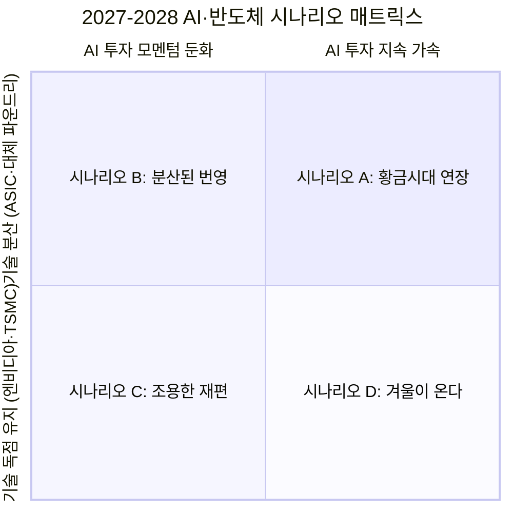
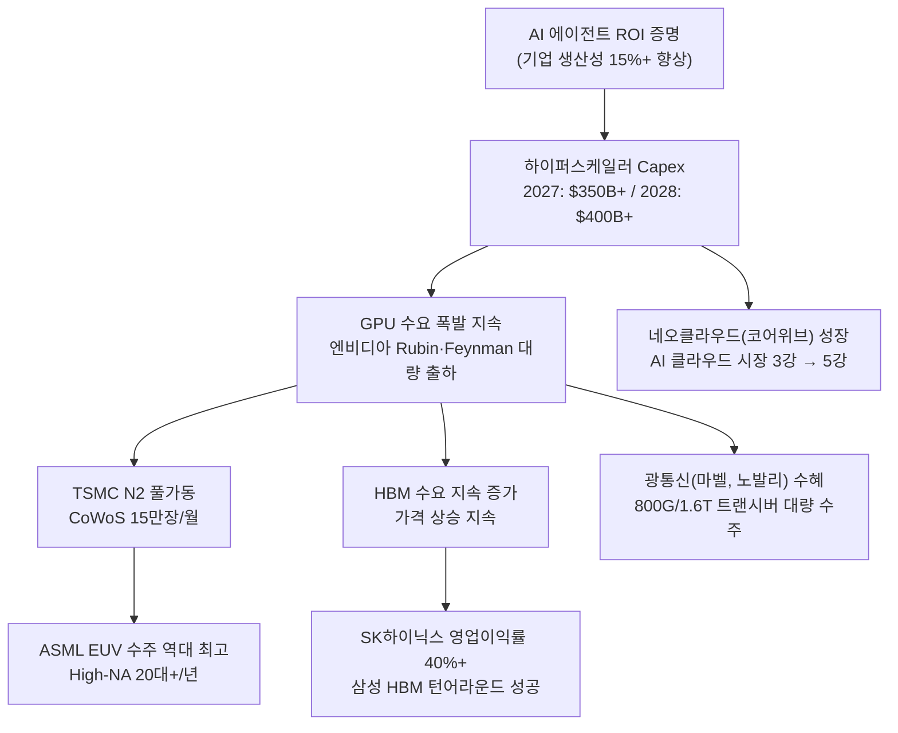
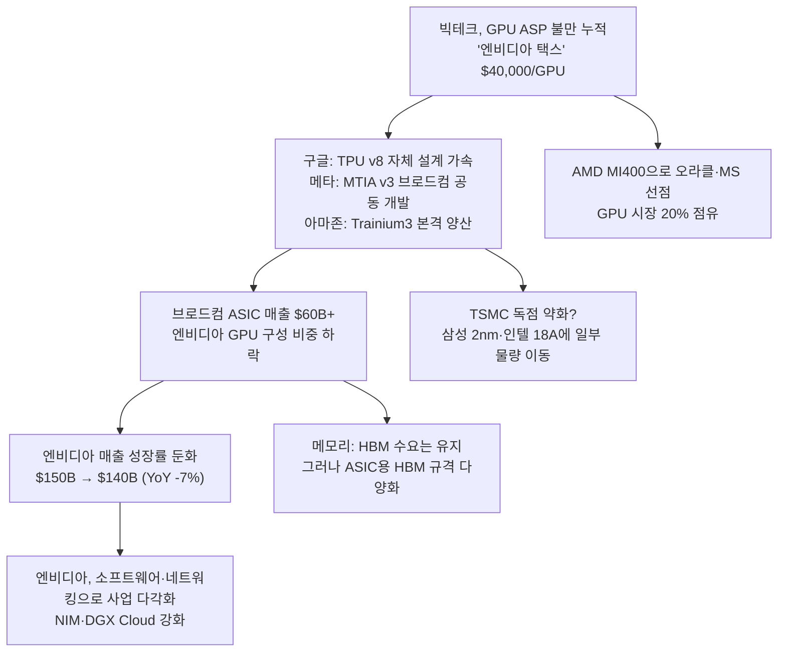
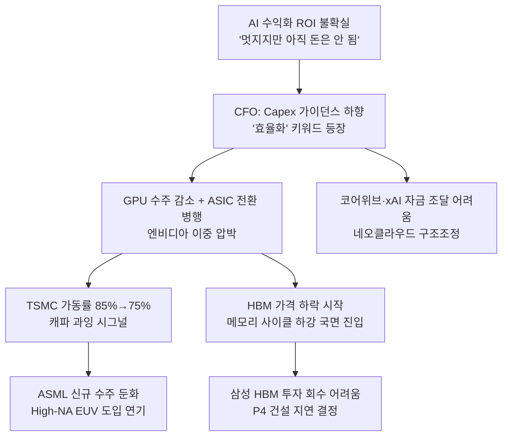
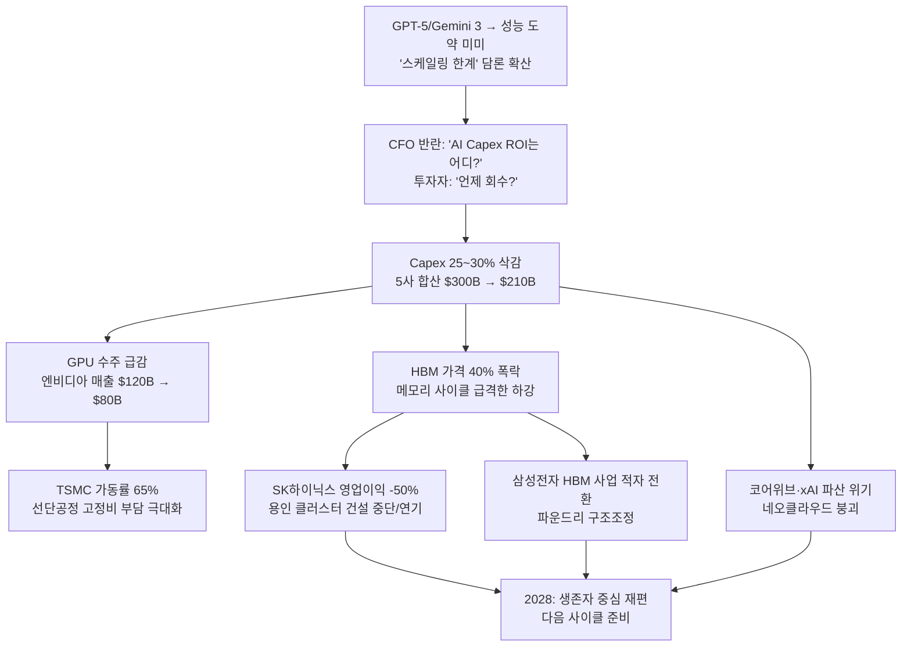
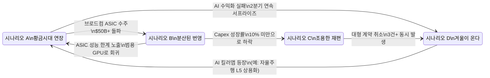
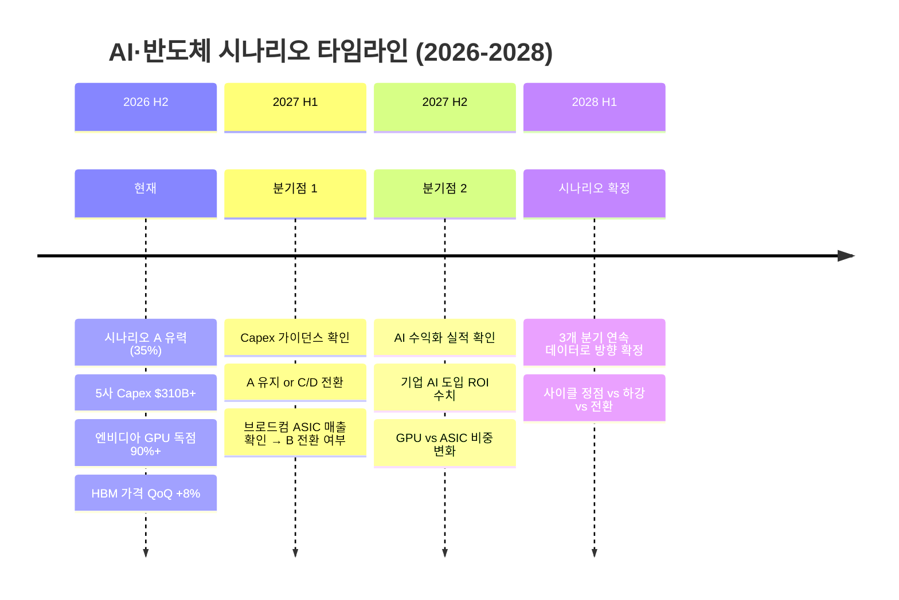

# [전략적 상상력 시나리오] AI·반도체 생태계의 미래를 상상하는 구조화된 사고 실험
**문서 버전**: v1.0.0  
**작성일자**: 2026-09-10  
**프로젝트 코드명**: `b_0910_memory_claude`  
**기반 문서**: human.md → 12개 설계 문서 전체 (요건정의서, DB 아키텍처, Fab Capacity, 기업 전략 통합 등)

---

## 0. 이 문서의 목적

human.md의 핵심 질문:

> *"2026, 2027, 2028년의 업황과 자본과 기술의 흐름을 읽어낼 수 있을까"*

이 질문에 답하려면 **데이터를 쌓는 것**만으로는 부족합니다. **"만약 이렇게 되면?"**이라는 질문을 구조적으로 던져야 합니다. 이것이 **전략적 상상력(Strategic Imagination)**입니다.

### 전략적 상상력이란?

```
데이터 분석    = 과거와 현재를 정리하는 것       → "무슨 일이 있었나?"
전략적 상상력  = 미래의 가능성을 구조화하는 것    → "무슨 일이 일어날 수 있는가?"
                                                → "그때 누가 이기고, 누가 지는가?"
                                                → "나는 그 전에 무엇을 봐야 하는가?"
```

| 일반적 시나리오 분석 | 전략적 상상력 |
| :--- | :--- |
| "엔비디아 매출이 10% 오를 수도, 내릴 수도" | **"만약 구글·메타가 2027년에 GPU 구매를 40% 줄이고 브로드컴 ASIC으로 전환한다면, 엔비디아는 코어위브·xAI 같은 네오클라우드에서 잃은 매출을 메우려 할 것이고, 이는 TSMC CoWoS 라인의 고객 구성을 근본적으로 바꿀 것이다"** |
| 변수 1개, 방향 2개 | **인과사슬**, **2차·3차 효과**, **기업 간 전략적 상호작용** |

---

## 1. 시나리오 프레임워크

### 1.1 불확실성의 2개 축

AI·반도체 생태계의 2027~2028년을 결정하는 **가장 큰 2가지 불확실성**:



| 축 | 핵심 변수 | 현재 상태 (2026-Q3) |
| :--- | :--- | :--- |
| **X축: AI 투자 모멘텀** | 하이퍼스케일러 Capex 방향, AI 수익화 증거, 기업 AI 도입률 | 가속 중 (구글 $76.7B, 5대 합산 $300B+) |
| **Y축: 기술 독점 vs 분산** | 엔비디아 GPU 점유율, 브로드컴 ASIC 성장률, 삼성·인텔 파운드리 경쟁력 | 독점 유지 (엔비디아 90%+, TSMC 선단공정 90%+) |

### 1.2 시나리오별 개요

| 시나리오 | X축 | Y축 | 확률 추정 | 한 줄 요약 |
| :--- | :--- | :--- | :---: | :--- |
| **A: 황금시대 연장** | 가속 지속 | 독점 유지 | 35% | 엔비디아·TSMC·SK하이닉스의 독주, 사이클 정점 연장 |
| **B: 분산된 번영** | 가속 지속 | 분산 진행 | 25% | 파이 자체는 커지지만, 승자가 늘어남 |
| **C: 조용한 재편** | 둔화 | 분산 진행 | 20% | 총 투자 감소 + 기술 대안 부상 = 기존 독점자 이중 압박 |
| **D: 겨울이 온다** | 급격한 둔화 | 독점 유지 | 15% | AI 버블 붕괴, 투자 축소, 수요 절벽 |
| **X: 블랙스완** | 예측 불가 | 예측 불가 | 5% | 지정학 충격, 기술 패러다임 전환 |

---

## 2. 시나리오 A: 황금시대 연장 (Golden Age Extended)

### 2.1 전제 조건

> "AI가 실제로 돈을 벌기 시작하고, 투자가 멈추지 않으며, 독점 구조도 유지된다"

- 하이퍼스케일러 5사 합산 Capex: 2027년 $350B+, 2028년 $400B+ (가속 지속)
- AI 에이전트가 기업 생산성을 측정 가능하게 향상 → ROI 증명
- 엔비디아 Rubin GPU가 ASIC 대비 가격-성능 우위 유지
- TSMC N2 공정 수율 85%+, CoWoS 캐파 15만장/월 달성
- SK하이닉스 HBM4 수율 85% 유지, 삼성 HBM4 수율 70% 달성

### 2.2 인과사슬



### 2.3 기업별 영향 매트릭스

| 기업 | 2027 영향 | 2028 영향 | 핵심 변수 |
| :--- | :--- | :--- | :--- |
| **엔비디아** | 🟢 매출 $150B+, 데이터센터 80% | 🟢 Feynman 세대 출하, 매출 $200B+ | ASIC 전환 속도, TSMC 캐파 배분 |
| **TSMC** | 🟢 N2 풀가동, 매출 $120B+ | 🟢 A16 양산 시작, ASP 상승 | Arizona 팹 수율, EUV 장비 인도 |
| **SK하이닉스** | 🟢 HBM4 독점적 1위, 영업이익 $25B+ | 🟢 용인 클러스터 1차 가동 | 수율 유지, 엔비디아 관계 |
| **삼성전자** | 🟡 HBM4 수율 70% → 2등 안착 | 🟢 P4 양산, HBM4E 경쟁 진입 | 수율 개선 속도가 유일한 변수 |
| **구글** | 🟢 AI 수익화(Cloud+Search AI) | 🟢 TPU v8 + Gemini 4.0 | 검색 광고 자기잠식 속도 |
| **앤트로픽** | 🟢 Claude 5, 기업 B2B 매출 $10B+ | 🟡 IPO 또는 추가 대형 펀딩 | 구글·아마존 양다리 균형 |
| **브로드컴** | 🟡 ASIC 성장하나 GPU가 더 빠르게 성장 | 🟡 ASIC 점유율 10~15% 정체 | 커스텀 칩 설계 리드타임 |

### 2.4 이 시나리오의 리스크 (역설)

> **황금시대의 역설**: 모든 것이 잘 될수록, **버블 붕괴의 크기도 커진다.**

- Capex $400B/년 → 데이터센터 과잉 투자 위험 (2000년 닷컴과 유사)
- GPU ASP $40,000+ → 고객 불만 누적, ASIC 전환 동기 강화
- HBM 가격 상승 → 메모리 기업 과잉 증설 → 2029년 공급 과잉 사이클 시작 가능

### 2.5 Memory Claude DB에서 감지할 신호

| 신호 | DB 테이블 | 쿼리 |
| :--- | :--- | :--- |
| 하이퍼스케일러 Capex 가이던스 상향 | `financials` | `WHERE metric = 'CAPEX' AND period >= '2027' ORDER BY value DESC` |
| GPU 수주 증가 | `contracts` | `WHERE seller_id = 'NVIDIA' AND status = 'CONFIRMED' AND value_b > 5` |
| TSMC 가동률 95%+ 유지 | `fab_capacity` | `WHERE entity_id = 'TSMC' AND utilization_pct > 95` |
| HBM 가격 QoQ 상승 지속 | `milestones` | `WHERE category = 'PRICE' AND entity_type = 'MEMORY'` |

---

## 3. 시나리오 B: 분산된 번영 (Distributed Prosperity)

### 3.1 전제 조건

> "AI 투자는 계속되지만, 엔비디아와 TSMC의 독점이 깨지기 시작한다"

- 하이퍼스케일러 Capex: 2027년 $300B+ (성장 지속, 그러나 구성 변화)
- **구글·메타·아마존이 GPU 비중을 60%→40%로 줄이고 ASIC 40%→60%로 전환**
- 브로드컴 ASIC 매출: 2027년 $60B+ (2026년 $40B 대비 50% 성장)
- AMD MI400이 학습·추론 모두에서 엔비디아 대비 80%+ 성능 달성
- 삼성 파운드리 2nm GAA 수율이 TSMC N2 수율의 90%에 도달
- 인텔 18A 공정으로 AWS Graviton 7 등 대형 고객 1건 이상 확보

### 3.2 인과사슬



### 3.3 기업별 영향 매트릭스

| 기업 | 영향 | 핵심 변화 |
| :--- | :--- | :--- |
| **엔비디아** | 🟡 매출 정체/소폭 하락. 그러나 절대 수준은 여전히 거대 | GPU 독점 90%→65%. 소프트웨어·네트워킹 매출 비중 상승. "하드웨어 기업→플랫폼 기업" 전환 가속 |
| **브로드컴** | 🟢🟢 최대 수혜자. ASIC 매출 $60B+, 기업 가치 $1T+ | 구글·메타·아마존 3사의 핵심 칩 설계 파트너로 부상 |
| **AMD** | 🟢 GPU 점유율 20%, MI400으로 비용 민감 시장 장악 | 오라클·MS의 "엔비디아 대안" 포지션 확립 |
| **TSMC** | 🟡 파운드리 독점은 유지하나, 고객 분산으로 협상력 약화 | ASIC도 TSMC에서 만들어야 하므로 물량은 유지. 그러나 ASP 인상 어려워짐 |
| **삼성 파운드리** | 🟢 2nm GAA로 일부 ASIC 물량 확보 | 엔비디아 외 고객(퀄컴, 구글 일부)으로 포트폴리오 다변화 |
| **SK하이닉스** | 🟡 HBM 수요 유지, 그러나 규격 다양화로 복잡도 증가 | GPU용 HBM + ASIC용 HBM 별도 대응 필요 |
| **코어위브** | 🟡 GPU 클라우드 모델의 매력 감소, ASIC 대응 필요 | 엔비디아 GPU 외에 AMD·커스텀 ASIC도 호스팅해야 생존 |

### 3.4 전략적 상상력 포인트

> **핵심 질문**: "엔비디아의 CUDA 해자는 얼마나 깊은가?"

현재 엔비디아의 독점은 **칩 성능**보다 **CUDA 소프트웨어 생태계**에 기반합니다. ASIC이 칩 성능에서 GPU를 넘어도, 개발자들이 CUDA에서 벗어나지 못하면 전환은 느려집니다.

**그러나**: 구글의 JAX, 메타의 PyTorch 2.0(컴파일러 기반)이 하드웨어 추상화를 진행 중. 2027~2028년에 **"어떤 칩이든 같은 코드로 돌린다"**가 현실이 되면, CUDA 해자가 급격히 얕아집니다.

```
관찰해야 할 것:
  ① PyTorch 2.x의 하드웨어 백엔드 다양화 속도
  ② 구글 JAX + TPU + Gemini의 폐쇄 생태계 확산
  ③ AMD ROCm의 호환성 성숙도
  ④ 브로드컴 ASIC의 소프트웨어 스택 완성도
```

### 3.5 DB 감지 신호

| 신호 | DB 테이블 | 의미 |
| :--- | :--- | :--- |
| 하이퍼스케일러 GPU 구매 비중 하락 | `contracts` | `WHERE buyer_id IN ('GOOGLE','META','AMAZON') AND seller_id = 'NVIDIA'` — 계약 규모 YoY 비교 |
| 브로드컴 ASIC 대형 계약 체결 | `contracts` | `WHERE seller_id = 'BROADCOM' AND value_b > 10` |
| 삼성 파운드리 2nm 고객 확보 | `milestones` | `WHERE entity_id = 'SAMSUNG' AND category = 'FOUNDRY_WIN'` |
| AMD GPU 대형 수주 | `contracts` | `WHERE seller_id = 'AMD' AND product_type = 'GPU'` |

---

## 4. 시나리오 C: 조용한 재편 (Silent Restructuring)

### 4.1 전제 조건

> "AI 투자 모멘텀이 둔화되면서, 동시에 기술 대안도 부상한다. 기존 독점자에게 최악의 조합."

- 하이퍼스케일러 Capex 성장률: 2027년 **+5%**(2026년 +35% 대비 급감)
- AI 수익화 지연: "AI로 돈 벌겠다" → "언제 벌 수 있는지 아직 불확실"
- 동시에 ASIC·AMD 대안이 부상 → **줄어든 파이를 더 많은 플레이어가 나눠 가짐**
- 전력 인프라 병목이 현실화 → 데이터센터 증설 속도 제한

### 4.2 인과사슬



### 4.3 기업별 영향 매트릭스

| 기업 | 영향 | 핵심 리스크 |
| :--- | :--- | :--- |
| **엔비디아** | 🔴 매출 성장 정체 또는 역성장. 주가 30~40% 조정 | GPU 수주 감소 + ASIC 전환의 이중 압박. CUDA 해자로 완전 붕괴는 방어 |
| **TSMC** | 🟡 가동률 하락, 그러나 기술 우위로 최후의 승자 | N2 양산 고객 확보 지연. Arizona 팹 투자 부담 |
| **SK하이닉스** | 🔴 HBM 가격 하락, 용인 클러스터 투자 부담 | 사이클 하강기 + 대규모 설비투자의 불일치 |
| **삼성전자** | 🔴🔴 HBM 수율 부진 + 시장 축소 = 최악 | 수율 미달 상태에서 시장이 줄어들면 투자 회수 불가 |
| **브로드컴** | 🟡 ASIC 성장하나, 전체 파이 축소로 기대 이하 | Capex 축소는 ASIC 수주에도 영향 |
| **앤트로픽** | 🔴 기업 가치 재조정. 추가 펀딩 어려움 | 비상장 고비용 기업, 수익 없이 비용만 증가하는 구조 |
| **ASML** | 🟡 신규 장비 수주 지연, 그러나 기존 설치 기반의 서비스 수익 | High-NA EUV 도입 연기는 A16/1nm 양산 지연을 의미 |
| **마벨·노발리** | 🔴 데이터센터 확장 둔화 → 광통신 수주 감소 | AI DC 증설 속도에 직접 연동 |

### 4.4 전략적 상상력 포인트

> **핵심 질문**: "AI 투자 사이클의 '정상적인 조정'과 '버블 붕괴'를 어떻게 구분하는가?"

**구분 기준:**

| 기준 | 정상적 조정 | 버블 붕괴 |
| :--- | :--- | :--- |
| Capex 감소폭 | YoY **-5~15%** | YoY **-30%+** |
| AI 도입률 | 지속 증가 (속도만 감소) | 감소 또는 정체 |
| 주요 기업 실적 | 매출 성장 유지, 마진 압축 | 매출 역성장, 대규모 감손 |
| 인력 변화 | 채용 속도 감소 | **대규모 정리해고** |
| 고객 행동 | 지출 효율화 추구 | **프로젝트 취소** |

### 4.5 DB 감지 신호

| 신호 | DB 테이블 | 의미 |
| :--- | :--- | :--- |
| Capex 가이던스 하향 조정 | `financials` | `WHERE metric = 'CAPEX_GUIDANCE' AND revision = 'DOWN'` |
| GPU 수주 취소 또는 연기 | `contracts` | `WHERE status = 'DELAYED' OR status = 'CANCELLED'` |
| TSMC 가동률 80% 미만 | `fab_capacity` | `WHERE entity_id = 'TSMC' AND utilization_pct < 80` |
| HBM 가격 QoQ 하락 | `milestones` | `WHERE category = 'PRICE' AND direction = 'DOWN'` |
| 네오클라우드 파산/구조조정 뉴스 | `milestones` | `WHERE category = 'RESTRUCTURING'` |

---

## 5. 시나리오 D: 겨울이 온다 (Winter is Coming)

### 5.1 전제 조건

> "AI가 기대에 부응하지 못하고, 대규모 투자 축소가 발생하며, 독점 구조만 남는다"

- 하이퍼스케일러 Capex: 2027년 **-25~30% YoY** 급감
- AI 수익화 실패: "GPT-5가 GPT-4 대비 혁신적 도약이 아님" → 스케일링 법칙 한계론 확산
- 중국 AI 기업(딥시크, 알리바바)이 훨씬 낮은 비용으로 유사 성능 달성 → "비싼 GPU가 필요한가?" 의문
- 전력 인프라 병목이 DC 증설을 물리적으로 차단
- 지정학적 긴장 심화 (대만 해협, 미중 반도체 규제 확대)

### 5.2 인과사슬



### 5.3 기업별 영향 매트릭스

| 기업 | 영향 | 생존 전략 |
| :--- | :--- | :--- |
| **엔비디아** | 🔴🔴 매출 -40%, 주가 -50%+. 그러나 현금 풍부, 사라지지는 않음 | 게이밍·자율주행·로보틱스로 사업 분산. 자사주 매입 확대 |
| **TSMC** | 🔴 가동률 급락, 해외 팹 투자 부담 | 스마트폰·자동차향 안정 수요 기반으로 버텨냄. 최악에도 기술 1위는 변함없음 |
| **SK하이닉스** | 🔴🔴 영업이익 -50~70%, 용인 투자 지연 | HBM은 줄어도 일반 DRAM 사이클 회복 시 반등 여력 |
| **삼성전자** | 🔴🔴🔴 HBM 적자 + 파운드리 적자 = 반도체 부문 전체 위기 | DRAM 1위 포지션으로 버틸 수 있으나, HBM·파운드리 구조조정 불가피 |
| **구글** | 🟡 검색 광고 수익이 완충재. AI 투자 속도 조절하면 이익률 개선 | AI Capex 삭감이 오히려 단기 이익 개선으로 작용 |
| **앤트로픽·오픈AI** | 🔴🔴 기업 가치 급락, M&A 대상 전락 가능 | 구글/아마존/MS에 완전 흡수 가능성. 독립 AI 랩 시대의 종말? |
| **ASML** | 🟡 신규 수주 급감, 그러나 설치 기반 서비스로 최소 수익 유지 | 반도체 사이클은 항상 돌아옴. 독점 지위는 유지 |

### 5.4 전략적 상상력 포인트

> **역설적 기회**: 겨울에 가장 싸게 살 수 있다.

2000년 닷컴 버블 붕괴 후, Amazon은 $6에서 $2로 하락했습니다. 그러나 인터넷 자체는 사라지지 않았고, Amazon은 20년 후 $3,000이 되었습니다.

**AI 겨울이 와도 변하지 않는 것:**
1. 데이터센터의 전력 소비는 늘어만 감 (AI가 아니어도)
2. 반도체 미세화는 멈추지 않음 (물리학의 한계까지)
3. HBM/광통신은 AI 외 다른 용도(자율주행, 메타버스, 국방)에서도 수요 존재
4. 빅테크의 현금 보유량은 어떤 겨울도 견딜 수 있음

```
겨울의 생존자 체크리스트:
  ✅ 현금 > 부채 (유동성)
  ✅ 경쟁자 대비 기술 격차 유지 (TSMC, ASML)
  ✅ 다각화된 매출원 (구글: 검색광고, 삼성: 스마트폰)
  ❌ 단일 고객/단일 제품 의존 (코어위브: 엔비디아 GPU만)
  ❌ 비상장 + 적자 + 고비용 구조 (앤트로픽, 오픈AI)
```

---

## 6. 시나리오 X: 블랙스완 (Black Swan Events)

예측 불가능하지만, 발생 시 모든 시나리오를 무효화하는 사건들.

### 6.1 지정학 블랙스완

#### X-1: 대만 해협 위기

```
트리거: 중국의 대만 군사 봉쇄 또는 실제 침공 시도
  → TSMC 생산 중단 (선단공정 칩의 90% 공급 차단)
    → 엔비디아·AMD·애플·구글 신규 칩 생산 불가
      → GPU/AI 칩 가격 5~10배 폭등
        → AI 산업 18~24개월 동결
          → 삼성 파운드리 반사 수혜? 
            → 그러나 삼성 2nm 수율로는 대체 불가

영향: 글로벌 GDP -2~5% 충격. 2008년 금융위기 이상.
확률: 극히 낮으나 (2~3%), 영향은 카테고리 초월.

관찰 신호:
  - 미국 CHIPS Act 투자 가속 → "보험"의 의미
  - TSMC Arizona/일본/독일 팹 투자 속도 → 분산 노력
  - 대만 주변 군사 활동 빈도
```

#### X-2: 미국-중국 반도체 전면 차단

```
트리거: 미국이 ASML High-NA EUV 수출을 중국 완전 차단 + 중국이 갈륨·게르마늄 수출 보복
  → ASML 매출 15~20% 감소 (중국향)
    → 중국 SMIC 14nm 이하 공정 영구 동결
      → 그러나 성숙 공정(28nm+)에서 중국의 대규모 덤핑 시작
        → 글로벌 성숙 공정 반도체 가격 30% 하락
          → 자동차·IoT 반도체의 가격 경쟁 격화

역설: 선단공정은 서방 독점 강화, 성숙 공정은 중국 범람. 두 시장이 분리된 "반도체 냉전".
```

### 6.2 기술 블랙스완

#### X-3: AGI 또는 AGI 수준 돌파

```
트리거: OpenAI/Google/Anthropic 중 하나가 "범용 인공지능" 수준 달성 공식 발표
  → AI 컴퓨트 수요 무한 확대? 오히려 축소?
    → 시나리오 분기:
      [A] "더 큰 모델이 필요하다" → GPU/HBM 수요 10배 → 모든 기업 수혜
      [B] "이제 추론만 하면 된다" → 학습 수요 급감, 추론 효율 경쟁
           → 에너지 효율적 ASIC이 GPU를 대체
      [C] "너무 위험하다" → 각국 정부 규제, 개발 모라토리엄
           → AI 투자 동결, 겨울보다 더 깊은 빙하기

핵심: AGI가 "좋은 일"인지 "나쁜 일"인지조차 불확실. 
      시장은 확실성이 없으면 일단 매도합니다.
```

#### X-4: 새로운 컴퓨팅 패러다임 등장

```
트리거: 양자 컴퓨터가 특정 AI 작업에서 GPU 대비 100배 효율 달성
  → 현재: 양자 컴퓨터는 상용화 10년+
    → 그러나: 구글 Willow, IBM Condor 등 진전 가속 중
      → 만약 2028년에 1,000 큐비트 안정 작동이 되면?
        → GPU 중심의 AI 인프라 투자 논리 자체가 흔들림
        → "5년 후 GPU가 필요 없을 수 있는데 왜 $400B을 쓰나?"

영향: 직접적이진 않으나, 투자 심리에 큰 영향.
관찰 신호: 구글·IBM·MS의 양자 컴퓨팅 로드맵 진전 속도
```

### 6.3 시장 블랙스완

#### X-5: 엔비디아 M&A 또는 분할

```
트리거: 
  [A] 엔비디아가 ARM을 다시 인수 시도 (또는 TSMC 지분 인수?)
    → 반독점 규제와의 전쟁. 2년+ 소요.
  [B] 미국 정부가 엔비디아를 반독점법으로 분할 (GPU vs 소프트웨어 vs 네트워킹)
    → CUDA + 칩이 분리되면 "풀스택" 전략 붕괴
    → 분리된 GPU 사업부 vs AMD 경쟁 심화

영향: AI 생태계의 권력 구조 자체가 변화.
확률: 분할은 매우 낮음 (<1%), 대형 M&A는 보통 (5~10%)
```

---

## 7. 시나리오 간 전환 신호 맵

> **시나리오는 갑자기 바뀌지 않습니다. 조기 경보 신호가 반드시 선행합니다.**



### 7.1 조기 경보 대시보드 (Memory Claude 구현 시)

| 감시 지표 | 현재 값 (2026-Q3) | A→B 전환 | A→D 전환 | 데이터 소스 |
| :--- | :---: | :---: | :---: | :--- |
| 엔비디아 GPU 점유율 | 90%+ | **<75%** | 90% 유지 | `contracts`, `financials` |
| 5대 합산 Capex YoY | +35% | +20%+ | **<0%** | `financials` |
| 브로드컴 ASIC 매출 | $40B | **$60B+** | $40B 유지 | `financials` |
| HBM 가격 QoQ 변동 | +8% | +5% | **-10%** | `milestones` |
| TSMC 가동률 | 95% | 90% | **<75%** | `fab_capacity` |
| AI 관련 특허 출원 수 | 급증 | 급증 | **감소** | 외부 데이터 |
| 네오클라우드 자금 조달 | 활발 | 보통 | **동결** | `milestones` |

---

## 8. Memory Claude DB에서의 시나리오 관리

### 8.1 `milestones` 테이블을 활용한 시나리오 추적

```sql
-- 시나리오 관련 마일스톤을 별도 카테고리로 관리
INSERT INTO milestones (event_id, entity_id, event_date, category, description, is_forecast, confidence) VALUES

-- 시나리오 A 신호
('SCN-A-001', 'GOOGLE', '2027-Q1', 'SCENARIO_SIGNAL',
 '구글 2027 Capex 가이던스 $85B → 시나리오 A 강화 신호', TRUE, 'C2'),

-- 시나리오 B 신호  
('SCN-B-001', 'BROADCOM', '2027-Q2', 'SCENARIO_SIGNAL',
 '브로드컴 ASIC 매출 $15B/분기 돌파 → 시나리오 B 전환 신호', TRUE, 'C2'),

-- 시나리오 D 신호
('SCN-D-001', 'META', '2027-Q1', 'SCENARIO_SIGNAL',
 '메타 AI Capex 20% 삭감 발표 → 시나리오 D 경고', TRUE, 'C1');
```

### 8.2 시나리오별 기업 포지셔닝 요약 테이블

```sql
-- entity_strategy 테이블에 시나리오별 포지셔닝 저장
INSERT INTO entity_strategy (entity_id, dimension, summary, detail, confidence, as_of_date) VALUES

('NVIDIA', 'SCENARIO_POSITIONING',
 '시나리오 A: 최대 수혜 | B: 성장 둔화 | C: 이중 압박 | D: 대폭 조정',
 'A: 매출 $200B+ / B: $140B (ASIC 잠식) / C: $100B (수요+경쟁 이중 감소) / D: $80B (겨울)',
 'C2', '2026-09'),

('SK_HYNIX', 'SCENARIO_POSITIONING',
 '시나리오 A: HBM 독주 | B: 규격 다양화 부담 | C: 사이클 하강 | D: 용인 투자 위기',
 'A: 영업이익 $25B+ / B: $18B / C: $12B (가격 하락) / D: $5B (과잉 투자 + 가격 폭락)',
 'C2', '2026-09'),

('SAMSUNG', 'SCENARIO_POSITIONING',
 '시나리오 A: HBM 턴어라운드 | B: 파운드리 기회 | C: 이중 고통 | D: 구조조정',
 'A: HBM 수율 70%+ 달성 시 $52B / B: 2nm 파운드리 기회 / C: $42B / D: HBM 적자',
 'C2', '2026-09');
```

### 8.3 `99.raw/strategy/` 에 시나리오 트래킹 파일

```markdown
---
type: scenario_tracking
as_of_date: 2026-09
current_scenario: A (확률 35%)
---

## 현재 시나리오 판단 근거
1. 하이퍼스케일러 5사 Capex 합산: $310B+ (가속 중) → 시나리오 A
2. 엔비디아 GPU 점유율: 90%+ → 독점 유지
3. 브로드컴 ASIC: $40B → 아직 GPU 대체 수준 아님
4. HBM 가격: QoQ +8% → 상승 지속

## 전환 위험 신호 (워치리스트)
- [ ] 메타/구글 Capex 가이던스 하향 → 시나리오 C/D 전환 경고
- [ ] 브로드컴 분기 매출 $18B+ → 시나리오 B 전환 신호
- [ ] 엔비디아 서프라이즈 미스 → 시나리오 C/D 전환 경고
- [ ] TSMC 가동률 85% 미만 → 시나리오 C 확인
```

---

## 9. 시나리오별 투자 시사점 요약

> **주의**: 이것은 투자 조언이 아닙니다. Memory Claude의 구조화된 사고를 위한 프레임워크입니다.

### 9.1 시나리오-기업 포지셔닝 매트릭스

| 기업 | 시나리오 A | 시나리오 B | 시나리오 C | 시나리오 D | **전 시나리오 평균** |
| :--- | :---: | :---: | :---: | :---: | :---: |
| 엔비디아 | 🟢🟢 | 🟡 | 🔴 | 🔴🔴 | 중립 (시나리오 의존적) |
| TSMC | 🟢🟢 | 🟢 | 🟡 | 🔴 | 🟢 (모든 시나리오에서 필요) |
| ASML | 🟢🟢 | 🟢 | 🟡 | 🟡 | 🟢 (독점, 사이클 저점에도 바닥 있음) |
| SK하이닉스 | 🟢🟢 | 🟡 | 🔴 | 🔴🔴 | 중립 (사이클 민감) |
| 삼성전자 | 🟢 | 🟢 | 🔴 | 🔴🔴🔴 | 🟡 (수율이 모든 시나리오의 키) |
| 브로드컴 | 🟡 | 🟢🟢 | 🟡 | 🟡 | 🟢 (시나리오 B의 최대 수혜) |
| AMD | 🟢 | 🟢🟢 | 🟡 | 🔴 | 🟢 (분산 수혜) |
| 구글 | 🟢 | 🟢 | 🟡 | 🟡 | 🟢 (광고 수익 완충) |
| 앤트로픽 | 🟢 | 🟢 | 🔴 | 🔴🔴 | 🟡 (비상장 리스크) |

### 9.2 "어떤 시나리오에서든 살아남는" 기업 (All-Weather Portfolio)

```
전 시나리오 생존자 3가지 조건:
  ① 기술 독점 (대안 없음)          → TSMC, ASML
  ② 다각화된 수익원 (AI만이 아님)  → 구글, 삼성전자(스마트폰), 애플
  ③ 시나리오 B에서 최대 수혜        → 브로드컴, AMD

가장 취약한 기업:
  ① 단일 제품 + 높은 ASP            → 엔비디아 (시나리오 C/D에 극취약)
  ② 비상장 + 적자 + 자금 의존        → 앤트로픽, 오픈AI
  ③ 대규모 설비투자 + 사이클 민감    → SK하이닉스 (용인 클러스터 리스크)
```

---

## 10. 전략적 상상력의 실제 활용법

### 10.1 분기별 시나리오 업데이트 루틴

```
매 분기 어닝콜 시즌 종료 후 (1, 4, 7, 10월):

1단계: 데이터 업데이트
   99.raw/ → validator.py → DB 반영
   financials, contracts, fab_capacity, milestones 갱신

2단계: 신호 점검
   §7.1 조기 경보 대시보드의 각 지표를 현재 DB 값과 대조
   "어떤 시나리오로 이동하고 있는가?"

3단계: 확률 재조정
   시나리오 A/B/C/D의 확률을 재배분
   (예: 2027-Q1에 브로드컴 ASIC 급증 확인 → B 확률 25%→40%, A 확률 35%→25%)

4단계: 전략 재검토
   entity_strategy 테이블의 SCENARIO_POSITIONING 업데이트
   변경 사항은 data_revisions에 히스토리 보존

5단계: 문서화
   99.raw/strategy/scenario_tracking_{YYYY_QN}.md 생성
   "왜 이 시나리오로 이동했는지" 근거 기록
```

### 10.2 Mermaid 시나리오 타임라인 (옵시디언 통합)



---

## 11. 결론: 전략적 상상력의 가치

### 11.1 왜 시나리오를 그려야 하는가

| 시나리오 없이 | 시나리오와 함께 |
| :--- | :--- |
| "엔비디아는 좋은 회사다" → 모든 가격에서 확신 | "엔비디아는 **시나리오 A에서** 최고의 선택이다. 시나리오 B/C/D로 전환 시 리스크 있음" → **조건부 판단** |
| 예상 밖 사건에 당황 | 사건이 **어떤 시나리오로의 이동 신호인지** 즉시 해석 |
| "왜 그때 그 판단을 했지?" | "시나리오 A 확률 35%에서 판단. 근거: Capex +35%, GPU 90%, HBM +8%" → **복기 가능** |

### 11.2 Memory Claude와의 통합

```
human.md의 질문:
  "업황과 자본과 기술의 흐름을 읽어낼 수 있을까"

전략적 상상력의 답:
  "흐름은 하나가 아니라 여러 갈래입니다.
   어떤 갈래로 가고 있는지 조기에 감지하면,
   읽어낼 수 있습니다."

Memory Claude의 역할:
  ① DB에 데이터를 축적한다 (과거와 현재)
  ② 시나리오 프레임워크로 미래를 구조화한다 (전략적 상상력)
  ③ 조기 경보 신호를 감시한다 (시나리오 전환 탐지)
  ④ 판단 근거를 문서화한다 (data_revisions, scenario_tracking)
```

> **데이터만으로는 미래를 읽을 수 없습니다. 상상력을 구조화하면 — 미래의 갈래를 미리 그려두고, 어떤 갈래로 가고 있는지 감지할 수 있습니다. 그것이 전략적 상상력입니다.**
