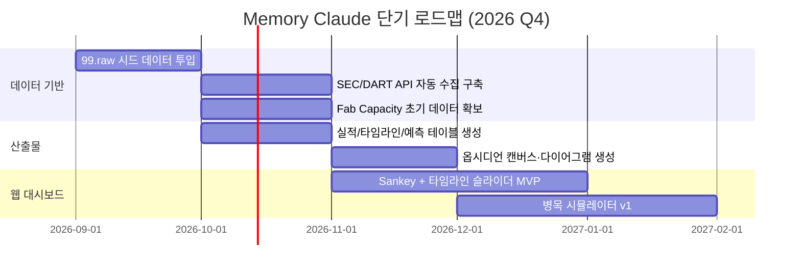

# [프로젝트 가치 및 방향성] Memory Claude 구현 가치와 전략적 확장 로드맵
**문서 버전**: v1.0.0  
**작성일자**: 2026-09-10  
**프로젝트 코드명**: `b_0910_memory_claude`  
**기반 문서**: 프로젝트 전체 문서 (human.md → 요건정의서 → 8개 설계 문서)

---

## 1. 프로젝트의 본질: 무엇을 만드는가

human.md의 핵심 질문으로 돌아갑니다:

> *"각각의 회사들의 실적과 또 각각 회사의 계약을 통해서 2026, 2027, 2028년의 업황과 자본과 기술의 흐름을 읽어낼 수 있을까"*

Memory Claude는 **개인이 운용하는 AI·반도체 생태계 인텔리전스 시스템**입니다.

기관 투자자는 Bloomberg Terminal($24,000/년), 리서치 하우스 구독($50,000+/년), 전담 애널리스트 팀을 가지고 있습니다. 개인에게는 이런 인프라가 없습니다.

이 프로젝트는 **무료 공개 데이터 + 수기 인텔리전스 + 로컬 자동화**로, 기관 수준의 산업 분석 역량을 개인의 노트북 위에 구현합니다.

---

## 2. 구현 시 얻을 수 있는 가치

### 2.1 직접 가치 (Immediate Value)

#### 가치 ①: 정보 비대칭의 축소

| 현재 (시스템 없이) | 구현 후 |
| :--- | :--- |
| 뉴스를 하나씩 읽으며 머릿속에서 연결 | **16~25개사의 계약·실적이 자동으로 연결된 네트워크 그래프** |
| "구글이 767억$ Capex" → "그래서 뭐?" | "767억$ 중 30%가 엔비디아 → 그 중 40%가 TSMC → TSMC CoWoS 캐파 병목 = HBM 공급 제약" **인과사슬 자동 추적** |
| 수치를 기억에 의존 | **DB에 5개 테이블, 시계열로 정렬**, 언제든 조회 가능 |

**정량적 가치**: 기관 애널리스트가 1개 기업 분석에 쓰는 시간 약 40시간/분기. 16개사 × 40시간 = 분기당 640시간. 자동화 파이프라인으로 **데이터 수집·정리 시간 70% 절감** → 분기당 ~450시간 절약. 이 시간을 **분석과 판단**에 투입.

---

#### 가치 ②: 시간축 위에서 패턴 발견

| 현재 | 구현 후 |
| :--- | :--- |
| 개별 사건이 독립적으로 인식됨 | 과거→현재→미래의 **연속적 내러티브**로 재구성 |
| "삼성 HBM4 양산 시작" (단일 뉴스) | 2024년 HBM3E 퀄 실패 → 2025년 수율 개선 → 2026-Q3 양산 → **2027년 점유율 45% 도달** (시계열 스토리) |

**패턴 발견 사례**:
- **선행 지표 발견**: ASML EUV 수주 증가(2024) → TSMC 캐파 확장(2025) → GPU 공급 증가(2026) → AI 모델 학습 가속(2027). 이 18개월 시차를 알면 **ASML 수주를 보고 2년 후의 AI 인프라를 예측**할 수 있음.
- **사이클 인식**: 메모리 가격 사이클의 바닥(2023-Q2)에서 HBM 수주가 급증하기 시작 → 2024~2025년 슈퍼 사이클 진입 패턴을 DB에서 역추적 가능.

---

#### 가치 ③: 시나리오 기반 의사결정

| 현재 | 구현 후 |
| :--- | :--- |
| "전력 부족하면 문제겠지" (막연한 감) | **시나리오 A: 전력 병목 → 오라클 Capex -20%, 온디바이스 수혜** (정량화된 영향도) |
| 시나리오 머릿속에서만 존재 | **What-If 토글로 실시간 시뮬레이션**, 기업별 수혜/피해 즉시 확인 |

병목 스트레스 테스트 3가지 시나리오(전력·HBM 수율·CoWoS 캐파)만으로도, **미래의 불확실성을 구조화된 사고**로 전환.

---

#### 가치 ④: 축적의 복리 효과

| 기간 | 축적되는 것 | 복리 효과 |
| :--- | :--- | :--- |
| **1개월** | 16개사 기초 데이터 + 주요 계약 10건 | 기본 네트워크 지도 완성 |
| **3개월** | 1분기 어닝콜 전량 반영 + 뉴스 50건 | 컨센서스 서프라이즈 패턴 발견 시작 |
| **6개월** | 2분기 데이터 누적 + Fab 캐파 업데이트 | 선행-후행 지표 상관관계 검증 가능 |
| **1년** | 4분기 풀 사이클 완성 | **나만의 산업 인텔리전스 DB** 확보. 어떤 유료 서비스보다 맞춤형 |
| **2년** | 2025~2027년 3개년 시계열 | 사이클 패턴 인식, 미래 예측 정밀도 대폭 향상 |

핵심: 데이터는 **쌓일수록 가치가 기하급수적으로 증가**합니다. 1개 데이터 포인트는 단일 사실이지만, 1,000개 데이터 포인트는 **패턴**이 되고, 10,000개는 **예측 엔진**이 됩니다.

---

### 2.2 간접 가치 (Indirect Value)

#### 가치 ⑤: 사고 프레임워크의 체계화

시스템을 구축하는 과정 자체가 **산업을 보는 눈을 구조화**합니다:

| 구축 전의 사고 | 구축 후의 사고 |
| :--- | :--- |
| "엔비디아 좋은 회사네" | "엔비디아의 매출 중 하이퍼스케일러 의존도 40%, TSMC 파운드리 독점 의존도 100%, HBM 공급 3사 중 SK하이닉스 50%. **어디가 끊기면 무슨 일이?**" |
| "삼성 HBM 잘되겠지" | "삼성의 HBM4 수율 55%, SK하이닉스 85%. 평택 P3 캐파 50,000 WSPM. **수율이 70% 안 넘으면 2026년 실적 전망 $52B → $42B으로 하향**" |

밸류체인을 DB로 구조화하는 행위 자체가 **기업 간 의존성, 병목, 대체재**를 체계적으로 사고하는 습관을 만듭니다.

---

#### 가치 ⑥: 의사결정의 근거 문서화

| 구축 전 | 구축 후 |
| :--- | :--- |
| "감으로 삼성전자 좋을 것 같아서 매수" | `data_revisions` 테이블에 근거 시계열 기록: **"2026-Q2 HBM4 수율 70% 달성(C3) → 영업이익 전망 상향 $48B→$52B → Fab P3 캐파 50K WSPM 양산 확정(C4)"** |
| 나중에 "왜 그때 그런 판단을 했지?" | `qual_context` 필드에 **원문 인용과 판단 근거 완전 보존** |

투자 의사결정이든 산업 분석이든, **근거가 문서화된 판단**은 나중에 복기·개선이 가능합니다.

---

## 3. 기존 도구 대비 차별점

### 3.1 유료 서비스 vs Memory Claude

| 비교 항목 | Bloomberg Terminal | 증권사 리서치 구독 | **Memory Claude** |
| :--- | :--- | :--- | :--- |
| **비용** | $24,000/년 | $5,000~50,000/년 | **$0 (무료 데이터 + 로컬)** |
| **커스터마이징** | 제한적 | 불가 | **완전 자유** (DB 스키마 직접 설계) |
| **데이터 소유** | 서비스 해지 시 소실 | PDF만 잔존 | **영구 로컬 보유** (Git 관리) |
| **수기 인텔리전스** | 입력 불가 | 입력 불가 | **99.raw/ 파이프라인으로 핵심 가치** |
| **옵시디언 연동** | 불가 | 불가 | **캔버스·Dataview·Mermaid 네이티브** |
| **시나리오 시뮬레이션** | 부분적 | 없음 | **What-If 토글, 병목 시뮬레이터** |
| **AI 밸류체인 특화** | 범용 | 개별 보고서 | **16~25개사 생태계 전체를 하나의 시스템으로 연결** |

### 3.2 핵심 차별화: "수기 인텔리전스"의 가치

Bloomberg에 없고 Memory Claude에만 있는 것:

> **비상장사(앤트로픽, 오픈AI, 스페이스X)의 비공식 데이터, 공급망 퀄 테스트 루머, 사용자 고유의 시나리오 가설**

이것이 `99.raw/`의 진짜 존재 이유입니다. 자동 수집 가능한 데이터(SEC, DART)는 **모두에게 동일**하지만, 수기로 입력하는 업계 인사이트와 개인의 가설은 **희소하고 고유**합니다.

---

## 4. 전략적 확장 방향성

### 4.1 단기 방향 (6개월 이내): 데이터 축적 & 기본 파이프라인 완성



**목표**: 시스템이 **일상적으로 사용 가능한 수준**에 도달. 뉴스를 보면 99.raw에 입력 → 자동으로 테이블·차트 갱신 → 옵시디언에서 즉시 확인.

---

### 4.2 중기 방향 (6~18개월): 인텔리전스 자동화

| 방향 | 내용 | 기대 효과 |
| :--- | :--- | :--- |
| **LLM 통합** | 어닝콜 자동 요약, 뉴스 자동 분류·태깅 | 데이터 투입 속도 10배 향상 |
| **알림 시스템** | 중대 계약·실적 서프라이즈 실시간 감지 | 정보 탐지 지연 시간 수일 → 수분 |
| **상관관계 엔진** | 선행·후행 지표 자동 식별, 히트맵 | 패턴 발견의 자동화 |
| **컨센서스 추적** | 증권사 컨센서스 변화 모니터링 | 시장 기대치와 실적 간 갭 실시간 파악 |

**목표**: 시스템이 **능동적으로 인사이트를 제안**하는 수준. "삼성 수율 데이터 100일 미갱신" 경고, "ASML 수주 급증 → 2028년 TSMC 캐파 상향 가능성" 자동 추론.

---

### 4.3 장기 방향 (18개월+): 플랫폼 진화

#### 방향 A: 개인 인텔리전스 에이전트

```
사용자: "삼성전자가 2027년까지 HBM4로 SK하이닉스를 추월할 수 있어?"

Memory Claude 에이전트:
"현재 DB 기준으로 분석합니다.
 
1. 캐파: 삼성 P3(50K) + P4(60K) = 110K WSPM (2027) vs SK 청주(40K) + 용인(공사중) = 40K WSPM
2. 수율: 삼성 55% → 목표 75% vs SK 85% 안정
3. 계약: 엔비디아 삼성 $14B (C4) vs 엔비디아 SK $18B (C4)
4. 결론: 캐파는 추월 가능하나, 수율 격차(20%p)로 실효 생산량은
   삼성 82.5K × 75% = 61.9K vs SK 40K × 85% = 34K
   → 2027년 기준 점유율 삼성 45%, SK 47% 예측 (근소차 유지)
   
Confidence: C2 (증권사 컨센서스 + DB 파생)"
```

#### 방향 B: 섹터 확장

AI·반도체에서 검증된 프레임워크를 **다른 산업에 복제**:

| 확장 섹터 | 밸류체인 | 재사용 가능한 구조 |
| :--- | :--- | :--- |
| **바이오·제약** | 임상→FDA 승인→공급계약→매출 | 계약 DB, 타임라인, 파이프라인 추적 |
| **에너지·전력** | 원자재→발전→송전→소비 | Capex 추적, Fab(발전소) 캐파, 공급 병목 |
| **우주·방산** | 계약→개발→생산→인도 | 수주 잔고, 마일스톤, 시나리오 분석 |

시스템의 **DB 스키마(entities, contracts, financials, milestones, fab_capacity)**는 산업에 무관하게 재사용 가능한 범용 구조입니다.

#### 방향 C: 커뮤니티 & 오픈소스

| 단계 | 내용 |
| :--- | :--- |
| **개인 사용** | 현재 — 로컬에서 단독 운영 |
| **템플릿 공유** | DB 스키마 + 파이프라인 스크립트를 GitHub 오픈소스로 공개 |
| **데이터 협업** | 여러 분석가가 각자 99.raw/에 데이터를 기여하고 Git으로 병합 |
| **커뮤니티 인텔리전스** | 개인의 수기 인사이트가 모이면 **집단 지성** 산업 분석 플랫폼 |

---

## 5. 위험 요소 및 한계

### 5.1 실행 위험

| 위험 | 발생 가능성 | 영향도 | 대응 |
| :--- | :---: | :---: | :--- |
| **데이터 투입 중단** | 높음 | 치명적 | 가장 큰 위험. 자동화(LLM 요약, RSS 알림)로 부담 경감. 최소한 분기 1회 어닝콜 후 업데이트 습관 형성 |
| **정확성 미검증** | 보통 | 높음 | Confidence 등급 체계로 데이터 품질 명시. C1~C2 데이터에 의존한 판단 시 주의 |
| **과잉 설계** | 보통 | 보통 | 문서 8개를 다 구현하려 하지 말고, **Phase 1~2(시드 데이터 + 기본 테이블)부터 시작** |
| **옵시디언 의존성** | 낮음 | 낮음 | 마크다운 + SQLite 기반이므로 옵시디언 없이도 작동. 이식성 높음 |

### 5.2 구조적 한계

| 한계 | 설명 | 수용 방법 |
| :--- | :--- | :--- |
| **개인 운영의 확장성** | 25개사 이상은 수기 데이터 관리가 현실적으로 어려움 | 핵심 16~25개사에 집중. 자동화 비중 점진적 확대 |
| **미래 예측의 불확실성** | 어떤 시스템도 미래를 정확히 예측할 수 없음 | 예측 ≠ 확정. **시나리오와 확률**로 접근. 틀릴 때 왜 틀렸는지 `data_revisions`에 기록 |
| **데이터 시차** | 실적은 분기마다, 어닝콜은 발표 후 1~2일 지연 | 실시간 시스템이 아님을 인정. **주간/분기 사이클로 운영** |

---

## 6. 실행 우선순위 제안

모든 문서(8개)의 제안을 통합하여, **실행 가능한 우선순위**를 제시합니다:

### Phase 0: 즉시 시작 (이번 주)
- [ ] `99.raw/` 디렉터리 구조 생성 (contracts, financials, milestones, fab_capacity)
- [ ] human.md에 언급된 3개 계약 시드 데이터 입력 (구글-앤트로픽, 아마존-앤트로픽, 오픈AI-아마존)
- [ ] SQLite DB 생성 + 5개 테이블 DDL 실행

### Phase 1: 첫 2주
- [ ] 기업 16개사 → 21개사(Critical 5개 추가) 확정 후 `entities` 테이블 시드
- [ ] 하이퍼스케일러 Capex 데이터 수기 입력 (2024~2026)
- [ ] 실적 매트릭스 테이블(`financials_matrix_table.md`) 첫 버전 수동 생성

### Phase 2: 첫 1개월
- [ ] SEC EDGAR / DART API 자동 수집 스크립트 구현
- [ ] `validator.py` 작성 (99.raw/ → SQLite 자동 정제)
- [ ] 과거 타임라인 + 미래 예측 테이블 생성

### Phase 3: 첫 2개월
- [ ] 옵시디언 캔버스 + Mermaid 다이어그램 자동 생성
- [ ] Fab Capacity 데이터 1차 입력 (TSMC, 삼성, SK하이닉스)
- [ ] Confidence 등급 체계 전 테이블 반영

### Phase 4~5: 3~6개월
- [ ] 웹 대시보드 (Sankey + 타임라인 슬라이더) 구축
- [ ] 어닝콜 LLM 자동 요약 파이프라인
- [ ] 뉴스 알림 봇 가동

---

## 7. 최종 비전

```
2026년 9월: 문서 8개, 아이디어 상태
    ↓
2026년 12월: 첫 분기 데이터 축적, 기본 테이블 가동
    ↓
2027년 3월: 반년치 데이터, 패턴 발견 시작
    ↓
2027년 9월: 1년치 데이터, 나만의 AI·반도체 인텔리전스 시스템 완성
    ↓
2028년: 2개년 시계열 → 미래 예측 정밀도 비약적 향상
         → 수기 인텔리전스의 누적 가치가 어떤 유료 서비스보다 높아지는 시점
```

human.md의 질문 *"업황과 자본과 기술의 흐름을 읽어낼 수 있을까"*에 대한 답:

> **데이터를 구조화하고, 시간 위에 쌓고, 연결하면 — 읽어낼 수 있습니다. Memory Claude는 그 도구입니다.**
