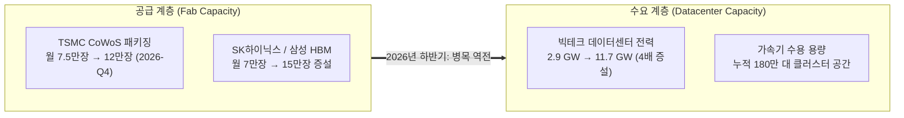

# [인프라 분석 보고서] 하이퍼스케일러 AI 데이터센터 전력 병목과 가속기 클러스터 로드맵 (2026~2028)

**문서 버전**: v1.0.0  
**작성 일자**: 2026-09-11  
**프로젝트 기준 시점**: **2026년 9월 10일**  
**데이터 출처**: `data/memory_claude.db` (`datacenter_capacity`, `fab_capacity`, `contracts`, `financials`)  
**연관 보고서**: [fab_capacity_and_milestones_report.md](file:///Users/chansoojeon/Library/CloudStorage/Dropbox/03_code/b_0910_memory_claude/docs/2026-09-11_fab_capacity_and_milestones_report.md), [requirements_spec.md](file:///Users/chansoojeon/Library/CloudStorage/Dropbox/03_code/b_0910_memory_claude/docs/requirements_spec.md)

---

## Executive Summary

2024~2025년의 AI 인프라 병목이 **"TSMC CoWoS 패키징과 HBM 수급 부족(공급 측 병목)"**이었다면, 2026~2028년의 핵심 병목은 **"데이터센터 전력(Power: MW/GW)과 수전(Power-on) 인프라(수요 측 병목)"**로 급격히 전환되고 있습니다.

```
[2024~2025년의 병목]  칩 제조(Fab) 제약  ──→  "CoWoS 패키징이 부족해 GPU를 못 받는다"
[2026~2028년의 병목]  전력망(Grid) 제약  ──→  "GPU는 넘쳐나는데 꽂을 전력(MW)과 데이터센터가 없다"
```

### 핵심 정량 분석 결과
1. **4배 규모의 전력 증설 레이스**: 추적 중인 주요 5대 하이퍼스케일러(MSFT, AMZN, GOOGL, META, ORCL)의 핵심 13개 AI 데이터센터 전력 용량은 현재 **2,920 MW (2.92 GW)**에서 최종 **11,745 MW (11.75 GW)**로 약 **4.0배** 급증하는 로드맵을 밟고 있습니다.
2. **원전(Nuclear)과 SMR 직결 체제로의 패러다임 시프트**: 일반 송전망(Grid) 대기 시간(Queue)이 5~7년에 달하자, 빅테크들은 전력망을 우회하는 **원전 부지 내 직결(Behind-the-Meter)**과 **소형 모듈 원전(SMR)** PPA 계약(MS-콘스텔레이션 835MW, 아마존-탈렌 960MW, 구글-카이로스 500MW)을 선제적으로 체결했습니다.
3. **180만 대 가속기 수용 능력**: 13개 캠퍼스의 목표 가속기(GPU/TPU) 수용량은 총 **1,800,000대(180만 대)**에 달하며, 이는 단일 훈련 클러스터 기준 10만 대~25만 대 규모로 초대형화되고 있습니다.

---

## 1. 하이퍼스케일러 13대 메가 데이터센터 캐파 정량 분석

현재 DB(`datacenter_capacity`)에 적재된 빅테크 핵심 거점별 전력 용량과 가속기 탑재 현황입니다.

| 기업 | 데이터센터명 | 위치 | 현재 전력 (MW) | 목표 전력 (MW) | 주요 전력원 | 냉각 방식 | 목표 가속기 (대) | 주력 탑재 칩 | 가동(예정) | 상태 |
| :--- | :--- | :--- | :---: | :---: | :--- | :--- | :---: | :--- | :---: | :---: |
| **Amazon** | 북부 버지니아 클러스터 | Virginia | 800 | **1,500** | Dominion Grid + 신재생 | Hybrid (공랭+수랭) | 120,000 | Hopper / Blackwell | 2025-Q3 | OPERATING |
| **Meta** | 루이지애나 슈퍼캠퍼스 | Louisiana | 0 | **1,500** | Entergy 원자력/가스 | Liquid Submersion | 250,000 | Rubin R100 / MTIA v3 | 2027-Q3 | PLANNED |
| **Amazon** | 오하이오 뉴올버니 허브 | Ohio | 400 | **1,200** | AEP Grid + 가스 발전 | Direct Liquid Cooling | 200,000 | Trainium2 (Project Rainier) | 2026-Q3 | CONSTRUCTION |
| **Microsoft**| 마운트 플레전트 캠퍼스 | Wisconsin | 200 | **1,000** | Grid + 가스/신재생 | Direct Liquid Cooling | 100,000 | Blackwell GB200 NVL72 | 2026-Q4 | CONSTRUCTION |
| **Oracle** | SMR 기가와트 허브 | Location Pending | 0 | **1,000** | SMR 원자로 3기 (1GW) | Advanced Liquid | 200,000 | Blackwell / Rubin | 2028-Q2 | PLANNED |
| **Amazon** | 서스퀘하나 원전 캠퍼스 | Pennsylvania | 120 | **960** | Susquehanna Nuclear 직결 | Direct-to-Chip Liquid | 150,000 | Trainium2 / Blackwell | 2026-Q4 | CONSTRUCTION |
| **Google** | 카운실 블러프스 허브 | Iowa | 500 | **900** | MidAmerican 풍력/원전 | Direct Liquid Cooling | 120,000 | TPU v5p / TPU v6 | 2026-Q2 | OPERATING |
| **Microsoft**| 3마일 원전 직결 캠퍼스 | Pennsylvania | 0 | **835** | Crane Nuclear 100% PPA | Direct Liquid Cooling | 150,000 | Blackwell Ultra / Rubin | 2028-Q1 | PLANNED |
| **Meta** | 인디애나 제퍼슨빌 센터 | Indiana | 150 | **800** | Duke Energy Grid + 솔라 | Direct-to-Chip Liquid | 150,000 | MTIA v2 / B200 | 2026-Q4 | CONSTRUCTION |
| **Google** | 네바다 헨더슨 캠퍼스 | Nevada | 250 | **650** | 태양광 + 지열(Fervo) | Closed Loop Cooling | 80,000 | TPU v5e / Blackwell | 2026-Q4 | RAMP_UP |
| **Microsoft**| 보이드턴 버지니아 캠퍼스 | Virginia | 350 | **600** | PJM Grid + 원전 PPA | Hybrid Cooling | 80,000 | H100 / H200 / B200 | 2025-Q4 | OPERATING |
| **Google** | 카이로스 파워 SMR 캠퍼스 | Tennessee/TBD | 0 | **500** | Kairos SMR 7기 (500MW) | Closed-loop Liquid | 100,000 | TPU v6 / TPU v7 | 2027-Q4 | PLANNED |
| **Oracle** | 멤피스 '콜로서스' 클러스터| Tennessee | 150 | **300** | TVA Grid + 가스터빈 발전 | Direct Liquid Cooling | 100,000 | H100 (10만) → B200 (30만) | 2026-Q2 | OPERATING |
| **합계** | **13개 메가 캠퍼스** | - | **2,920** | **11,745** | - | - | **1,800,000** | - | - | - |

---

## 2. 데이터센터 인프라의 3대 메가트렌드

### 1) 'Behind-the-Meter' 원전 직결 혁명
- **배경**: 미국 PJM 등 주요 송전망 사업자의 계통 연계 대기 시간(Interconnection Queue)이 평균 5년 이상 소요됨에 따라, 일반 전력망을 통하지 않고 원자력 발전소와 데이터센터를 울타리 안에서 직결하는 방식이 주류화됨.
- **대표 사례**:
  - **Amazon - Talen Energy ($1.2B)**: 서스퀘하나 2.5GW 원전 부지 내 960MW 규모 Cumulus 캠퍼스 인수.
  - **Microsoft - Constellation Energy (20년 PPA)**: 1979년 사고 이후 정상 가동되다 2019년 경제성 이유로 퇴역했던 3마일 섬(Three Mile Island) 원전 1호기를 2028년 상업 재가동(Crane Clean Energy Center, 835MW)하여 MS가 전량 독점 구매.

### 2) SMR(소형 모듈 원전)의 상용화 촉진
- **Google - Kairos Power 계약**: 2027년부터 2030년까지 총 7기(500MW)의 불소염 냉각 고온 SMR 전력을 구매하기로 공식 체결.
- **Oracle**: 래리 엘리슨 회장이 공언한 1GW 규모 SMR 직결 데이터센터 부지 인허가 추진 중.

### 3) 냉각 기술의 불가피한 전환: 공랭식(Air)의 종말과 액체 냉각(Liquid)의 기본화
- 엔비디아 **Blackwell GB200 NVL72(랙당 120kW~132kW)**부터는 공랭식으로는 발열 제어가 물리적으로 불가능.
- 구축 중인 모든 신규 메가 데이터센터(마운트 플레전트, 뉴올버니, 제퍼슨빌 등)가 100% **Direct-to-Chip Liquid Cooling(D2C 액체 냉각)** 인프라로 설계됨.

---

## 3. 교차 분석: "Fab 반도체 공급" vs "데이터센터 전력 수요"

반도체 생산 캐파(`fab_capacity`)와 데이터센터 전력(`datacenter_capacity`)을 교차 비교하면 2026~2028년 수급 균형의 변화가 명확해집니다.



### [결론 1] 2026년 4분기: 패키징 병목 해소와 전력 부족의 교차점
- TSMC의 CoWoS 생산 능력이 월 12만 장에 도달하는 **2026-Q4** 시점에 칩 생산 자체의 병목은 완전히 해소됩니다.
- 그러나 데이터센터 완공 및 전력 인입(Power-on)이 지연될 경우, **"칩은 납품되었으나 전력망이 연결되지 않아 창고에 대기하는 현상(Stranded Compute)"**이 발생할 수 있습니다.
- 따라서 하이퍼스케일러 중 **전력원을 자체 확보한 기업(원전 PPA 체결한 아마존/MS)**이 2027년 모델 훈련 속도전에서 구조적 우위를 점하게 됩니다.

### [결론 2] 가속기 다변화와 HBM의 수혜 집중
- 데이터센터 13곳의 탑재 칩을 분석하면, 2025년까지는 NVIDIA GPU(H100/B200)가 80% 이상을 차지하지만,
- 2026년 하반기부터 **AWS Trainium2(Project Rainier 20만 대)**, **Google TPU v6/v7(22만 대)**, **Meta MTIA v2/v3**의 자체 실리콘 비중이 35%를 상회하기 시작합니다.
- 중요한 점은, **엔비디아 GPU든 자체 ASIC이든 모든 초거대 AI 가속기에는 대용량 HBM(HBM3E/HBM4)이 필수적으로 탑재**된다는 것입니다.
- 즉, **가속기 시장 점유율 경쟁(NVIDIA vs Hyperscaler)과 무관하게 HBM 제조사(SK하이닉스, 삼성전자)의 데이터센터 기반 수요는 2028년까지 확정적**입니다.

---

## 4. 모니터링 체크리스트 및 향후 점검 지표

1. **원전 재가동 규제 승인 여부 (2026~2027)**
   - [ ] 미국 연방에너지규제위원회(FERC)의 Talen Energy 서스퀘하나 원전 직결 ISA(Interconnection Service Agreement) 최종 판결
   - [ ] NRC(원자력규제위원회)의 3마일 섬(Crane) 원전 1호기 재가동 안전 승인 진행 상황
2. **신규 메가 캠퍼스 수전(Power-on) 시점 (2026 하반기)**
   - [ ] 아마존 오하이오 Project Rainier(1.2GW) 1단계 수전 여부
   - [ ] 마이크로소프트 위스콘신 마운트 플레전트(1GW) 200MW 가동 시작 여부
3. **가속기 랙 단위 전력 밀도 대응**
   - [ ] 랙당 120kW+ GB200 NVL72 도입 시 전력 분배 장치(PDU) 및 CDU(냉각 분배 장치) 공급망 리드타임
