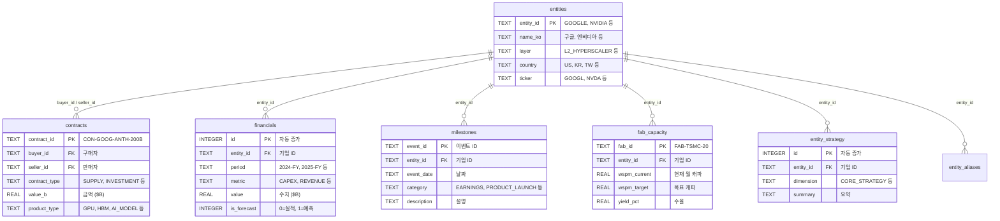

# [DB 구조와 쿼리 설명서] Memory Claude 데이터베이스 가이드
**작성일자**: 2026-09-11  
**프로젝트 코드명**: `b_0910_memory_claude`

---

## 1. DB 파일 위치

```
data/memory_claude.db  (SQLite 파일, 현재 약 100KB)
```

로컬 파일 하나가 전체 데이터베이스입니다. 별도 서버 없이 `sqlite3` 명령어나 Python으로 바로 접근합니다.

---

## 2. SQL 실행 방법

### 방법 1: 터미널에서 직접 실행 (가장 간단)

```bash
# 프로젝트 폴더에서 실행
cd /Users/chansoojeon/Library/CloudStorage/Dropbox/03_code/b_0910_memory_claude

# 한 줄 쿼리
sqlite3 -header -column data/memory_claude.db "SELECT * FROM entities LIMIT 5;"

# 여러 줄 쿼리 (대화형 모드)
sqlite3 data/memory_claude.db
```

대화형 모드에 진입하면:
```
SQLite version 3.x.x
Enter ".help" for usage hints.
sqlite> SELECT name_ko, layer FROM entities ORDER BY layer;
sqlite> .quit
```

유용한 sqlite3 명령어:
```
.tables          -- 전체 테이블 목록
.schema entities -- entities 테이블 구조 보기
.headers on      -- 컬럼 헤더 표시
.mode column     -- 보기 좋은 정렬
.quit            -- 종료
```

### 방법 2: VS Code 확장 프로그램

1. VS Code에서 **SQLite Viewer** 또는 **SQLite** 확장 설치
2. `data/memory_claude.db` 파일 클릭 → 테이블 브라우징
3. 쿼리 실행 창에서 SQL 직접 입력 가능

### 방법 3: Python 스크립트

```python
import sqlite3

conn = sqlite3.connect('data/memory_claude.db')
conn.row_factory = sqlite3.Row

# 쿼리 실행
rows = conn.execute("SELECT name_ko, layer FROM entities").fetchall()
for r in rows:
    print(r['name_ko'], r['layer'])

conn.close()
```

### 방법 4: DB Browser for SQLite (GUI 앱)

```bash
# Homebrew로 설치
brew install --cask db-browser-for-sqlite
```

설치 후 `data/memory_claude.db` 파일을 열면 테이블 브라우징, 쿼리 실행, 데이터 편집을 GUI로 할 수 있습니다.

---

## 3. 사용된 테이블 구조

### 3.1 전체 구조 (ER 다이어그램)



### 3.2 각 테이블 역할

| 테이블 | 역할 | 현재 데이터 | 핵심 질문 |
| :--- | :--- | :---: | :--- |
| **`entities`** | 기업 마스터 | 21개사 | WHO (누구) |
| **`contracts`** | 계약·투자 | 10건 | WHAT (무슨 계약, 얼마) |
| **`financials`** | 실적·Capex | 33건 | HOW MUCH (매출, Capex) |
| **`milestones`** | 과거·미래 이벤트 | 0건 | WHEN (언제) |
| **`fab_capacity`** | 공장 증산·수율 | 0건 | WHERE & HOW MANY (공장) |
| **`entity_strategy`** | 전략·포지셔닝 | 0건 | WHY (왜) |
| **`entity_aliases`** | 이름 별칭 | 25건 | 검색 편의 |

---

## 4. 보고서 각 섹션에 사용된 쿼리

### 섹션 1: DB 현황 요약

```sql
-- 각 테이블의 행 수 카운트
SELECT COUNT(*) FROM entities;      -- → 21
SELECT COUNT(*) FROM contracts;     -- → 10
SELECT COUNT(*) FROM financials;    -- → 33
```

### 섹션 2: 등록 기업 목록

```sql
SELECT entity_id, name_ko, layer, country, ticker
FROM entities
ORDER BY layer, entity_id;
```

`layer` 값(`L1_AI_LAB` 등)을 Python에서 한글 이름으로 변환합니다.

### 섹션 3: 핵심 계약 (금액순)

```sql
-- DB에 미리 만들어둔 뷰(View)를 사용
SELECT * FROM v_contract_summary;
```

이 뷰의 실체:

```sql
CREATE VIEW v_contract_summary AS
SELECT
    e1.name_ko AS buyer,       -- 구매자 한글명
    e2.name_ko AS seller,      -- 판매자 한글명
    c.contract_type,           -- INVESTMENT, SUPPLY 등
    c.value_b,                 -- 금액 ($B)
    c.product_type,            -- GPU, HBM, AI_MODEL 등
    c.announced_date,
    c.description
FROM contracts c
JOIN entities e1 ON c.buyer_id = e1.entity_id   -- 구매자 이름 연결
JOIN entities e2 ON c.seller_id = e2.entity_id  -- 판매자 이름 연결
ORDER BY c.value_b DESC;                         -- 금액 큰 순
```

**핵심**: `contracts` 테이블에는 `buyer_id = 'GOOGLE'`처럼 ID만 저장되어 있고, `entities` 테이블과 **JOIN**(연결)해서 `'구글'`이라는 한글 이름을 가져옵니다. 이 JOIN을 2번(구매자, 판매자) 합니다.

### 섹션 4: 하이퍼스케일러 Capex 추이

```sql
-- 기업별 각 연도의 Capex 값 조회
SELECT value FROM financials
WHERE entity_id = 'GOOGLE'      -- 특정 기업
  AND period = '2026-FY'        -- 특정 기간
  AND metric = 'CAPEX';         -- Capex 지표
-- → 76.7
```

이 쿼리를 5개 기업 × 3개 연도 = 15번 실행. Python에서 YoY 계산:

```python
yoy = ((2026값 - 2025값) / 2025값) × 100
# 구글: (76.7 - 65.0) / 65.0 × 100 = +18%
```

합계:

```sql
SELECT SUM(value) FROM financials
WHERE entity_id IN ('GOOGLE','AMAZON','MICROSOFT','META','ORACLE')
  AND period = '2026-FY'
  AND metric = 'CAPEX';
-- → 280.7
```

### 섹션 5: 핵심 기업 매출 추이

Capex와 동일한 구조, `metric = 'REVENUE'`로 변경:

```sql
SELECT value FROM financials
WHERE entity_id = 'NVIDIA'
  AND period = '2025-FY'
  AND metric = 'REVENUE';
-- → 130.0
```

### 섹션 6: 자본 흐름 요약

```sql
-- GPU/ASIC 수주 합계
SELECT SUM(value_b) FROM contracts
WHERE product_type IN ('GPU', 'ASIC') AND value_b IS NOT NULL;
-- → $65B (구글 $30B + 메타 $25B + 메타-브로드컴 $10B)

-- HBM 공급 계약 합계
SELECT SUM(value_b) FROM contracts
WHERE product_type = 'HBM' AND value_b IS NOT NULL;
-- → $32B (SK하이닉스 $18B + 삼성 $14B)

-- AI 랩 투자 합계
SELECT SUM(value_b) FROM contracts
WHERE contract_type = 'INVESTMENT' AND value_b IS NOT NULL;
-- → $225B (구글-앤트로픽 $200B + MS-오픈AI $13B + 아마존-앤트로픽 $12B)
```

---

## 5. 자주 쓸 쿼리 모음

### 특정 기업의 모든 계약 보기

```sql
SELECT * FROM v_contract_summary
WHERE buyer = '엔비디아' OR seller = '엔비디아';
```

### 특정 기업의 실적 추이

```sql
SELECT period, metric, value, 
       CASE WHEN is_forecast THEN '예측' ELSE '실적' END AS 구분
FROM financials
WHERE entity_id = 'NVIDIA'
ORDER BY period, metric;
```

### 계층별 기업 수

```sql
SELECT layer, COUNT(*) AS 기업수
FROM entities
GROUP BY layer
ORDER BY layer;
```

### 금액 상위 계약 5건

```sql
SELECT * FROM v_contract_summary LIMIT 5;
```

### 팹 생산 캐파 및 증설 현황 조회 (신규 뷰)

```sql
SELECT 기업, 팹_공장명, 공정노드, 현재캐파_월장, 목표캐파_월장, 증설목표시점, 상태 
FROM v_fab_summary;
```

### 기술 및 공급망 마일스톤 타임라인 (신규 뷰)

```sql
SELECT 일자, 관련기업, 구분, 타임라인, 영향도, 주요내용 
FROM v_milestones_timeline
ORDER BY 일자;
```

### 하이퍼스케일러 AI 데이터센터 전력 및 클러스터 현황 조회 (신규 뷰)

```sql
SELECT 기업, 데이터센터명, 위치, 현재전력_MW, 목표전력_MW, 전력원, 목표가속기수, 주력칩, 가동목표, 상태 
FROM v_datacenter_summary;
```

### 데이터 추가 (새 계약 입력)

```sql
INSERT INTO contracts (contract_id, buyer_id, seller_id, contract_type, value_b, 
                       announced_date, description, product_type, confidence, source)
VALUES ('CON-AMZN-NVDA-GPU', 'AMAZON', 'NVIDIA', 'SUPPLY', 20.0,
        '2026-Q2', '아마존, 엔비디아 Rubin GPU 공급 계약', 'GPU', 'C3', '업계 보도');
```

### 데이터 추가 (새 실적 입력)

```sql
INSERT INTO financials (entity_id, period, metric, value, unit, is_forecast, confidence, source)
VALUES ('NVIDIA', '2026-Q2', 'REVENUE', 45.0, 'B_USD', 0, 'C4', '10-Q 공시');
```

---

## 6. 전체 흐름 요약

```
init_db.sql           export_report.py          report_summary.md
───────────           ────────────────          ─────────────────
DDL (테이블 생성)  →    DB 연결               →   마크다운 텍스트 출력
INSERT (시드 데이터)     SELECT 쿼리 실행          테이블·수치 자동 포맷
                       Python에서 YoY 계산       파일로 저장
```

DB에 데이터를 추가한 뒤 `python3 scripts/export_report.py`만 재실행하면 보고서가 자동 갱신됩니다.
