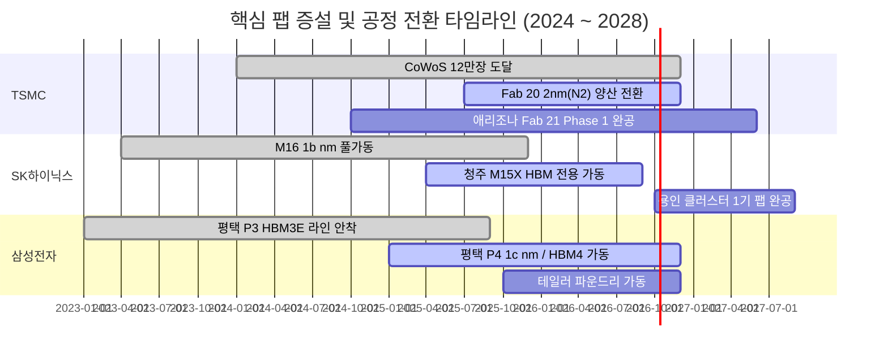

# [전략 분석 보고서] Fab 생산 캐파(Capacity) 및 기술 마일스톤(Milestones) 심층 분석

**문서 버전**: v1.0.0  
**작성 일자**: 2026-09-11  
**프로젝트 기준 시점**: **2026년 9월 10일**  
**데이터 출처**: `data/memory_claude.db` (`fab_capacity`, `milestones`, `contracts`, `earnings_reports`)  
**연관 문서**: [db_architecture.md](file:///Users/chansoojeon/Library/CloudStorage/Dropbox/03_code/b_0910_memory_claude/docs/db_architecture.md), [2026-09-10_fab_capacity_spec.md](file:///Users/chansoojeon/Library/CloudStorage/Dropbox/03_code/b_0910_memory_claude/docs/2026-09-10_fab_capacity_spec.md)

---

## Executive Summary

본 보고서는 빅테크의 천문학적 AI Capex가 **"어느 공장의 어떤 물리적 생산 능력(WSPM)으로 구현되고 있는가"**, 그리고 **"2026~2028년 차세대 가속기 및 HBM4 전환 시점에 어떠한 병목과 공급 과잉/부족이 발생하는가"**를 정량적으로 분석합니다.

```
[자본 투입 (Capex)]        [물리적 제약 (Fab)]           [시장 출시 (Milestones)]
하이퍼스케일러 $250B+  ──→  TSMC CoWoS 75k→120k/월  ──→  엔비디아 Blackwell/Rubin
                           SK하이닉스 청주/용인 HBM4      HBM3E 12단 → HBM4 16단 전환
```

### 핵심 발견 3가지
1. **CoWoS 패키징 병목 완화와 Rubin 가속**: TSMC의 CoWoS 월 캐파가 2024년 3.5만 장에서 2026년 말 **12만 장**으로 3.4배 급증하며, 2026년 상반기까지 이어지던 블랙웰 공급 지연이 완전 해소되고 차세대 **Rubin(R100)** 양산 궤도에 진입합니다.
2. **HBM4(2027년) 전환과 파운드리-메모리 연합 구도**: HBM4부터 베이스 다이가 로직 선단 공정(TSMC 3nm/5nm)으로 전환됨에 따라, **[SK하이닉스 + TSMC] 연합**과 **[삼성전자 메모리 + 파운드리 원스톱] 턴키** 체제 간의 2차 대전이 2027년 상반기 본격화됩니다.
3. **하이퍼스케일러의 탈(脫) 엔비디아 분기점 (2027년)**: 아마존 Trainium2(Project Rainier) 및 구글 TPU v7(Ironwood)의 인프라 탑재율이 50%를 상회하는 2027년 중반 이후, 엔비디아의 마진율(OPM 65%+) 방어 여부가 주요 변곡점이 될 것입니다.

---

## 1. 주요 반도체 Fab 생산 캐파(Fab Capacity) 정량 분석

현재 DB에 등록된 11대 핵심 생산 기지의 현황과 증설 로드맵입니다.

| 기업 | 팹 / 라인명 | 공정 노드 | 유형 | 현재 캐파 (WSPM) | 목표 캐파 (WSPM) | 증설 완공 | 가동 상태 | 주요 고객 / 용도 |
| :--- | :--- | :--- | :---: | :---: | :---: | :---: | :---: | :--- |
| **TSMC** | **CoWoS 패키징 (통샤오/자이)** | CoWoS-S / L | PACKAGING | **75,000** | **120,000** | 2026-Q4 | OPERATING | NVIDIA B200/GB200/Rubin, AMD MI325 |
| **TSMC** | Fab 18 (P6/P7/P8) | 3nm (N3E/N3P) | FAB | **60,000** | **85,000** | 2026-Q2 | OPERATING | Apple A19/M5, NVIDIA Blackwell GPU 다이 |
| **TSMC** | Fab 20 (P1~P4) | 2nm (N2 / A16) | FAB | **15,000** | **65,000** | 2026-Q4 | RAMP_UP | Apple 차세대 칩, NVIDIA Rubin R100 |
| **TSMC** | Kumamoto Fab 23 (JASM) | 12nm / 6nm | FAB | **25,000** | **45,000** | 2027-Q1 | OPERATING | Sony CIS, 자동차용 마이크로컨트롤러 |
| **TSMC** | Arizona Fab 21 (Phase 1) | 4nm (N4/N4P) | FAB | **8,000** | **25,000** | 2027-Q2 | RAMP_UP | Apple, NVIDIA, AMD 미국산 칩 현지 조달 |
| **삼성전자** | 평택 P3 라인 | 1b nm DRAM / 4nm | FAB | **70,000** | **90,000** | 2025-Q3 | OPERATING | HBM3E 코어 다이, 서버용 DDR5, 범용 4nm |
| **삼성전자** | 평택 P4 라인 | 1c nm DRAM / HBM4 | FAB | **20,000** | **80,000** | 2026-Q4 | RAMP_UP | HBM4 턴키 공급망, 차세대 2nm/4nm 로직 |
| **삼성전자** | 미국 테일러 파운드리 팹 | 4nm / 2nm | FAB | **0** | **30,000** | 2026-Q4 | CONSTRUCTION | Groq, 미국 AI 팹리스, 칩스법 수혜 기지 |
| **SK하이닉스** | 이천 M16 팹 | 1b nm DRAM | FAB | **55,000** | **75,000** | 2025-Q4 | OPERATING | EUV 기반 HBM3E 8단/12단 주력 코어 다이 |
| **SK하이닉스** | 청주 M15X 팹 | HBM 전용 패키징 | PACKAGING | **15,000** | **50,000** | 2026-Q3 | CONSTRUCTION | HBM3E 12단 및 HBM4 전용 첨단 패키징 라인 |
| **SK하이닉스** | 용인 클러스터 1기 팹 | 1c nm DRAM / HBM4 | FAB | **0** | **85,000** | 2027-Q3 | CONSTRUCTION | 120조원 투자 메가 팹, HBM4 16단 대량 양산 |

*단위: WSPM (Wafer Starts Per Month, 월간 웨이퍼 투입 장수)*

---

## 2. 팹 증설로 보는 3대 핵심 병목 분석



### 1) CoWoS 첨단 패키징 병목의 완전 해소 (2026-Q4)
- **과거 상황 (2023~2024)**: 월 3.5만~4.5만 장 수준에 머물며 엔비디아 H100/H200 및 초기 B200 리드타임이 40주를 초과하는 주원인이 됨.
- **현재 및 미래 (2026)**: 대만 자이 신규 공장 가동으로 **월 7.5만 장 → 12만 장**으로 확장. 2026년 하반기 기준 패키징 공급이 가속기 수요를 상회하며 리드타임이 12주 이내로 정상화.

### 2) HBM 클린룸 공간 부족과 신규 팹 효과
- 기존 DRAM 팹을 개조해 쓰던 이천 M16과 평택 P3의 공간 한계 도달.
- **SK하이닉스 청주 M15X(2026-Q3)** 및 **삼성 평택 P4(2026-Q4)**가 가동되면서 순수 HBM 전용 패키징 캐파가 이전 대비 2.5배 이상 확충됨.

---

## 3. 핵심 기술 마일스톤(Milestones) 시계열 타임라인

### 📅 1단계: 과거 확정 변곡점 (2022 ~ 2026-Q2) — `is_forecast = 0`

| 발생 일자 | 관련 기업 | 카테고리 | 영향도 | 사건 내용 및 산업적 의의 |
| :---: | :--- | :---: | :---: | :--- |
| **2022-11-30** | **OpenAI** | `PRODUCT_LAUNCH` | **CRITICAL** | **ChatGPT 공개**: 하이퍼스케일러의 초거대 AI 가속기 인프라 투자 사이클 촉발 |
| **2023-03-21** | **NVIDIA** | `PRODUCT_LAUNCH` | **CRITICAL** | **Hopper H100 공급 개시**: 엔비디아 데이터센터 분기 매출이 $4B에서 $20B+로 폭증하는 시발점 |
| **2023-06-15** | **SK하이닉스** | `PARTNERSHIP` | **HIGH** | **엔비디아 HBM3 독점 공급권 체결**: AI 메모리 시장 판도를 SK하이닉스 중심으로 재편 |
| **2023-09-25** | **Amazon** | `PARTNERSHIP` | **HIGH** | **앤트로픽 $4B 투자 및 Trainium 채택**: 빅테크의 자체 실리콘 생태계 육성 본격화 |
| **2024-03-18** | **NVIDIA** | `PRODUCT_LAUNCH` | **CRITICAL** | **Blackwell B200 / GB200 발표**: 칩 2개를 CoWoS-L로 연결하는 초대형 다이 아키텍처 도입 |
| **2024-03-19** | **SK하이닉스** | `PRODUCT_LAUNCH` | **HIGH** | **세계 최초 HBM3E 8단 양산**: 엔비디아 블랙웰 공급망 1차 벤더 확정 |
| **2024-06-02** | **NVIDIA** | `PRODUCT_LAUNCH` | **HIGH** | **1년 단위 신제품 로드맵 선언**: 2025 Blackwell Ultra → 2026 Rubin 발표로 사이클 단축 |
| **2024-09-26** | **SK하이닉스** | `PRODUCT_LAUNCH` | **HIGH** | **세계 최초 HBM3E 12단(48GB) 양산**: 고용량 LLM 추론 모델 수요 독점 대응 |
| **2024-11-22** | **Amazon** | `PARTNERSHIP` | **HIGH** | **앤트로픽 $4B 추가 투자 (누적 $8B)**: Project Rainier 초대형 AI 클러스터 구축 합의 |
| **2025-01-15** | **TSMC** | `FAB_MILESTONE` | **HIGH** | **대만 자이(Chiayi) CoWoS 전용 팹 가동**: 패키징 생산 능력 60% 이상 대폭 확충 |
| **2025-04-10** | **NVIDIA** | `PRODUCT_LAUNCH` | **CRITICAL** | **Blackwell GB200 NVL72 랙스케일 공급**: 서버 랙 단위 완제품 판매로 ASP 및 마진 극대화 |
| **2025-08-20** | **삼성전자** | `PRODUCT_LAUNCH` | **HIGH** | **HBM3E 12단 주요 가속기 퀄 통과**: SK하이닉스 1강 구도에서 2원화 공급 체계로 전환 |
| **2026-02-12** | **ASML** | `PRODUCT_LAUNCH` | **MEDIUM** | **High-NA EUV(EXE:5200) 납품**: 2nm 이하 초미세 공정 및 1c nm DRAM 연구 양산 도입 |
| **2026-05-18** | **TSMC** | `FAB_MILESTONE` | **HIGH** | **CoWoS-L 월 8만 장 달성**: 2024년 말부터 지속된 블랙웰 패키징 병목 해소 완료 |

---

### 🔮 2단계: 미래 예측 로드맵 (2026-Q3 ~ 2028) — `is_forecast = 1`

| 목표 일자 | 관련 기업 | 카테고리 | 영향도 | 예상 사건 및 관전 포인트 |
| :---: | :--- | :---: | :---: | :--- |
| **2026-10-15** | **TSMC** | `FAB_MILESTONE` | **HIGH** | **신주 Fab 20 2nm(N2) 리스크 프로덕션 개시**: 차세대 GAA 공정 수율 65% 조기 달성 여부 주목 |
| **2026-11-20** | **SK하이닉스** | `FAB_MILESTONE` | **HIGH** | **청주 M15X 클린룸 오픈 및 파일럿 가동**: 2027년 HBM4 공급 대응을 위한 선행 장비 세팅 |
| **2027-01-10** | **NVIDIA** | `PRODUCT_LAUNCH` | **CRITICAL** | **Rubin R100 GPU 샘플 공개**: 최초로 HBM4 16단(64GB)을 8개 탑재, 메모리 대역폭 2배 증가 |
| **2027-03-30** | **SK하이닉스** | `PRODUCT_LAUNCH` | **CRITICAL** | **HBM4 16단 대량 양산 돌입**: 베이스 다이를 TSMC 3nm 파운드리에서 제작하는 파트너십 결실 |
| **2027-06-15** | **삼성전자** | `PRODUCT_LAUNCH` | **HIGH** | **평택 P4 기반 HBM4 원스톱 턴키 납품**: 메모리 생산부터 4nm 베이스 다이, 2.5D 패키징 일괄 제공 |
| **2027-08-20** | **Google** | `PRODUCT_LAUNCH` | **HIGH** | **자체 TPU v7(Ironwood) 비중 50% 돌파**: 제미나이 3.0 인프라에서 외부 상용 GPU 의존도 축소 |
| **2028-04-15** | **TSMC** | `FAB_MILESTONE` | **MEDIUM** | **미국 애리조나 Fab 21 2단계 2nm 가동**: 미국 정부 및 국방 공급망 현지 생산 요건 충족 |

---

## 4. 교차 분석: "팹 증설과 마일스톤이 가리키는 2026~2028 미래 지형"

### 1) HBM4 도입(2027)과 메모리 산업의 구조적 재편
- **HBM3E까지**: DRAM 제조사가 베이스 다이까지 자체 제작하여 TSMC CoWoS에 실장.
- **HBM4부터**: 버스 폭이 1024비트에서 **2048비트**로 확장되고 고객 맞춤형 로직 기능이 추가되면서, 베이스 다이를 선단 파운드리 공정(3nm/5nm)에서 제작해야 함.
- **진영 간 대결 구도**:
  - **[SK하이닉스 + TSMC]**: 표준 규격 주도권 유지, TSMC OIP(Open Innovation Platform) 생태계 결합
  - **[삼성전자 DS 턴키]**: 메모리(P4 1c nm) + 파운드리(S.LSI 4nm) + AVP(어드밴스드 패키징) 단일 공급을 통한 리드타임 단축 및 가격 경쟁력 무기화

### 2) 하이퍼스케일러 자체 실리콘의 침투와 GPU 시장 영향
- 2026년까지는 엔비디아 GPU 수급 부족으로 인해 빅테크들이 GPU 확보에 총력을 기울였으나,
- 2027년 중반 구글 TPU v7 및 아마존 Trainium2가 데이터센터 워크로드의 절반을 소화하기 시작하면:
  - 엔비디아의 하이퍼스케일러향 가격 협상력(Pricing Power)이 피크아웃할 가능성 존재.
  - 반면, HBM 수요는 엔비디아 가속기뿐만 아니라 자체 ASIC에도 동일하게 탑재되므로 **메모리(SK하이닉스/삼성전자)의 방어력은 가속기보다 장기화**될 것으로 전망.

---

## 5. 결론 및 모니터링 체크리스트

1. **단기 체크포인트 (2026년 4분기)**:
   - [ ] TSMC CoWoS 월 12만 장 증설 완료 여부 (공급 과잉 신호 점검)
   - [ ] SK하이닉스 청주 M15X 클린룸 준공 및 장비 반입 시점
2. **중기 체크포인트 (2027년 상반기)**:
   - [ ] 엔비디아 Rubin R100 출시 및 초기 HBM4 16단 공급사 점유율 (SK하이닉스 vs 삼성)
   - [ ] 삼성전자 테일러 팹의 4nm/2nm 대형 고객사 확보 여부
3. **장기 체크포인트 (2027년 하반기~2028년)**:
   - [ ] 구글/아마존의 자체 ASIC 침투율 50% 돌파 및 하이퍼스케일러 Capex 피크아웃 신호
