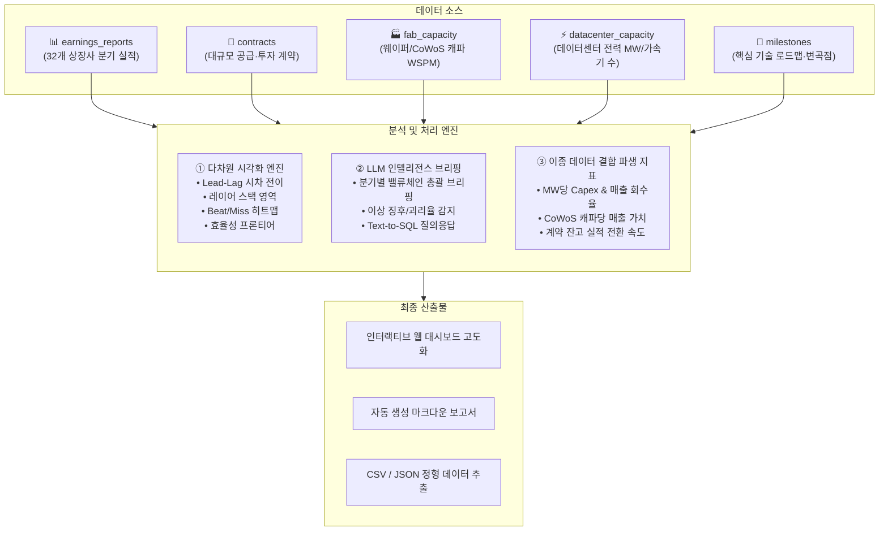
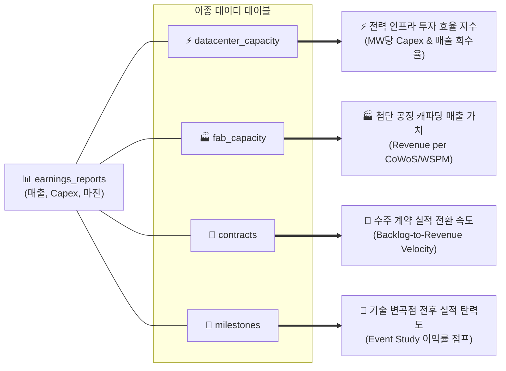

# 36개사 실적 기반 시각화 고도화, LLM 요약 및 파생 인텔리전스 창출 제안서

**작성일**: 2026-09-16  
**프로젝트 기준 시점**: 2026-09-10  
**문서 상태**: 제안 및 기획 보고서 (Proposal)  
**관련 문서**:
- [AGENTS.md](file:///Users/boon/Dropbox/03_code/b_0910_memory_claude/AGENTS.md) (프로젝트 핵심 운영 지침 및 표준 규약)
- [dashboard/index.html](file:///Users/boon/Dropbox/03_code/b_0910_memory_claude/dashboard/index.html) (현행 인터랙티브 웹 대시보드)
- [docs/2026-09-16_visualization_and_analytics_roadmap.md](file:///Users/boon/Dropbox/03_code/b_0910_memory_claude/docs/2026-09-16_visualization_and_analytics_roadmap.md) (시각화·분석 로드맵)
- [docs/2026-09-13_feasibility_and_core_value.md](file:///Users/boon/Dropbox/03_code/b_0910_memory_claude/docs/2026-09-13_feasibility_and_core_value.md) (현실성 평가와 핵심 가치)

---

## 1. 배경 및 현황 진단 (As-Is vs To-Be)

### 1.1 현행 상태 (As-Is)
- 현재 [대시보드](file:///Users/boon/Dropbox/03_code/b_0910_memory_claude/dashboard/index.html)의 실적 탭은 **단일 기업 1개씩 드롭다운으로 선택**하여 해당 기업의 개별 분기 실적(매출/영업익 막대·선 그래프 및 마진율 선 그래프)만을 표시하는 고립된 뷰입니다.
- SQLite DB(`data/memory_claude.db`)에는 총 36개 기업(비상장 4개사 제외 시 상장 32개사)의 8대 레이어 마스터와 400여 건 이상의 분기 실적(`earnings_reports`), 공급 계약(`contracts`), 팹 캐파(`fab_capacity`), 데이터센터 전력(`datacenter_capacity`), 기술 변곡점(`milestones`)이 체계적으로 구축되어 있으나, 이들 간의 **유기적 연결과 교차 분석**이 대시보드에 충분히 시각화되지 못하고 있습니다.

### 1.2 지향 목표 (To-Be)
> *"하이퍼스케일러의 초대형 AI Capex와 장기 공급 계약은 2026~2028년 메모리, 파운드리, 가속기 시장의 업황을 어떻게 결정짓는가?"*

단순히 개별 기업 실적을 나열하는 것을 넘어, **자본의 흐름, 공급망 시차 전이, 업황 전반의 센티먼트, 그리고 이종 데이터 간의 결합 파생 지표**를 입체적으로 제공하는 인텔리전스 시스템으로 고도화합니다.

---

## 2. 상장 32개사 실적 기반 5대 신규 시각화 방안

### ① 밸류체인 시차 전이 차트 (Lead-Lag Correlation Chart)
- **개념**: AI 자본 지출의 시차(Time-Lag) 효과 시각화.
  - `빅4 하이퍼스케일러 Capex 합산` $\rightarrow$ `(1분기 후) 엔비디아 데이터센터 매출` $\rightarrow$ `(2분기 후) TSMC & SK하이닉스(HBM) 매출`.
- **차트 형태**: 정규화(기준 분기 100 기준 또는 YoY 증감률) 다중 축 꺾은선 그래프.
- **분석 가치**: 
  - 하이퍼스케일러의 투자 집행이 부품/제조사 실적으로 현실화되기까지의 리드타임 변화 추적.
  - 선행 지표(빅테크 Capex 가이던스)가 꺾일 때 후행 제조사 실적이 언제 둔화될지 예측하는 조기 경보 시스템 역할.

### ② 8대 레이어별 자본 흡수 스택 영역 차트 (Layer Capital Absorption Area Chart)
- **개념**: 분기별로 발생한 자본이 어느 밸류체인 레이어로 흡수되는지 총량 비교.
  - L2 하이퍼스케일러 Capex vs L3 컴퓨팅 매출 vs L4 파운드리/장비 매출 vs L5 메모리 매출 vs L8 전력 인프라 매출.
- **차트 형태**: 100% 누적 영역 차트(Stacked Area Chart) 또는 그룹 막대 차트.
- **분석 가치**: AI 인프라 지출 중 가속기(GPU) 비중이 줄고 광통신/전력/냉각으로 분산되는 구조적 패러다임 전환을 정량적으로 증명.

### ③ 32개사 실적 서프라이즈 매트릭스 히트맵 (Earnings Heatmap)
- **개념**: 가로축(2023-Q1 ~ 2026-Q2 분기), 세로축(32개 기업, 8대 레이어별 정렬)의 격자 히트맵.
- **표현 체계**:
  - 🟢 **Beat (어닝 서프라이즈)**: 짙은 녹색 (매출 및 EPS 컨센서스 상회)
  - 🟡 **In-Line (부합)**: 노란색
  - 🔴 **Miss (어닝 쇼크)**: 빨간색
  - ⚪ **Forecast (전망 구간: 2026-Q3~)**: 점선 테두리 및 별도 표기
- **분석 가치**: 업황 둔화나 병목이 발생했을 때 어느 레이어(메모리? 파운드리? 클라우드?)부터 Miss가 번져나가는지 업황 전이 경로 즉각 식별.

### ④ 효율성 프론티어 버블 차트 (Efficiency Frontier Scatter Chart)
- **축 구성**:
  - X축: **매출 성장률 (YoY %)**
  - Y축: **영업이익률 (OPM %)**
  - 버블 크기: **분기 매출 규모 ($B)**
  - 버블 색상: **8대 밸류체인 레이어 (L2~L8)**
- **분석 가치**: 4분면 분석을 통해 ‘고성장-고수익(우상단: 엔비디아, 버티브, TSMC 등)’ 구간과 ‘성장 정체-마진 압박(좌하단)’ 구간에 위치한 기업군 직관적 비교.

### ⑤ Capex 집약도(Capex-to-Revenue Ratio) 추이 차트
- **개념**: `(분기 Capex / 분기 매출액) × 100%`를 산출하여 하이퍼스케일러와 반도체 제조사의 자본 투자 강도 비교.
- **분석 가치**: 하이퍼스케일러의 Capex 집약도가 역사적 임계치(예: 매출의 25~30%)를 초과할 경우 잉여현금흐름(FCF) 압박 및 투자 속도 조절 가능성 점검.

---

## 3. LLM 기반 요약 및 분석 자동화 방안

`AGENTS.md`의 수치 무결성 원칙을 준수하기 위해 **"정량 DB 집계 ➔ 구조화 컨텍스트(JSON) 프롬프트 주입 ➔ LLM 정성·인과관계 추론 브리핑"** 파이프라인을 운영합니다.

| 방안 | 입력 데이터 (Context) | LLM 역할 | 산출물 형태 |
| :--- | :--- | :--- | :--- |
| **A. 분기별 밸류체인 총괄 브리핑** (Quarterly Macro Briefing) | 특정 분기의 32개사 실적 집계, 전분기 대비 증감률, Beat/Miss 카운트 | 레이어 간 인과관계 해석 (예: "빅4 Capex 18% 증가가 L3 엔비디아와 L5 HBM에 미친 낙수효과 요약") | 3단 구성 마크다운 보고서 (총평 / 레이어별 명암 / 리스크) |
| **B. 어닝콜 텍스트 마이닝 & 이상 징후 감지** (Anomaly Detection) | `earnings_reports.key_takeaways`, `guidance_next_q`, 컨콜 발언 | 수치 지표와 경영진 발언 간의 괴리 분석 (예: 매출은 성장했으나 CoWoS 병목/수율 이슈 언급 증가 여부 탐지) | 기업별 "핵심 시그널 & 병목 워치" 카드 |
| **C. 하이브리드 Text-to-SQL 어시스턴트** (자연어 질의응답) | 사용자 자연어 질문 + DB 스키마 DDL | 정확한 SQL 작성 ➔ SQLite 실행 ➔ 결과 숫자에 기반한 분석 답변 생성 | 대시보드 내 인라인 Q&A 위젯 |

> [!TIP]
> **환각(Hallucination) 방지 원칙**: LLM에 실적 숫자를 직접 기억해서 쓰게 하지 않고, `scripts/export_report.py`처럼 **SQL로 검증된 집계 테이블을 JSON/Markdown 표로 생성해 프롬프트에 주입**함으로써 100% 정확한 근거 기반 요약을 보장합니다.

---

## 4. 실적과 이종 데이터 결합 신규 파생 인텔리전스

현재 DB에 구축된 `contracts`(계약), `fab_capacity`(팹 캐파), `datacenter_capacity`(데이터센터 전력), `milestones`(기술 변곡점)를 `earnings_reports`(실적)와 조인(JOIN)하여 도출할 수 있는 차별화된 파생 지표입니다.

### ① 전력 인프라 투자 효율 지수 (Capex / MW & MW당 매출 회수율)
- **데이터 결합**: `datacenter_capacity.power_mw_target` + `earnings_reports.capex` 및 클라우드 매출.
- **파생 지표**:
  - **MW당 투입 Capex ($M/MW)**: 하이퍼스케일러별 데이터센터 전력 확보 및 클러스터 구축 비용 단가 비교.
  - **MW당 클라우드 매출 ($M/MW)**: 확보한 전력 용량 대비 실제 AI 클라우드 매출로 회수하는 자본 회수 효율(ROI).

### ② 첨단 패키징/웨이퍼 캐파당 매출 가치 (Revenue per Wafer Capacity)
- **데이터 결합**: `fab_capacity.wspm_target` + 파운드리/메모리 실적 (`revenue`).
- **파생 지표**:
  - TSMC CoWoS 1장당 창출되는 엔비디아/TSMC의 결합 매출 가치 역산.
  - HBM 전용 TSV 라인 증설 속도 대비 SK하이닉스/마이크론의 HBM 매출 전환 탄력도.

### ③ 장기 계약 잔고의 실적 전환 속도 (Contract Backlog Velocity)
- **데이터 결합**: `contracts.value_b` + 공급사/수요사의 분기별 매출 인식 속도.
- **파생 지표**:
  - 대규모 장기 계약(예: CoreWeave-NVIDIA $10B, Oracle-OpenAI 등)이 실제 몇 개 분기에 걸쳐 매출로 흡수되는지 전환율(Conversion Rate) 추적.

### ④ 기술 로드맵 마일스톤 전후 실적 이벤트 스터디 (Milestone Event Study)
- **데이터 결합**: `milestones.event_date` + 해당 기업의 전후 2분기 `op_margin_pct`, `revenue`.
- **파생 지표**:
  - "Blackwell 양산 출하", "HBM3E 12단 최초 인증", "원전 PPA 체결" 등 핵심 사건 전후로 실제 영업이익률(OPM)이 리레이팅된 폭 정량 분석.

---

## 5. 단계별 실행 로드맵

| 단계 | 추진 내용 | 세부 작업 | 산출물 |
| :---: | :--- | :--- | :--- |
| **Phase 1** | **대시보드 통합 차트 구현** | • `dashboard/index.html`에 Lead-Lag 시차 차트 신설 • 32개사 실적 Beat/Miss 히트맵 탭 추가 | `dashboard/index.html` 업데이트 |
| **Phase 2** | **파생 지표 SQL 뷰 구축** | • `v_capex_to_revenue` (Capex 집약도) • `v_power_capex_efficiency` (전력 효율성) | `scripts/add_derived_views.sql` |
| **Phase 3** | **LLM 분기 브리핑 자동화** | • DB 통계 JSON 직렬화 및 프롬프트 주입 스크립트 작성 | `scripts/generate_llm_briefing.py` |
| **Phase 4** | **데이터 정기 다운로드 & 내보내기** | • CSV / JSON 다운로드 스크립트 및 최신 파일 유지 | `data/earnings_reports_export.csv` `data/earnings_reports_export.json` |
