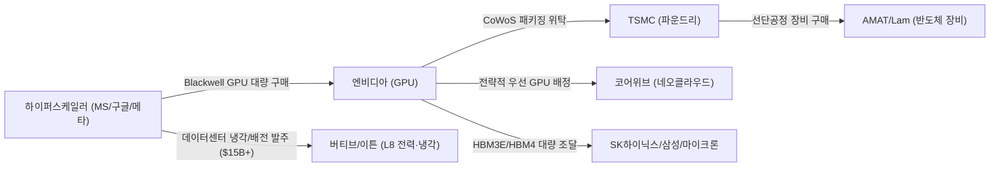

# 기업 마스터 관리 및 L8_POWER 확장 아키텍처 명세서

**작성일**: 2026-09-16  
**프로젝트 기준 시점**: 2026-09-10  
**문서 상태**: 확정 및 DB 반영 완료 (Approved & Executed)  
**마이그레이션 스크립트**: [scripts/add_entities_l8_expansion.sql](file:///Users/boon/Dropbox/03_code/b_0910_memory_claude/scripts/add_entities_l8_expansion.sql)  
**DB 총 관리 기업 수**: **36개사 (기존 21개사 + L8 전력 4개사 + 네오클라우드/장비/패키징 11개사)**

---

## 1. 개요 및 설계 원칙

본 문서는 Memory Claude의 밸류체인 유니버스를 확장하면서도 시스템의 안정성을 100% 보존하기 위한 **8대 레이어(`L1_AI_LAB` ~ `L8_POWER`) 표준 체계**와 **xAI의 SpaceX 통합 규약**을 정의합니다.

### 3대 핵심 원칙
1. **`L1` ~ `L7` 기존 레이어 100% 유지**:
   - 기존의 `L1_AI_LAB`, `L2_HYPERSCALER`, `L3_COMPUTE`, `L4_FOUNDRY`, `L5_MEMORY`, `L6_OPTICAL`, `L7_INFRA` 코드를 일체 변경하지 않아 기존 쿼리 및 대시보드 호환성을 완벽히 유지합니다.
2. **`L8_POWER` (전력 & 에너지 인프라) 단독 신설**:
   - 2026~2028년 AI 인프라 확장의 최대 병목인 **액체냉각(Liquid Cooling), 배전·변압기, 가스터빈 및 발전 인프라**를 독립된 `L8_POWER` 계층으로 분리하여 자본 흐름의 선명성을 극대화합니다.
3. **xAI의 SpaceX 통합 관리 (`SPACEX`)**:
   - 일론 머스크의 xAI(Grok 개발사, 멤피스 Colossus 100k GPU 클러스터)는 독자 엔티티로 분리하지 않고, **`SPACEX` (SpaceX / xAI)**로 일원화 통합하여 스타링크 위성망 및 전력 인프라 시너지 관점에서 추적합니다.
   - `xAI`, `Colossus`, `Grok` 등의 명칭은 `entity_aliases`를 통해 `SPACEX`로 자동 매핑됩니다.

---

## 2. 8대 밸류체인 레이어 체계 (36개사 마스터)

| 계층 코드 | 계층 명칭 | 주요 역할 | 소속 기업 리스트 (`entity_id` / ticker) |
| :--- | :--- | :--- | :--- |
| **`L1_AI_LAB`** | AI 프론티어 랩 | 프론티어 모델 개발, 컴퓨트 수요 진원지 | • 앤트로픽 (`ANTHROPIC`) • 오픈AI (`OPENAI`) |
| **`L2_HYPERSCALER`** | 하이퍼스케일러 & 네오클라우드 | AI Capex 주도, 클라우드 & GPU 인프라 대여 | • 구글 (`GOOGLE` / GOOGL) • 아마존 (`AMAZON` / AMZN) • 마이크로소프트 (`MICROSOFT` / MSFT) • 메타 (`META` / META) • 오라클 (`ORACLE` / ORCL) • **코어위브 (`COREWEAVE`)** ⬅ 네오클라우드 • **네비우스 (`NEBIUS` / NBIS)** ⬅ 네오클라우드 |
| **`L3_COMPUTE`** | 컴퓨팅 & 가속기 | GPU, CPU, ASIC, 서버 시스템 공급 | • 엔비디아 (`NVIDIA` / NVDA) • AMD (`AMD` / AMD) • 브로드컴 (`BROADCOM` / AVGO) • **Arm (`ARM` / ARM)** ⬅ CPU IP • **인텔 (`INTEL` / INTC)** ⬅ 서버 CPU |
| **`L4_FOUNDRY`** | 파운드리, 장비 & 패키징 | 선단공정 제조, 반도체 장비, 외주 패키징(OSAT) | • TSMC (`TSMC` / TSM) • ASML (`ASML` / ASML) • **어플라이드 (`APPLIED_MATERIALS` / AMAT)** ⬅ 장비 • **램리서치 (`LAM_RESEARCH` / LRCX)** ⬅ 장비 • **KLA (`KLA` / KLAC)** ⬅ 장비 • **ASE (`ASE` / ASX)** ⬅ 패키징 • **앰코 (`AMKOR` / AMKR)** ⬅ 패키징 |
| **`L5_MEMORY`** | 메모리 & 스토리지 | HBM, 범용 DRAM, NAND, eSSD | • SK하이닉스 (`SK_HYNIX` / 000660) • 삼성전자 (`SAMSUNG` / 005930) • 마이크론 (`MICRON` / MU) • 샌디스크/WDC (`WDC` / WDC) • **키옥시아 (`KIOXIA` / 285A)** ⬅ NAND/eSSD |
| **`L6_OPTICAL`** | 광통신 & 네트워킹 | AI 클러스터 스위치 패브릭, 광트랜시버 | • 마벨 (`MARVELL` / MRVL) • 코히어런트/노발리 (`COHERENT` / COHR) • **아리스타 (`ARISTA` / ANET)** ⬅ 1.6T 스위치 |
| **`L7_INFRA`** | 인프라 & 특수 플랫폼 | 온디바이스, 우주/AI 통합, 투자 펀드 | • **스페이스X / xAI (`SPACEX`)** ⬅ xAI 통합 • 애플 (`APPLE` / AAPL) • 소프트뱅크 (`SOFTBANK` / 9984) |
| ⚡ **`L8_POWER`** | **전력 & 에너지 인프라** | **AI 데이터센터 고밀도 냉각, 배전, 발전 솔루션** | • **버티브 (`VERTIV` / VRT)** ⬅ 액체냉각 1위 • **이튼 (`EATON` / ETN)** ⬅ 배전·변압기 • **GE 버노바 (`GE_VERNOVA` / GEV)** ⬅ 가스터빈/발전 • **슈나이더 (`SCHNEIDER` / SU)** ⬅ 전력 인프라 |

---

## 3. xAI의 SpaceX 통합 관리 상세 (`SPACEX`)

- **통합 사유**: 
  - xAI는 단순 모델 연구소를 넘어 테네시주 멤피스에 100k H100/H200 규모의 초대형 슈퍼컴퓨터 **Colossus**를 가동 중이며, 대규모 이동식 가스터빈 발전기를 직접 가동하는 등 인프라 레벨에서 SpaceX 및 머스크 생태계와 긴밀히 융합되어 있습니다.
- **DB 반영 사항**:
  - `entities.entity_id`: `SPACEX`
  - `entities.name_ko`: `스페이스X / xAI`
  - `entities.description`: `Starlink 저궤도 위성 통신망 + xAI Colossus 100k GPU 슈퍼컴퓨터 및 자체 가스터빈 전력 인프라`
  - `entity_aliases` 매핑:
    - `xAI` → `SPACEX`
    - `XAI` → `SPACEX`
    - `xai` → `SPACEX`
    - `Colossus` → `SPACEX`
    - `Grok` → `SPACEX`

---

## 4. 자본 흐름(Sankey) 및 전력 인프라 연계

`L8_POWER`와 네오클라우드(`COREWEAVE`)의 추가로, 대시보드 Sankey 다이어그램에서 실제 산업 자본의 순환이 완벽하게 가시화됩니다:

---

## 5. 변경 완료 확인 및 검증 결과

1. **외래키 무결성 검증**:
   - `PRAGMA foreign_key_check;` 실행 결과: **오류 0건 (Complete Pass)**
2. **DB 무결성 검증**:
   - `PRAGMA integrity_check;` 실행 결과: **`ok`**
3. **재현성 보장**:
   - [scripts/init_db.sql](file:///Users/boon/Dropbox/03_code/b_0910_memory_claude/scripts/init_db.sql)의 SEED DATA에 36개 기업 및 신규 별칭이 동기화되어, 향후 DB 재생성 시에도 완벽히 복원됩니다.
4. **산출물 동기화**:
   - [docs/memory_claude_value_chain.canvas](file:///Users/boon/Dropbox/03_code/b_0910_memory_claude/docs/memory_claude_value_chain.canvas): 36개 기업 8대 레이어 노드 자동 생성 완료.
   - [dashboard/sankey_scenario.html](file:///Users/boon/Dropbox/03_code/b_0910_memory_claude/dashboard/sankey_scenario.html): 버티브(`L8_POWER`), 코어위브(`COREWEAVE`) 자본 흐름 및 전용 필터 버튼 장착 완료.
