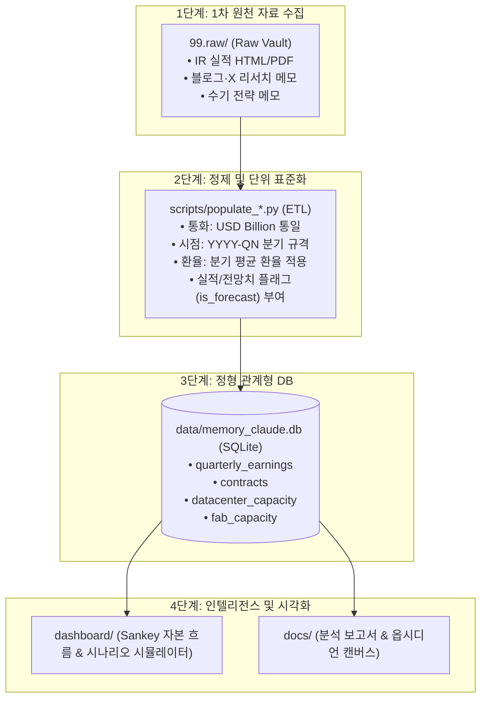

# 99.raw 원천 계층 아키텍처 및 RAG 방식 비교 분석

**작성일**: 2026-09-16  
**프로젝트 기준 시점**: 2026-09-10  
**문서 상태**: 공식 아키텍처 가이드 (Approved)  
**관련 문서**:
- [AGENTS.md](file:///Users/boon/Dropbox/03_code/b_0910_memory_claude/AGENTS.md) (디렉토리 접근 및 보호 정책)
- [db_architecture.md](file:///Users/boon/Dropbox/03_code/b_0910_memory_claude/docs/db_architecture.md) (원천 계층 및 SQLite 스키마)
- [2026-09-13_feasibility_and_core_value.md](file:///Users/boon/Dropbox/03_code/b_0910_memory_claude/docs/2026-09-13_feasibility_and_core_value.md)

---

## 1. 개요 (Executive Summary)

본 문서는 `b_0910_memory_claude` 시스템의 `99.raw/` 디렉토리가 채택하고 있는 데이터 처리 구조의 정체성을 명확히 정의하고, 일반적인 **RAG(Retrieval-Augmented Generation, 검색 증강 생성)** 방식과의 구조적 차이점 및 장단점, 그리고 향후 확장 가능성을 정리합니다.

- **현재 구조**: **정형화 ETL 파이프라인 + 원천 데이터 금고(Raw Vault) + 감사 추적(Audit Lineage)**
- **RAG 여부**: 현재 상태에서는 벡터 임베딩 및 유사도 검색 기반의 RAG를 사용하지 않으며, **관계형 데이터베이스(SQLite) 기반 정량 인텔리전스 시스템**으로 운영됨.

---

## 2. 현재 `99.raw/`의 역할과 데이터 파이프라인

### 2.1 3대 핵심 역할

1. **원천 데이터 금고 (Raw Evidence Vault)**:
   - 사용자가 수집한 1차 자료(증권사/전문가 블로그, X 스크랩, IR 실적 발표 전문, 10-Q/10-K, 뉴스 등)를 변조 없이 원형 그대로 보존합니다.
   - `AGENTS.md` 제3조에 따라 에이전트는 사용자의 명시적 요청 없이 기존 파일을 수정하거나 삭제하지 않습니다.
2. **정형 ETL 파이프라인의 입력 계층 (Source of Truth)**:
   - 비정형 원문에서 필요한 핵심 수치(매출, 영업이익, Capex, 공급 계약, Fab 생산 능력, 데이터센터 전력량 등)를 추출하여 정형화 스크립트(`scripts/populate_*.py`)를 통해 관계형 DB로 적재합니다.
3. **감사 추적 및 근거 연결 (Audit Lineage & Grounding)**:
   - SQLite DB의 각 테이블(`quarterly_earnings`, `contracts`, `datacenter_capacity`, `fab_capacity`) 레코드에는 `raw_source` 필드가 존재하여, 대시보드나 리포트에 표기된 숫자의 최초 출처를 `99.raw/...` 상대 경로로 즉시 역추적할 수 있습니다.

### 2.2 파이프라인 흐름도



---

## 3. 현재 방식 vs RAG 방식 심층 비교

| 비교 항목 | 현재 방식 (Data Vault + SQLite) | 일반적 RAG 방식 (Vector Search) |
| :--- | :--- | :--- |
| **데이터 형태** | 파일 원본 보존 + 정규화된 관계형 테이블 | 텍스트 청크(Chunk) 분할 + 고차원 벡터 임베딩 |
| **저장소** | 로컬 파일시스템 + SQLite (`data/memory_claude.db`) | 벡터 데이터베이스 (Chroma, Pinecone, FAISS 등) |
| **검색/질의 방식** | 정확한 SQL 쿼리, 시계열 필터, 수학적 집계 | 자연어 의미 기반 유사도 검색 (Cosine Similarity) |
| **수치 정확도** | **100% 정밀 보장** ($30.04B, 12GW 등 오차 없음) | 환각(Hallucination), 단위 누락, 시점 혼선 위험 존재 |
| **적합한 작업** | • 분기별 실적 및 Capex 추이 비교<br/>• 공급망 자본 흐름(Sankey)<br/>• 변수 변경에 따른 실적 시나리오 시뮬레이션 | • "A사 컨콜 분위기가 어땠는가?" 질적 요약<br/>• 여러 기사 속 비정형 의견 종합 질의응답 |
| **유지 관리 비용** | 스키마 관리 및 적재 스크립트 작성 필요 | 임베딩 비용, 청킹 전략 튜닝, 재색인 필요 |

### 3.1 왜 본 프로젝트는 정형 DB 방식을 우선했는가?

1. **투자·산업 분석의 핵심은 '숫자의 무결성'**:
   - 하이퍼스케일러의 AI Capex 규모와 메모리 3사의 분기 실적은 소수점 단위의 오차나 분기 시점 혼동이 치명적입니다.
   - LLM 기반 RAG는 정성적인 텍스트 요약에는 뛰어나지만, *"2024~2026년 빅4 Capex 합산 추이와 SK하이닉스 HBM 매출 비율"*과 같은 수학적 집계 쿼리에서는 환각이나 누락이 발생하기 쉽습니다.
2. **21개 핵심 기업으로 고정된 유니버스**:
   - 분석 범위가 전 세계 모든 기업이 아닌 21개 핵심 밸류체인 기업으로 한정되어 있어, 정형 스키마로 관리할 때의 비용 대비 효용이 극대화됩니다.

---

## 4. 향후 확장: 하이브리드 RAG (정량 DB + 정성 RAG)

현재 구조는 RAG와 배타적인 관계가 아니며, 오히려 **가장 이상적인 하이브리드 구조**로 확장될 수 있습니다.

```
[사용자 질의]
      │
      ├─ 정량 질의 ("2026-Q2 엔비디아 데이터센터 매출은?") ──► [SQLite DB] (100% 정확한 수치 반환)
      │
      └─ 정성 질의 ("엔비디아 블랙웰 패키징 지연에 대한 시장 의견은?")
             │
             ▼
        [99.raw/ 기반 로컬 RAG] (블로그, 분석글 청크 검색 후 LLM 요약)
```

### 4.1 향후 RAG 도입 시 추천 로드맵 (Phase 7 이후)
1. **대상**: `99.raw/strategy/`, `99.raw/financials/` 내의 HTML 텍스트 본문.
2. **구현 방안**:
   - 외부 API 비용 없이 작동하는 경량 로컬 임베딩 모델(예: BGE-m3, MiniLM) 사용.
   - SQLite의 `sqlite-vec` 확장 또는 로컬 Chroma DB 연동.
   - 출처 문서의 메타데이터(`entity_id`, `date`)를 벡터 메타데이터와 결합하여 하이브리드 필터링 제공.

---

## 5. 결론

- `99.raw/`는 단순 RAG용 문서 덤프가 아니라, **정량 데이터의 엄밀한 소스 추적(Lineage)과 원천 보호를 위한 아키텍처적 금고**입니다.
- 정량 데이터는 **SQLite DB**가 책임지고, 향후 정성적 리서치 질문 대응이 필요해질 때 `99.raw/`를 지식 베이스로 삼아 **RAG 레이어를 추가로 얹는 것이 가장 이상적인 방향**입니다.
