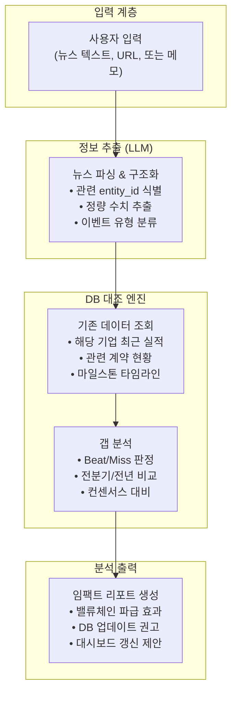

# 뉴스 인텔리전스 레이어 설계 — 순방향 분석과 역방향 발견

**작성일**: 2026-09-17  
**프로젝트 기준 시점**: 2026-09-10  
**DB 현황**: 36개사 마스터 (L1~L8), 실적 658건 (28개사), 계약 15건 ($877B), 마일스톤 25건, Fab 12건  
**관련 문서**:
- [AGENTS.md](file:///Users/boon/Dropbox/03_code/b_0910_memory_claude/AGENTS.md) (밸류체인 8대 레이어 36개사 마스터)
- [2026-09-16_raw_layer_architecture_and_rag_comparison.md](file:///Users/boon/Dropbox/03_code/b_0910_memory_claude/docs/2026-09-16_raw_layer_architecture_and_rag_comparison.md) (현 아키텍처 vs RAG 비교)
- [scripts/sync_chrome_bookmarks.py](file:///Users/boon/Dropbox/03_code/b_0910_memory_claude/scripts/sync_chrome_bookmarks.py) (기존 북마크 동기화)

---

## 0. 핵심 질문의 두 방향

사용자가 제기한 질문은 **서로 보완적인 두 방향**입니다:

```
        ┌─────────────────────────────────────────────────┐
        │                Memory Claude DB                 │
        │  실적 658건 · 계약 $877B · 마일스톤 25건 · Fab 12건 │
        └────────────┬──────────────────┬─────────────────┘
                     │                  │
          ┌──────────▼─────────┐  ┌─────▼──────────────────┐
          │  방향 A (순방향)      │  │  방향 B (역방향)          │
          │  📥 → 📊            │  │  📊 → 🔍               │
          │                    │  │                        │
          │  뉴스가 들어오면      │  │  DB에 축적된 데이터를     │
          │  기존 DB와 대조하여   │  │  기반으로 "지금 봐야 할   │
          │  임팩트를 즉시 분석   │  │  뉴스"를 역으로 발견      │
          └────────────────────┘  └────────────────────────┘
```

| 구분 | 방향 A: 순방향 (News → Analysis) | 방향 B: 역방향 (DB → News Discovery) |
|:---|:---|:---|
| **트리거** | 새 뉴스/실적 발표 발생 | 정기 점검 또는 수동 실행 |
| **질문** | *"이 뉴스가 우리 밸류체인에 어떤 영향?"* | *"지금 DB에서 빠져있거나 확인해야 할 것은?"* |
| **핵심 가치** | 즉시 반응, 정량적 임팩트 산출 | 놓치고 있는 정보 발굴, 데이터 완결성 |
| **기술 난이도** | ⭐⭐ (LLM API 필요) | ⭐ (규칙 엔진 + SQLite만으로 가능) |

---

## 1. 방향 A — 순방향: 새 뉴스 → 기존 DB 대조 분석

### 1.1 사용 시나리오

```
[사용자 입력]
  "SK하이닉스가 2026-Q3 실적 발표에서 영업이익률 48.2%를 기록했다.
   HBM4 12단 양산을 앞당기고 NVIDIA에 독점 선공급 계약을 연장했다."

[시스템 분석 출력]
  ┌──────────────────────────────────────────────────────────┐
  │ 📊 임팩트 분석 리포트                                       │
  │                                                          │
  │ 1. 실적 대조                                              │
  │    - OPM 48.2% → 전분기(2026-Q2) 46.3% 대비 +1.9%p 개선   │
  │    - DB 전망치: 45.0% (C2 컨센서스) → Beat +3.2%p          │
  │    - 4분기 연속 OPM 상승 추세 확인                          │
  │                                                          │
  │ 2. 계약 영향                                              │
  │    - 기존 CON-NVDA-SKH: $18.0B → 연장 시 $22~25B 추정     │
  │    - 삼성 CON-NVDA-SAM: $14.0B 계약에 가격 경쟁 압력 가능   │
  │                                                          │
  │ 3. 밸류체인 파급                                           │
  │    - L4 TSMC: CoWoS 패키징 수요 +15% 상향 가능             │
  │    - L3 NVIDIA: 원가 안정→마진 유지→Rubin 생산 가속          │
  │    - L8 전력: SK하이닉스 M15X 전력 수요 상향 조정 검토 필요    │
  │                                                          │
  │ 4. 추천 후속 조치                                          │
  │    ☐ earnings_reports에 2026-Q3 실적 업데이트               │
  │    ☐ contracts 테이블 독점 연장 반영 검토                     │
  │    ☐ HBM 수급 시뮬레이터 파라미터 업데이트                    │
  └──────────────────────────────────────────────────────────┘
```

### 1.2 구현 아키텍처



### 1.3 기술적 구현 방안 (3단계)

#### Stage 1: 수동 프롬프트 방식 (즉시 구현 가능, LLM API 불필요)

현재 에이전트(Antigravity/Claude)와의 대화 자체가 이미 **수동 순방향 분석기**입니다. 차이점은 이를 **표준화된 프롬프트 템플릿**으로 만드는 것입니다.

```python
# scripts/analyze_news_impact.py
# 사용자가 뉴스 텍스트를 입력하면 DB를 자동 조회하여
# 대조 컨텍스트를 준비해주는 도우미 스크립트

"""
사용법:
  python3 scripts/analyze_news_impact.py "SK하이닉스 2026-Q3 OPM 48.2%"

출력:
  - 해당 entity의 최근 8분기 실적 테이블
  - 관련 계약 목록
  - 해당 기업이 포함된 마일스톤
  - → 이 출력을 LLM에게 "이 뉴스의 임팩트를 분석하라"와 함께 전달
"""
```

**장점**: 추가 API 비용 없음, 즉시 구현, 에이전트와의 대화에서 자연스럽게 활용  
**한계**: 매번 수동으로 실행해야 함

#### Stage 2: 반자동 분석 (북마크 연동)

기존 [sync_chrome_bookmarks.py](file:///Users/boon/Dropbox/03_code/b_0910_memory_claude/scripts/sync_chrome_bookmarks.py)를 확장하여:

1. **새로 추가된 북마크** 감지 (diff 기반)
2. 북마크 URL의 페이지 제목에서 **entity_id 자동 매칭** (36개사 마스터 + `entity_aliases` 테이블 활용)
3. 매칭된 entity의 **DB 컨텍스트를 자동 첨부**한 분석 프롬프트 생성

```
[새 북마크 감지]
  → "SK하이닉스 3분기 영업이익 7조 돌파" (URL: ...)
  → entity_id: SK_HYNIX 자동 매칭
  → DB 조회: 최근 실적, 계약, Fab 캐파
  → 분석 프롬프트 자동 생성 → docs/news_alerts/2026-09-17_sk_hynix.md 저장
```

#### Stage 3: LLM API 기반 완전 자동 분석 (향후)

```python
# 뉴스 텍스트 → Gemini/Claude API → 구조화 JSON → DB 대조 → 임팩트 리포트
# 비용: ~$0.01~0.05/건 (Gemini Flash 또는 Claude Haiku 기준)
```

### 1.4 구현 우선순위 평가

| Stage | 구현 난이도 | 외부 의존성 | 즉시 가치 | 추천 |
|:---|:---|:---|:---|:---|
| Stage 1 (프롬프트 템플릿 + DB 조회 스크립트) | ⭐ | 없음 | ⭐⭐⭐⭐ | **✅ 즉시 구현** |
| Stage 2 (북마크 diff + 자동 매칭) | ⭐⭐ | 없음 | ⭐⭐⭐ | ✅ 단기 |
| Stage 3 (LLM API 완전 자동) | ⭐⭐⭐ | API 키 | ⭐⭐⭐⭐⭐ | 중기 |

---

## 2. 방향 B — 역방향: DB 기반 → 중요 뉴스 발견

### 2.1 핵심 개념: "데이터가 말해주는 감시 대상 목록"

현재 DB에 축적된 658건의 실적, 15건의 계약, 25건의 마일스톤에서 **"앞으로 무엇을 봐야 하는가"**를 자동으로 도출합니다.

### 2.2 역방향 발견의 6가지 유형

#### 유형 1: 📅 실적 발표 캘린더 기반 감시 (Earnings Watch)

```sql
-- "다음 분기 실적이 아직 DB에 없는 기업"을 자동 식별
SELECT e.entity_id, e.name_ko, e.layer,
       MAX(er.period) as last_period
FROM entities e
JOIN earnings_reports er ON e.entity_id = er.entity_id
WHERE er.is_forecast = 0
GROUP BY e.entity_id
HAVING MAX(er.period) < '2026-Q3'
ORDER BY e.layer;
```

**출력 예시**:
```
⚠️ 2026-Q3 확정 실적 미입력 기업 감시 목록 (기준일: 2026-09-17)
─────────────────────────────────────────
 NVIDIA (L3)      | 마지막 확정: 2026-Q2 | 8/28 발표 예정 → 확인 필요
 SK_HYNIX (L5)    | 마지막 확정: 2026-Q2 | 10월 발표 예정 → 대기
 GOOGLE (L2)      | 마지막 확정: 2026-Q2 | 10/22 발표 예정 → 대기
 ...
```

**가치**: *"어떤 기업의 실적을 놓치고 있는가"*를 자동으로 알려줌

#### 유형 2: 🔗 계약 만료/갱신 감시 (Contract Expiry Watch)

```sql
-- 계약 종료일이 6개월 이내인 계약 식별
SELECT contract_id, buyer_id, seller_id, value_b, end_date, description
FROM contracts
WHERE end_date IS NOT NULL
  AND end_date <= date('2027-03-10')
  AND end_date >= date('2026-09-10')
ORDER BY end_date;
```

**가치**: 대형 계약의 갱신/확대 여부가 밸류체인 전체에 영향. 미리 감시 설정.

#### 유형 3: 🏭 마일스톤 도래 감시 (Milestone Arrival Watch)

```sql
-- 향후 12개월 내 도래하는 마일스톤
SELECT entity_id, event_date, category, description, impact_level
FROM milestones
WHERE event_date BETWEEN '2026-09-10' AND '2027-09-10'
  AND is_forecast = 1
ORDER BY event_date;
```

현재 DB의 마일스톤:

| 시점 | 기업 | 이벤트 | 임팩트 |
|:---|:---|:---|:---|
| 2026-Q4 | NVIDIA | Blackwell Ultra B300 양산 출하 개시 | CRITICAL |
| 2027-01 | NVIDIA | Rubin R100 GPU 샘플 출하 | CRITICAL |
| 2027-03 | SK_HYNIX | HBM4 16단 대량 양산 개시 | CRITICAL |
| 2027-06 | SAMSUNG | P4 HBM4 턴키 대형 납품 | HIGH |
| 2027-08 | GOOGLE | TPU Ironwood 인프라 50% 돌파 | HIGH |
| 2028-04 | TSMC | 애리조나 Fab 21 2nm 가동 | MEDIUM |

**가치**: *"이 마일스톤이 예정대로 진행되고 있는지"* 확인할 뉴스를 능동적으로 찾아야 함

#### 유형 4: 📊 이상치 감지 기반 뉴스 탐색 (Anomaly-Driven Search)

```sql
-- 전분기 대비 매출 20% 이상 급변한 기업 → 원인 뉴스 필요
SELECT e.name_ko, er1.period as curr_q, er1.revenue as curr_rev,
       er0.revenue as prev_rev,
       ROUND((er1.revenue - er0.revenue) / ABS(er0.revenue) * 100, 1) as qoq_pct
FROM earnings_reports er1
JOIN earnings_reports er0 ON er1.entity_id = er0.entity_id
JOIN entities e ON er1.entity_id = e.entity_id
WHERE er0.period = '2026-Q1' AND er1.period = '2026-Q2'
  AND ABS((er1.revenue - er0.revenue) / ABS(er0.revenue)) > 0.20
ORDER BY ABS(qoq_pct) DESC;
```

**가치**: *"이 기업의 급격한 변화를 설명하는 뉴스가 99.raw에 있는가?"*

#### 유형 5: 🕳️ 데이터 공백 감지 (Data Gap Detection)

```sql
-- 36개 엔티티 중 실적 데이터가 없는 기업
SELECT e.entity_id, e.name_ko, e.layer
FROM entities e
LEFT JOIN earnings_reports er ON e.entity_id = er.entity_id
WHERE er.entity_id IS NULL
ORDER BY e.layer;
```

현재 실적 미보유 8개사: `ANTHROPIC`, `OPENAI`, `COREWEAVE`, `NEBIUS`, `SPACEX`, `SOFTBANK`, `ASML`, `SCHNEIDER`

**가치**: *"이 기업들의 실적이 공개되었는가? 비상장사라면 어떤 프록시 데이터로 추정할 수 있는가?"*

#### 유형 6: ⚖️ 크로스체크 기반 검증 필요 항목 (Cross-Validation Needs)

```
[자동 감지 규칙]
 - NVIDIA 매출 $40B+ 인데 TSMC 매출이 전분기 대비 정체 → 비정상적 괴리
 - SK하이닉스 OPM 46%+ 인데 삼성 OPM이 한 자릿수 → 격차 원인 확인
 - Capex 분기 $20B+ 투입한 하이퍼스케일러의 다음 분기 매출 성장률 < 5% → 회수 지연?
```

### 2.3 통합 구현: "뉴스 워치리스트 자동 생성기"

위 6가지 유형을 하나의 스크립트로 통합하여 **정기적으로 실행 가능한 감시 보고서**를 자동 생성합니다.

```python
# scripts/generate_news_watchlist.py
#
# 실행: python3 scripts/generate_news_watchlist.py
# 출력: docs/news_watchlist_YYYY-MM-DD.md
#
# 기능:
#   1. 실적 미입력 기업 식별 (Earnings Watch)
#   2. 계약 만료 임박 알림 (Contract Expiry Watch)
#   3. 마일스톤 도래 목록 (Milestone Arrival Watch)
#   4. 이상치 기업 탐색 (Anomaly Detection)
#   5. 데이터 공백 기업 (Gap Detection)
#   6. 밸류체인 크로스체크 (Cross-Validation)
#
# → 각 항목에 대해 "확인해야 할 뉴스/정보" 키워드 자동 생성
```

**출력 예시 (docs/news_watchlist_2026-09-17.md)**:

```markdown
# 📋 뉴스 워치리스트 (2026-09-17 자동 생성)

## 🔴 긴급 확인 (Critical)
1. **NVIDIA 2026-Q3 실적** — 8월 28일 발표 예정, 아직 DB 미반영
   - 검색 키워드: "NVIDIA Q3 2026 earnings", "엔비디아 3분기 실적"
   - 확인 포인트: Blackwell 매출 비중, 데이터센터 $40B 돌파 여부

2. **Blackwell Ultra B300 양산** — 2026-Q4 마일스톤 도래
   - 검색 키워드: "Blackwell Ultra B300 production", "B300 양산"
   - 확인 포인트: TSMC CoWoS 캐파 제약 여부

## 🟡 주의 (Watch)
3. **SK_HYNIX vs SAMSUNG OPM 격차 확대** — 40%p+ 괴리
   - 검색 키워드: "삼성 HBM4 수율", "SK하이닉스 삼성 점유율"
   
4. **앤트로픽 $518B 컴퓨트 조달** — 실행 진척도 확인
   - 검색 키워드: "Anthropic compute deal", "앤트로픽 데이터센터"

## 🟢 데이터 보강 (Enhancement)
5. **비상장 8개사 프록시 데이터** — Anthropic, OpenAI, SpaceX 등
   - 검색 키워드: 각 사 최근 밸류에이션, 매출 추정치
```

---

## 3. 두 방향의 시너지: 통합 인텔리전스 루프

```
         ┌──────────────────────────────────────────┐
         │         통합 인텔리전스 루프               │
         │                                          │
         │   ┌─────────┐        ┌─────────┐         │
         │   │ 방향 B   │ ────► │ 방향 A   │         │
         │   │역방향 발견│워치리스│순방향 분석│         │
         │   │          │트 제공 │          │         │
         │   └────▲─────┘       └─────┬────┘         │
         │        │                   │              │
         │        │    DB 업데이트     │              │
         │        │                   ▼              │
         │   ┌────┴──────────────────────┐           │
         │   │    memory_claude.db       │           │
         │   │  (실적·계약·마일스톤·Fab)   │           │
         │   └───────────────────────────┘           │
         └──────────────────────────────────────────┘
```

**루프 동작 방식**:
1. **방향 B** (역방향)가 "NVIDIA Q3 실적 확인 필요"를 감지
2. 사용자가 해당 뉴스를 찾아 입력
3. **방향 A** (순방향)가 뉴스를 DB와 대조하여 임팩트 분석
4. 분석 결과에 따라 DB 업데이트 (실적 입력, 계약 갱신 등)
5. DB가 업데이트되면 **방향 B**가 새로운 워치리스트를 갱신

---

## 4. 실현 가능성 평가 및 제약 조건

### 4.1 현재 기술 스택에서 가능한 것

| 기능 | 가능 여부 | 필요 기술 | 비고 |
|:---|:---|:---|:---|
| DB 기반 워치리스트 생성 (방향 B) | ✅ **즉시 가능** | Python + SQLite | 추가 API 불필요 |
| 뉴스 텍스트 DB 대조 (방향 A, Stage 1) | ✅ **즉시 가능** | Python + SQLite | 에이전트 대화에서 활용 |
| 북마크 diff 기반 새 뉴스 감지 | ✅ **즉시 가능** | 기존 sync_chrome_bookmarks.py 확장 | |
| 자동 뉴스 수집 (RSS/API) | ⚠️ 조건부 가능 | 뉴스 API (Google News, Seeking Alpha RSS 등) | 무료 티어 한계 있음 |
| LLM 기반 자동 분석 | ⚠️ 조건부 가능 | Gemini/Claude API 키 필요 | 비용 ~$0.01~0.05/건 |
| 실시간 뉴스 스트림 모니터링 | ❌ 과도 | 상시 서버 + 뉴스 스트림 API | 현 로컬 시스템에 부적합 |

### 4.2 현실적 제약

1. **로컬 시스템 한계**: 상시 서버가 아닌 로컬 스크립트 기반이므로 "실시간" 모니터링은 부적합. **주기적 배치 실행**(매일/매주)이 적합.
2. **뉴스 소스 접근**: 대부분의 금융 뉴스 API는 유료. 현실적 대안:
   - **무료**: Google News RSS, 크롬 북마크 수동 추가, X(Twitter) 수동 스크랩
   - **반무료**: Seeking Alpha RSS (요약만), Yahoo Finance API (기본 데이터)
   - **유료**: Bloomberg API, Refinitiv, Alpha Vantage Pro
3. **데이터 입력은 사용자 주도**: AGENTS.md 원칙상 에이전트가 DB에 임의 삽입하지 않으므로, 분석 결과를 **"추천"**으로 제시하고 사용자가 확인 후 반영하는 흐름이 적절.

---

## 5. 추천 구현 로드맵

### Phase 1: 즉시 구현 (1~2일) ⭐ 추천

> **`scripts/generate_news_watchlist.py`** — DB 기반 역방향 워치리스트 자동 생성기

- 6가지 유형의 감시 항목을 SQLite 쿼리로 자동 추출
- `docs/news_watchlist_YYYY-MM-DD.md` 파일로 출력
- 각 항목에 **검색 키워드**, **확인 포인트**, **우선순위(Critical/Watch/Enhancement)** 자동 부여
- 대시보드 (`dashboard/index.html`)에 "📋 뉴스 워치리스트" 링크 추가

### Phase 2: 단기 (3~5일)

> **`scripts/analyze_news_impact.py`** — 순방향 뉴스 임팩트 분석 도우미

- CLI에서 뉴스 텍스트 또는 URL을 입력하면:
  1. 텍스트에서 기업명/ticker 자동 매칭 (`entity_aliases` 테이블 활용)
  2. 매칭된 기업의 최근 실적, 계약, 마일스톤을 자동 조회
  3. **대조 컨텍스트가 포함된 분석 프롬프트**를 자동 생성
  4. 결과를 `docs/news_alerts/YYYY-MM-DD_ENTITY.md`로 저장
- 에이전트와의 대화에서도 즉시 활용 가능 (프롬프트 복사-붙여넣기)

### Phase 3: 중기 (선택적)

> **북마크 diff 기반 반자동 신규 뉴스 감지**

- `sync_chrome_bookmarks.py` 확장: 이전 실행과의 diff 비교로 **새로 추가된 북마크**만 추출
- 새 북마크의 제목에서 entity 매칭 → Phase 2의 임팩트 분석 자동 트리거

### Phase 4: 장기 (선택적, API 키 필요)

> **LLM API 기반 완전 자동 분석 파이프라인**

- Gemini Flash 또는 Claude Haiku로 뉴스 텍스트 → 구조화 JSON 자동 변환
- 자동 Beat/Miss 판정, 밸류체인 파급 효과 추정
- 월 비용 추정: 하루 5~10건 분석 시 **~$5~15/월**

---

## 6. 결론 및 핵심 판단

### 가능합니다. 그리고 두 방향 모두 구현해야 합니다.

| | 방향 A (순방향) | 방향 B (역방향) |
|:---|:---|:---|
| **핵심 가치** | 뉴스에 즉각 반응 | 놓치는 뉴스 방지 |
| **먼저 구현할 것** | Phase 2 | **Phase 1** ⭐ |
| **이유** | DB 컨텍스트가 있어야 분석 품질↑ | DB만으로 즉시 실행 가능 |

**방향 B(역방향)가 먼저**인 이유:
- 현재 DB에 이미 658건의 실적 + 15건의 계약 + 25건의 마일스톤이 축적되어 있으므로, **추가 외부 의존성 없이** 워치리스트를 즉시 생성할 수 있습니다.
- 워치리스트가 있으면 사용자가 **무엇을 검색해야 하는지** 명확해지고, 그 뉴스를 찾아왔을 때 방향 A의 분석이 자연스럽게 이어집니다.

> **궁극적 비전**: Memory Claude는 단순히 "데이터를 저장하는 시스템"에서 **"데이터가 스스로 다음에 볼 것을 알려주는 능동형 인텔리전스 시스템"**으로 진화합니다.
