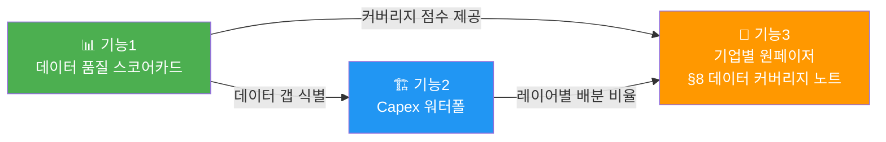

# Memory Claude — 3대 핵심 기능 요건정의서

**작성일**: 2026-09-17  
**프로젝트 기준 시점**: 2026-09-10  
**참조 문서**: [2026-09-17_additional_feature_proposals.md](file:///Users/chansoojeon/Library/CloudStorage/Dropbox/03_code/b_0910_memory_claude/docs/2026-09-17_additional_feature_proposals.md) (A-1, B-3, C-2)

---

## 현재 시스템 현황 (요건 도출 근거)

| 항목 | 수량 | 비고 |
|:---|:---:|:---|
| 마스터 기업 (`entities`) | 36사 | 8개 레이어, 비상장 8사 포함 |
| 실적 (`earnings_reports`) | 657건 | 확정 642건 / 전망 15건 |
| 실적 보유 기업 | 28사 | 비상장 8사 실적 0건 |
| Capex 입력 기업 | 2사 | GOOGLE, META만 |
| Beat/Miss 입력 기업 | 8사 | NVIDIA, GOOGLE, AMAZON 등 |
| 가이던스 입력 기업 | 2사 | NVIDIA, KIOXIA만 |
| 계약 (`contracts`) | 15건 | 총 $877B |
| 마일스톤 (`milestones`) | 25건 | — |
| Fab (`fab_capacity`) | 12건 | — |

---

# 기능 1. 📊 데이터 품질 대시보드 (Data Quality & Coverage Scorecard)

## 1.1 목적

> 36개사 × 7대 데이터 필드의 **입력 완결성**을 한눈에 시각화하여,  
> "다음에 어떤 데이터를 채워야 하는가"에 대한 우선순위를 즉시 판단할 수 있게 한다.

## 1.2 핵심 사용자 시나리오

| # | 시나리오 | 기대 결과 |
|:---:|:---|:---|
| S1 | 사용자가 대시보드에 접속하면 36개사의 데이터 커버리지 히트맵이 표시된다 | 빈칸(미입력)이 많은 기업/필드를 즉시 식별 |
| S2 | 특정 셀(예: NVIDIA × Capex)을 클릭하면 해당 데이터의 상세 현황이 표시된다 | 어떤 분기가 비어있는지 확인 |
| S3 | 레이어별 필터링이 가능하다 (L3 컴퓨팅만, L5 메모리만 등) | 관심 레이어 집중 분석 |
| S4 | 전체 시스템 데이터 품질 요약 스코어가 표시된다 | "전체 완결도 32.7%" 같은 한 줄 지표 |

## 1.3 데이터 소스 및 측정 기준

`earnings_reports` 테이블에서 아래 **7개 필드**의 NULL이 아닌 비율을 기업별로 집계:

| 측정 필드 | DB 컬럼 | 기대 분기 수 | 산출식 |
|:---|:---|:---:|:---|
| 매출 (Revenue) | `revenue` | 26 (2020-Q1~2026-Q2) | `COUNT(revenue IS NOT NULL) / 26` |
| 영업이익률 (OPM) | `op_margin_pct` | 26 | `COUNT(op_margin_pct IS NOT NULL) / 26` |
| Capex | `capex` | 26 | `COUNT(capex IS NOT NULL) / 26` |
| Beat/Miss | `beat_miss_status` | 26 | `COUNT(beat_miss_status IS NOT NULL) / 26` |
| 가이던스 | `guidance_next_q` | 26 | `COUNT(guidance_next_q IS NOT NULL) / 26` |
| EPS 실적 | `eps_actual` | 26 | `COUNT(eps_actual IS NOT NULL) / 26` |
| 컨센서스 매출 | `consensus_revenue` | 26 | `COUNT(consensus_revenue IS NOT NULL) / 26` |

**총점**: 각 기업의 7개 필드 완결 건수 합산 / (7 × 26) = 최대 182점 만점

> [!NOTE]
> 비상장 8사(Anthropic, OpenAI, CoreWeave, Nebius, Kioxia, SpaceX, ARM, Amkor)는 실적 데이터 자체가 0건이므로 별도 구역("데이터 미수집 기업")으로 분리 표시한다.

## 1.4 UI/UX 요건

### 메인 히트맵 (핵심 뷰)

```
         │ Revenue │ OPM │ Capex │ Beat │ Guide │ EPS │ Cons.Rev │ 총점
─────────┼─────────┼─────┼───────┼──────┼───────┼─────┼──────────┼─────
NVIDIA   │ 🟩 26/26│🟩26 │ 🟥 0  │🟨23  │ 🟥 1  │🟩26 │ 🟨 18   │ 120
GOOGLE   │ 🟩 26/26│🟩26 │ 🟨 2  │🟩24  │ 🟥 0  │🟩26 │ 🟨 20   │ 124
SK_HYNIX │ 🟩 24/26│🟩24 │ 🟥 0  │🟨20  │ 🟥 0  │🟩24 │ 🟨 16   │ 108
...
```

- **색상 스케일**: 🟩 80%+ → 🟨 40~79% → 🟧 10~39% → 🟥 0~9%
- **정렬**: 총점 내림차순 (기본), 클릭으로 각 열 기준 정렬 전환

### 경고 배너 (상단 요약)

```
⚠️ Capex: 2/28사만 입력 (7.1%) — 가장 시급한 데이터 갭
⚠️ 가이던스: 2/28사만 입력 (7.1%)
⚠️ 비상장 8사: 실적 0건 — 수집 가능한 자료가 있으면 우선 입력 권장
📊 전체 데이터 완결도: 약 32.7%
```

### 인터랙션

- **레이어 필터**: 체크박스로 L1~L8 필터링
- **셀 클릭**: 해당 기업 × 해당 필드의 분기별 입력 현황 팝업
- **Export**: 현재 뷰를 CSV로 다운로드

## 1.5 기술 구현 명세

| 항목 | 명세 |
|:---|:---|
| **파일 위치** | `dashboard/data_quality.html` (신규) 또는 기존 `index.html`에 탭 추가 |
| **데이터 로드** | SQLite → JSON 사전 변환 (`scripts/export_quality_scorecard.py`) |
| **차트 라이브러리** | Chart.js Matrix 플러그인 또는 순수 HTML `<table>` + CSS 히트맵 |
| **반응형** | 최소 1200px 뷰포트, 기업명 열 고정(sticky) |
| **예상 소요** | ~2시간 |

## 1.6 산출물

| 산출물 | 경로 |
|:---|:---|
| 집계 스크립트 | `scripts/export_quality_scorecard.py` |
| 대시보드 | `dashboard/data_quality.html` |
| (선택) JSON 캐시 | `data/quality_scorecard.json` |

---

# 기능 2. 🏗️ Capex → 밸류체인 전파 워터폴 차트

## 2.1 목적

> 하이퍼스케일러(L2)의 Capex $100B이 밸류체인 각 레이어(L3→L4→L5→L6→L7/L8)로  
> **어떤 비율로 분배·전파되는지**를 워터폴(Waterfall) 차트로 시각화한다.

## 2.2 핵심 사용자 시나리오

| # | 시나리오 | 기대 결과 |
|:---:|:---|:---|
| S1 | 사용자가 Capex 총액 슬라이더를 조정하면 각 레이어 배분액이 실시간 변동 | 시뮬레이션 효과 |
| S2 | 각 워터폴 단계를 클릭하면 해당 레이어에 속한 기업별 배분 상세가 표시된다 | 레이어 내 기업 비중 확인 |
| S3 | 실제 계약 데이터(contracts)에 기반한 비율과 사용자 수동 비율을 토글 가능 | 데이터 기반 vs. 추정 비교 |
| S4 | 연도/분기별로 필터링하여 Capex 흐름의 시계열 변화를 관찰 | 2024 vs. 2026 비교 |

## 2.3 데이터 소스 및 비율 산출 로직

### 1차 소스: `contracts` 테이블 (15건, $877B)

현재 계약 데이터에서 추출 가능한 레이어 간 자금 흐름:

| 흐름 경로 | 계약 건수 | 합계 ($B) | 비고 |
|:---|:---:|:---:|:---|
| L2→L1 (투자) | 3건 | $225.0B | GOOGLE→ANTH, MSFT→OPAI, AMZN→ANTH |
| L1→L2 (인프라 구매) | 2건 | $430.0B | ANTH→AWS, ANTH→GOOG |
| L2→L3 (GPU 조달) | 2건 | $55.0B | GOOG→NVDA, META→NVDA |
| L1→L3 (ASIC 파트너십) | 1건 | $65.0B | OPAI→BRCM |
| L3→L4 (웨이퍼 외주) | 1건 | $35.0B | NVDA→TSMC |
| L3→L5 (HBM 조달) | 2건 | $32.0B | NVDA→SKH, NVDA→SAM |
| L1→L5 (메모리 직납) | 2건 | $25.0B | ANTH→SKH, ANTH→MU |
| L2→L3 (ASIC) | 1건 | $10.0B | META→BRCM |

### 2차 소스: 산업 보고서 기반 추정 비율 (기본값)

계약 데이터가 충분하지 않은 경로(L2→L6 네트워킹, L2→L7/L8 인프라·전력 등)는 아래 기본 비율을 적용:

| Capex 배분 | 비율(%) | $100B 기준 |
|:---|:---:|:---:|
| L3 컴퓨팅 (GPU/ASIC) | 45% | $45.0B |
| └ L4 파운드리 전파 | 28% → (상위의 62%) | $28.0B |
| └ L5 메모리 전파 (HBM) | 17% → (상위의 38%) | $17.0B |
| L6 네트워킹/광통신 | 15~20% | $15~20B |
| L7/L8 인프라·전력 | 20~25% | $20~25B |
| L4 장비 (ASML 등) | 5~8% | $5~8B |
| 기타 (SW, 인력 등) | 5~10% | $5~10B |

> [!IMPORTANT]
> **비율 산출의 한계**: 현재 계약 데이터 15건은 전체 밸류체인 자금 흐름의 일부만 포착합니다. 특히 L6(광통신), L7/L8(인프라·전력) 방향의 계약 데이터가 0건이므로, 해당 경로는 산업 보고서 기반 추정 비율을 사용합니다. 차트에 **"추정" vs. "계약 기반"** 구분을 반드시 표시해야 합니다.

## 2.4 UI/UX 요건

### 워터폴 차트 (핵심 뷰)

```
  ▓▓▓▓▓▓▓▓▓▓▓▓▓▓▓▓▓▓▓▓  $100B  Capex (L2 하이퍼스케일러)
  │
  ├── ▓▓▓▓▓▓▓▓▓  $45B ──→ L3 컴퓨팅 (GPU/ASIC)
  │     ├── ▓▓▓▓▓  $28B ──→ L4 파운드리 (TSMC 웨이퍼)
  │     │     └── ▓▓  $8B ──→ L4 장비 (ASML/AMAT/LAM)
  │     └── ▓▓▓  $17B ──→ L5 메모리 (HBM)
  ├── ▓▓▓▓  $20B ──→ L6 네트워킹
  ├── ▓▓▓▓▓  $25B ──→ L7/L8 인프라·전력
  └── ▓▓  $10B ──→ 기타
```

### 인터랙션

- **Capex 총액 슬라이더**: $50B ~ $500B 범위, 기본값 $100B
- **비율 소스 토글**: "계약 데이터 기반" ↔ "산업 보고서 추정" ↔ "혼합(기본)"
- **레이어 드릴다운**: 워터폴 각 단계 클릭 → 해당 레이어 내 기업별 배분 파이차트
- **연도 필터**: 2024 / 2025 / 2026 선택 시 해당 연도의 실제 Capex 데이터 반영
- **데이터 신뢰도 표시**: 계약 기반 경로는 실선(━), 추정 경로는 점선(┈) + "추정" 라벨

### 하이퍼스케일러별 실제 Capex (참조 테이블)

차트 하단에 하이퍼스케일러별 실제 Capex 투입 현황을 함께 표시:

```
하이퍼스케일러 Capex 현황 (2026-Q2 기준, 연간 환산):
  GOOGLE:    $xx.xB (분기 $xx.xB × 4)
  META:      $xx.xB (분기 $xx.xB × 4)
  AMAZON:    데이터 미입력 ⚠️
  MICROSOFT: 데이터 미입력 ⚠️
```

## 2.5 기술 구현 명세

| 항목 | 명세 |
|:---|:---|
| **파일 위치** | `dashboard/capex_waterfall.html` (신규) |
| **데이터 전처리** | `scripts/export_capex_waterfall.py` — contracts + earnings_reports(capex 컬럼) 결합 |
| **차트 라이브러리** | Chart.js (Bar 차트 + floating bars로 워터폴 구현) 또는 D3.js |
| **비율 설정 파일** | `data/capex_allocation_ratios.json` — 수동 조정 가능한 비율 파라미터 |
| **예상 소요** | ~3시간 |

## 2.6 산출물

| 산출물 | 경로 |
|:---|:---|
| 비율 산출 스크립트 | `scripts/export_capex_waterfall.py` |
| 비율 설정 파일 | `data/capex_allocation_ratios.json` |
| 대시보드 | `dashboard/capex_waterfall.html` |

---

# 기능 3. 📝 기업별 원페이저 (Entity One-Pager) 자동 생성

## 3.1 목적

> 36개 기업 각각에 대해 **투자 노트 1장 분량의 현재 포지션 스냅샷**을 DB 데이터에서  
> 자동 생성하여 `docs/generated/entity_profiles/{ENTITY_ID}.md`로 출력한다.

## 3.2 핵심 사용자 시나리오

| # | 시나리오 | 기대 결과 |
|:---:|:---|:---|
| S1 | `python3 scripts/generate_entity_one_pager.py --entity SK_HYNIX` 실행 | `SK_HYNIX.md` 1개 파일 생성 |
| S2 | `python3 scripts/generate_entity_one_pager.py --all` 실행 | 36개사 전체 프로필 일괄 생성 |
| S3 | `--format html` 옵션으로 HTML 버전 출력 | 대시보드에서 직접 열람 가능 |
| S4 | 생성된 원페이저에 "데이터 부족 경고"가 자동 포함 | 비상장사나 미입력 데이터가 많은 기업에 대한 신뢰도 고지 |

## 3.3 원페이저 템플릿 구조

각 원페이저는 아래 **8개 섹션**으로 구성:

```markdown
# {name_en} ({entity_id}) — {layer_label}
> {ticker} | {country} | {description}

---

## 1️⃣ 최근 실적 추이 (Recent Earnings)
최근 4~8분기 실적 요약 테이블:
| 분기 | 매출($B) | 영업이익($B) | OPM(%) | Beat/Miss | 비고 |

## 2️⃣ 실적 트렌드 차트 (Sparkline)
매출·OPM의 26분기(2020-Q1~2026-Q2) 추이를 ASCII 또는 미니차트로 시각화

## 3️⃣ Capex 현황
capex 컬럼이 있는 경우 표시, 없으면 "⚠️ Capex 데이터 미입력" 경고

## 4️⃣ 주요 계약 (Key Contracts)
contracts 테이블에서 buyer_id 또는 seller_id로 해당 기업이 관여한 계약 목록

## 5️⃣ 마일스톤 (Key Milestones)
milestones 테이블에서 해당 기업의 이벤트 목록 (시간순)

## 6️⃣ Fab/인프라 현황
fab_capacity 테이블에서 해당 기업의 팹 목록

## 7️⃣ 핵심 관전 포인트 (Key Watchpoints)
자동 생성 규칙 기반 하이라이트 (아래 3.4절 참조)

## 8️⃣ 데이터 커버리지 노트
해당 기업의 데이터 완결도 요약 (기능1 스코어카드 연동)
```

## 3.4 자동 하이라이트 규칙 (Key Watchpoints)

스크립트가 데이터를 분석하여 **규칙 기반**으로 자동 생성하는 인사이트:

| 규칙 ID | 조건 | 출력 메시지 |
|:---:|:---|:---|
| W1 | 최근 분기 OPM ≥ 50% | ⚡ OPM {X}%는 동종 레이어 평균 대비 상위권 |
| W2 | 최근 4분기 연속 매출 성장 | 📈 {N}분기 연속 매출 성장 중 (QoQ) |
| W3 | Beat 연속 스트릭 ≥ 4 | 🎯 {N}분기 연속 컨센서스 Beat |
| W4 | 매출 YoY 성장률 ≥ 50% | 🚀 YoY 매출 성장률 {X}% — 고성장 구간 |
| W5 | 매출 YoY 성장률 ≤ -20% | ⚠️ YoY 매출 {X}% 역성장 — 다운사이클 주의 |
| W6 | 계약 총액 ≥ $10B | 🔗 대규모 계약 {N}건, 총 ${X}B |
| W7 | CRITICAL 마일스톤 존재 | 🎯 주요 마일스톤: {description} ({date}) |
| W8 | Capex 데이터 0건 | ⚠️ Capex 데이터 미입력 — 투자 규모 파악 불가 |
| W9 | 실적 데이터 0건 (비상장) | ❌ 비상장 기업 — 공개 실적 없음, 제한적 분석만 가능 |

## 3.5 데이터 소스 매핑 (테이블 → 섹션)

| 섹션 | 주요 테이블 | JOIN 조건 / 필터 |
|:---|:---|:---|
| ①②③ 실적/트렌드/Capex | `earnings_reports` | `entity_id = :eid AND is_forecast = 0` |
| ④ 계약 | `contracts` | `buyer_id = :eid OR seller_id = :eid` |
| ⑤ 마일스톤 | `milestones` | `entity_id = :eid` |
| ⑥ Fab | `fab_capacity` | `entity_id = :eid` |
| ⑦ 관전포인트 | 위 전체 테이블 결합 | 규칙 기반 자동 산출 |
| ⑧ 커버리지 | `earnings_reports` | NULL 비율 집계 (기능1 연동) |
| 기업 메타데이터 | `entities` | `entity_id = :eid` |

## 3.6 CLI 인터페이스

```bash
# 단일 기업 생성
python3 scripts/generate_entity_one_pager.py --entity SK_HYNIX

# 전체 기업 일괄 생성
python3 scripts/generate_entity_one_pager.py --all

# 특정 레이어만 생성
python3 scripts/generate_entity_one_pager.py --layer L5_MEMORY

# HTML 출력 포맷
python3 scripts/generate_entity_one_pager.py --entity NVIDIA --format html

# 출력 디렉토리 지정
python3 scripts/generate_entity_one_pager.py --all --output-dir docs/generated/entity_profiles/
```

## 3.7 기술 구현 명세

| 항목 | 명세 |
|:---|:---|
| **스크립트** | `scripts/generate_entity_one_pager.py` (Python, sqlite3 표준 라이브러리만 사용) |
| **출력 경로** | `docs/generated/entity_profiles/{ENTITY_ID}.md` |
| **HTML 버전** | `docs/generated/entity_profiles/{ENTITY_ID}.html` (선택) |
| **의존성** | Python 3.8+ 표준 라이브러리만 (외부 패키지 불필요) |
| **LLM 불필요** | 모든 텍스트는 규칙 기반 템플릿 + 조건문으로 생성 |
| **예상 소요** | ~3시간 |

## 3.8 산출물

| 산출물 | 경로 |
|:---|:---|
| 생성 스크립트 | `scripts/generate_entity_one_pager.py` |
| 출력 디렉토리 | `docs/generated/entity_profiles/` |
| (선택) 인덱스 | `docs/generated/entity_profiles/INDEX.md` — 36개사 링크 목록 |

---

# 3개 기능 간 연동 관계



- **기능1 → 기능3**: 스코어카드의 기업별 커버리지 점수가 원페이저 §8 섹션에 자동 임베딩
- **기능2 → 기능3**: Capex 워터폴의 레이어별 배분 비율이 원페이저의 맥락 정보로 활용 가능
- **기능1 → 기능2**: 데이터 갭 식별 결과가 워터폴 차트의 "추정 vs. 확정" 표시에 활용

---

# 구현 우선순위 및 일정

| 순서 | 기능 | 난이도 | 예상 소요 | 선행 조건 |
|:---:|:---|:---:|:---:|:---|
| **1** | 📊 데이터 품질 대시보드 | ⭐ | ~2시간 | 없음 |
| **2** | 📝 기업별 원페이저 | ⭐⭐ | ~3시간 | 기능1 (커버리지 연동) |
| **3** | 🏗️ Capex 워터폴 차트 | ⭐⭐ | ~3시간 | 없음 (독립 구현 가능) |

> **총 예상 소요: ~8시간**  
> 기능1을 먼저 구현하면 기능3의 §8 섹션을 자동으로 채울 수 있으므로, 1→2→3 순서를 권장합니다.
