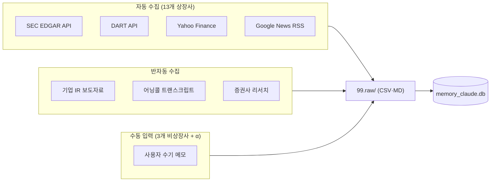

# [데이터 소스 정의서] Memory Claude 데이터 수집 전략 및 소스 분류
**문서 버전**: v1.0.0  
**작성일자**: 2026-09-10  
**프로젝트 코드명**: `b_0910_memory_claude`  
**기반 문서**: [docs/human.md](file:///Users/chansoojeon/Library/CloudStorage/Dropbox/03_code/b_0910_memory_claude/docs/human.md)

---

## 1. 데이터 소스 체계 개요

`human.md`의 요구를 분석하면, 본 시스템에 필요한 데이터는 **4가지 유형**으로 분류됩니다:

| 데이터 유형 | human.md 근거 | 수집 난이도 | 자동화 가능성 |
| :--- | :--- | :---: | :---: |
| ① **실적 데이터** (Capex, 매출, 영업이익) | *"실적 데이터를 정리하고"*, *"capex 767억 달러"* | 낮음 | 높음 (API) |
| ② **계약·투자 데이터** | *"구글 앤트로픽 2000억 달러 계약"*, *"아마존 앤트로픽 120억 달러"* | 보통 | 보통 (뉴스) |
| ③ **기술 로드맵·이벤트** | *"과거의 시간 정리"*, *"미래 사건 예측"* | 높음 | 낮음 (수동) |
| ④ **사용자 수기 데이터** | *"99.raw에는 사용자가 수기로 데이터를 넣을것이고"* | - | 수동 입력 |

---

## 2. 기업별 데이터 수집 가능성 매트릭스

`human.md` 언급 16개 기업의 데이터 접근성:

| 기업 | 상장 여부 | 실적 공시 소스 | 실적 자동 수집 | 계약 정보 수집 |
| :--- | :---: | :--- | :---: | :---: |
| **구글 (Alphabet)** | 상장 (GOOGL) | SEC EDGAR, Yahoo Finance | ✅ API | ✅ 8-K 공시 |
| **아마존 (AWS)** | 상장 (AMZN) | SEC EDGAR, Yahoo Finance | ✅ API | ✅ 8-K 공시 |
| **마이크로소프트** | 상장 (MSFT) | SEC EDGAR, Yahoo Finance | ✅ API | ✅ 8-K 공시 |
| **오라클** | 상장 (ORCL) | SEC EDGAR, Yahoo Finance | ✅ API | ✅ 8-K 공시 |
| **엔비디아** | 상장 (NVDA) | SEC EDGAR, Yahoo Finance | ✅ API | ✅ 8-K 공시 |
| **TSMC** | 상장 (TSM) | SEC/TWSE | ✅ API | ⚠️ 보통 |
| **ASML** | 상장 (ASML) | SEC/NL 공시 | ✅ API | ⚠️ 보통 |
| **삼성전자** | 상장 (005930) | DART (금감원) | ✅ API | ⚠️ 보통 |
| **샌디스크/WDC** | 상장 (WDC) | SEC EDGAR | ✅ API | ✅ 8-K 공시 |
| **마벨 (Marvell)** | 상장 (MRVL) | SEC EDGAR | ✅ API | ✅ 8-K 공시 |
| **코히어런트/노발리** | 상장 (COHR) | SEC EDGAR | ✅ API | ✅ 8-K 공시 |
| **소프트뱅크** | 상장 (9984.T) | 도쿄 증권 공시 | ⚠️ Yahoo | ⚠️ 보통 |
| **애플** | 상장 (AAPL) | SEC EDGAR | ✅ API | ✅ 8-K 공시 |
| **앤트로픽** | **비상장** | 없음 (수동) | ❌ 수동 | ❌ 뉴스만 |
| **오픈AI** | **비상장** | 없음 (수동) | ❌ 수동 | ❌ 뉴스만 |
| **스페이스X** | **비상장** | 없음 (수동) | ❌ 수동 | ❌ 뉴스만 |

> **13개사 상장** (API 자동 수집 가능) + **3개사 비상장** (수동 입력 필수)

---

## 3. 데이터 소스별 상세 수집 전략

### 3.1 실적 데이터 소스 (Financials & Capex)

*human.md 근거: "실적 데이터를 정리하고", "2026년 capex 767억 달러"*

#### 소스 A: SEC EDGAR API (미국 상장 11개사)

| 항목 | 상세 |
| :--- | :--- |
| **대상** | 구글, 아마존, MS, 오라클, 엔비디아, TSMC(ADR), ASML, 마이크론(미포함 시 제외), WDC, 마벨, 코히어런트, 애플 |
| **URL** | `https://data.sec.gov/api/xbrl/companyfacts/CIK{cik}.json` |
| **비용** | **100% 무료**, 무제한 |
| **필수 설정** | HTTP Header에 `User-Agent: {이메일}` 필수 |
| **수집 지표** | `PaymentsToAcquirePropertyPlantAndEquipment` (Capex), `Revenues` (매출), `OperatingIncomeLoss` (영업이익) |

```python
# 예시: SEC EDGAR에서 Capex 수집
import requests

CIK_MAP = {
    "GOOGLE": "0001652044",
    "AMAZON": "0001018724",
    "NVIDIA": "0001045810",
    # ...
}

def fetch_sec_financials(entity_id):
    cik = CIK_MAP[entity_id]
    url = f"https://data.sec.gov/api/xbrl/companyfacts/CIK{cik}.json"
    headers = {"User-Agent": "memory_claude project@email.com"}
    resp = requests.get(url, headers=headers)
    data = resp.json()
    # Capex 추출
    capex = data["facts"]["us-gaap"]["PaymentsToAcquirePropertyPlantAndEquipment"]["units"]["USD"]
    return capex
```

#### 소스 B: Yahoo Finance (보조·글로벌)

| 항목 | 상세 |
| :--- | :--- |
| **대상** | 소프트뱅크(9984.T), TSMC(보조), 전 상장사 보조 소스 |
| **도구** | `pip install yfinance` |
| **비용** | **무료** |
| **수집 지표** | `quarterly_cashflow` → Capital Expenditure, `quarterly_financials` → Revenue |

```python
import yfinance as yf

def fetch_yahoo_financials(ticker):
    stock = yf.Ticker(ticker)
    cashflow = stock.quarterly_cashflow
    capex = cashflow.loc["Capital Expenditure"]
    return capex
```

#### 소스 C: DART 오픈 API (한국 상장 1개사: 삼성전자)

| 항목 | 상세 |
| :--- | :--- |
| **대상** | 삼성전자 (005930) |
| **URL** | `https://opendart.fss.or.kr/api/fnlttSinglAcnt.json` |
| **비용** | **무료** (API 키 필요, 즉시 발급) |
| **도구** | Python `opendartreader` 패키지 |
| **수집 지표** | 연결재무제표: 매출액, 영업이익, 현금흐름표 내 유형자산 취득(Capex) |

```python
import OpenDartReader

dart = OpenDartReader("YOUR_API_KEY")

# 삼성전자 연간 재무제표
samsung = dart.finstate("005930", 2025)
```

---

### 3.2 계약·투자 데이터 소스 (Contracts & Deals)

*human.md 근거: "구글 앤트로픽과 2000억 달러 계약", "아마존 앤트로픽 120억 달러 계약", "엔비디아 하이퍼스케일러 GPU 공급계약, 네오클라우드 공급계약", "tsmc, asml과 독점공급계약"*

#### 소스 A: Google News RSS (실시간 뉴스 탐지)

| 항목 | 상세 |
| :--- | :--- |
| **URL 형식** | `https://news.google.com/rss/search?q={검색어}&hl=ko&gl=KR` |
| **비용** | **100% 무료**, 무제한 |
| **도구** | Python `feedparser` |
| **추천 검색어** | `(NVIDIA OR "삼성전자") AND (HBM4 OR 공급계약 OR Capex)` |

```python
import feedparser

def fetch_news(query):
    url = f"https://news.google.com/rss/search?q={query}&hl=ko&gl=KR"
    feed = feedparser.parse(url)
    return [{"title": e.title, "link": e.link, "date": e.published} for e in feed.entries]
```

#### 소스 B: SEC Form 8-K (미국 중대 계약 공시)

| 항목 | 상세 |
| :--- | :--- |
| **용도** | $1B 이상 중대 계약, 합병, 투자 시 의무 공시 |
| **URL** | `https://efts.sec.gov/LATEST/search-index?q={기업명}&forms=8-K` |
| **비용** | **무료** |

#### 소스 C: 기업 IR 프레스 릴리즈

| 항목 | 상세 |
| :--- | :--- |
| **용도** | 공급계약 발표, 투자 발표, 실적 가이던스 |
| **접근** | 각 기업 IR 페이지에서 Press Release / News 섹션 직접 확인 |
| **주요 기업 IR 페이지** | `investor.google.com`, `ir.nvidia.com`, `investor.tsmc.com` 등 |

---

### 3.3 기술 로드맵·이벤트 소스 (Milestones & Roadmap)

*human.md 근거: "과거의 각각의 시간을 정리하는 테이블", "미래의 사건을 예측하는 테이블"*

#### 소스 A: 전문 테크·반도체 미디어

| 미디어 | 분야 | 접근 방식 |
| :--- | :--- | :--- |
| **SemiAnalysis** | AI 인프라, HBM, 파운드리 심층 분석 | 뉴스레터 구독 (일부 무료) |
| **TrendForce** | 메모리 가격, 점유율 발표 | 프레스 센터 무료 공개 데이터 |
| **The Register** | 칩 스펙, 로드맵 뉴스 | RSS 피드 무료 |
| **Tom's Hardware / Wccftech** | GPU·CPU 스펙, 벤치마크 | RSS 피드 무료 |

#### 소스 B: 어닝콜 트랜스크립트 (무료)

| 항목 | 상세 |
| :--- | :--- |
| **소스** | Motley Fool (`fool.com/earnings/call-transcripts/`) |
| **비용** | **100% 무료** |
| **활용법** | 어닝콜 전문을 LLM에 입력 → "HBM4 납품 시점과 Capex 가이던스만 요약" |

#### 소스 C: 증권사 리서치 보고서 (무료)

| 소스 | 상세 |
| :--- | :--- |
| **한경컨센서스** | `consensus.hankyung.com` — 국내 전 증권사 반도체·빅테크 보고서 PDF 무료 |
| **네이버 증권 리서치** | `finance.naver.com/research/` — 산업분석·기업분석 최신 보고서 |

---

### 3.4 사용자 수기 데이터 (Manual / High-Alpha)

*human.md 근거: "99.raw에는 사용자가 수기로 데이터를 넣을것이고"*

**자동화가 불가능하기 때문에 가장 희소하고 값비싼 데이터 영역**입니다.

| 수기 데이터 유형 | 예시 | 입력 위치 |
| :--- | :--- | :--- |
| **비상장사 투자 정보** | 앤트로픽 밸류에이션, 오픈AI 펀딩 조건, 스페이스X 매출 추정 | `99.raw/financials/` |
| **공급망 루머·선행 지표** | "삼성 HBM4 엔비디아 퀄 통과 시점", "TSMC 수율 60% 달성" | `99.raw/milestones/` |
| **비공식 계약 정보** | 테크 미디어 단독보도, 업계 관계자 정보 | `99.raw/contracts/` |
| **분석가 시나리오 가설** | "원전 SMR 1년 지연 시?", "빅테크 Capex 피크아웃 시?" | `99.raw/milestones/` |

---

## 4. 데이터 수집 파이프라인 요약



---

## 5. 수집 우선순위 및 실행 계획

| 우선순위 | 데이터 소스 | 대상 기업 | 첫 번째 수집 작업 |
| :---: | :--- | :--- | :--- |
| **P0** (즉시) | 사용자 수기 입력 | 전체 16개사 | `human.md`에 언급된 계약·Capex 데이터를 `99.raw/`에 시드 |
| **P1** (1주 내) | SEC EDGAR API | 미국 상장 11개사 | Capex + 매출 자동 수집 스크립트 구현 |
| **P1** (1주 내) | DART API | 삼성전자 | 삼성전자 연결재무제표 자동 수집 |
| **P2** (2주 내) | Google News RSS | 전체 16개사 | 계약·투자 뉴스 자동 탐지 파이프라인 |
| **P3** (3주 내) | 어닝콜 + 리서치 | 주요 10개사 | LLM 기반 어닝콜 요약 자동화 |
