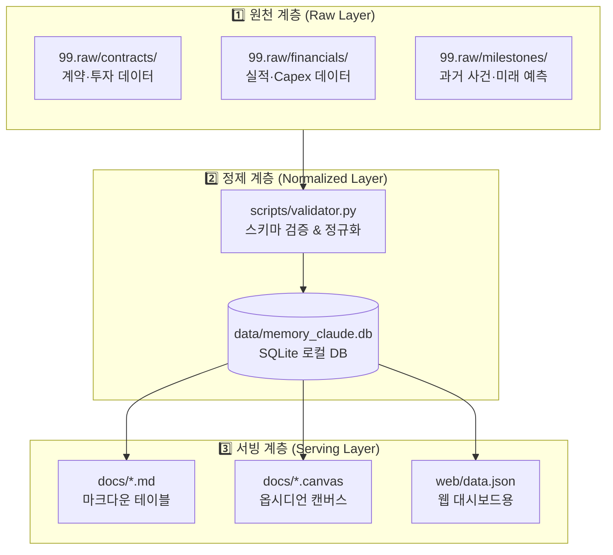
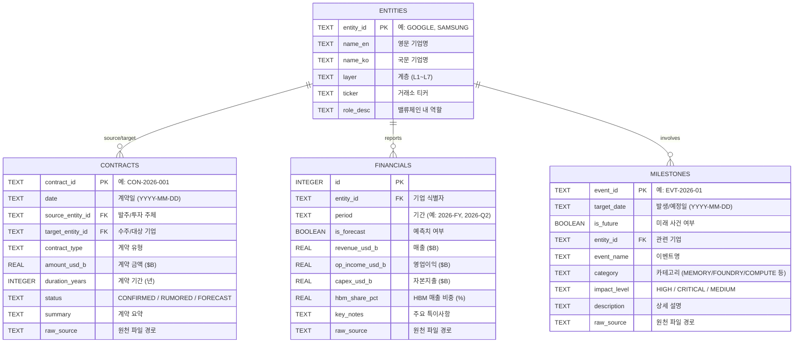

# [DB 아키텍처 설계서] Memory Claude 데이터베이스 구축 및 저장 구조
**문서 버전**: v1.0.0  
**작성일자**: 2026-09-10  
**프로젝트 코드명**: `b_0910_memory_claude`  
**기반 문서**: [docs/human.md](file:///Users/chansoojeon/Library/CloudStorage/Dropbox/03_code/b_0910_memory_claude/docs/human.md)

---

## 1. DB 설계 원칙

`human.md`의 핵심 요구에서 도출된 설계 원칙:

| 요구 | DB 설계 반영 |
| :--- | :--- |
| *"99.raw에는 사용자가 수기로 데이터를 넣을것이고"* | **원천 계층**: 마크다운/CSV 파일 기반, 수기 입력 친화적 |
| *"실적 데이터를 정리하고"* | **정제 계층**: 정규화된 SQLite DB로 구조화 |
| *"과거 시간 정리 + 미래 예측 테이블"* | **서빙 계층**: 시계열 기반 테이블 자동 생성 |
| *"옵시디언에 뿌려주는 그림들"* | **출력 계층**: 마크다운·Canvas·이미지 자동 산출 |

---

## 2. 3계층 데이터 저장 아키텍처



---

## 3. 원천 계층 (Raw Layer): `99.raw/`

사용자가 **수기로 데이터를 넣는** 입력 디렉터리입니다.

### 3.1 디렉터리 구조

```text
99.raw/
├── contracts/          # 기업 간 계약, 투자, 파트너십
│   ├── contracts.csv           # CSV 일괄 입력
│   └── {YYYY}_{기업A}_{기업B}.md  # 개별 계약 마크다운
├── financials/         # 연도/분기별 실적, Capex
│   ├── financials.csv          # CSV 일괄 입력
│   └── {YYYY}_{기업}_forecast.md  # 개별 실적 예측 마크다운
└── milestones/         # 과거 마일스톤 + 미래 이벤트
    ├── timeline_events.csv     # CSV 일괄 입력
    └── {YYYY}_{YYYY}_{주제}.md    # 연도 범위별 이벤트 마크다운
```

### 3.2 입력 포맷 명세

#### A. 계약 데이터 (contracts)

**Markdown Frontmatter 방식** (권장):
```markdown
---
id: CON-2026-001
date: 2026-02-15
source_entity: GOOGLE
target_entity: ANTHROPIC
contract_type: INVESTMENT_CLOUD
amount_usd_b: 200.0
duration_years: 5
status: CONFIRMED
summary: "구글-앤트로픽 2000억 달러 클라우드 투자 계약"
---
## 상세 내용
(자유 텍스트로 메모)
```

**CSV 방식** (`contracts.csv`):
```csv
id,date,source_entity,target_entity,contract_type,amount_usd_b,duration_years,status,summary
CON-2026-001,2026-02-15,GOOGLE,ANTHROPIC,INVESTMENT_CLOUD,200.0,5,CONFIRMED,"구글-앤트로픽 2000억 달러"
CON-2025-012,2025-11-20,AMAZON,ANTHROPIC,INVESTMENT_CLOUD,12.0,3,CONFIRMED,"아마존-앤트로픽 120억 달러"
```

#### B. 실적 데이터 (financials)

```csv
entity_id,period,is_forecast,revenue_usd_b,op_income_usd_b,capex_usd_b,hbm_share_pct,key_notes
GOOGLE,2026-FY,TRUE,,,76.7,,"2026년 Capex 767억 달러"
SAMSUNG,2026-FY,TRUE,,,,,"삼성전자 2026년 예상실적"
```

#### C. 타임라인 이벤트 (milestones)

```csv
event_id,target_date,is_future,entity_id,event_name,category,impact_level,description
EVT-2026-01,2026-06-30,TRUE,TSMC,2nm_MASS_PROD,FOUNDRY,HIGH,"TSMC N2 양산 개시"
EVT-2026-02,2026-09-15,TRUE,SAMSUNG,HBM4_SHIPMENT,MEMORY,CRITICAL,"삼성전자 HBM4 양산 인도"
```

---

## 4. 정제 계층 (Normalized Layer): SQLite DB

### 4.1 DB 파일 경로
```
data/memory_claude.db
```

### 4.2 테이블 스키마 (ERD)



### 4.3 상세 DDL (SQLite)

```sql
-- ============================================================
-- Memory Claude DB Schema v1.0
-- ============================================================

-- 1. 기업 마스터 테이블
CREATE TABLE IF NOT EXISTS entities (
    entity_id       TEXT PRIMARY KEY,
    name_en         TEXT NOT NULL,
    name_ko         TEXT,
    layer           TEXT NOT NULL,  -- L1_AI_LABS, L2_HYPERSCALERS, ...
    ticker          TEXT,
    role_desc       TEXT,
    created_at      TEXT DEFAULT (datetime('now')),
    updated_at      TEXT DEFAULT (datetime('now'))
);

-- 2. 계약 테이블
CREATE TABLE IF NOT EXISTS contracts (
    contract_id     TEXT PRIMARY KEY,
    date            TEXT NOT NULL,  -- YYYY-MM-DD
    source_entity_id TEXT NOT NULL REFERENCES entities(entity_id),
    target_entity_id TEXT NOT NULL REFERENCES entities(entity_id),
    contract_type   TEXT NOT NULL,  -- INVESTMENT_CLOUD, GPU_SUPPLY, HBM_SUPPLY, FOUNDRY_EXCLUSIVE, ...
    amount_usd_b    REAL,          -- 금액 ($B 단위)
    duration_years  INTEGER,
    tech_focus      TEXT,          -- 관련 기술 (HBM4, RUBIN, 2NM 등)
    status          TEXT DEFAULT 'CONFIRMED',  -- CONFIRMED, RUMORED, FORECAST
    summary         TEXT,
    raw_source      TEXT,          -- 원천 파일 경로
    created_at      TEXT DEFAULT (datetime('now'))
);

-- 3. 실적 테이블
CREATE TABLE IF NOT EXISTS financials (
    id              INTEGER PRIMARY KEY AUTOINCREMENT,
    entity_id       TEXT NOT NULL REFERENCES entities(entity_id),
    period          TEXT NOT NULL,  -- 2026-FY, 2026-Q1, 2025-Q4
    is_forecast     BOOLEAN DEFAULT 0,
    revenue_usd_b   REAL,
    op_income_usd_b REAL,
    capex_usd_b     REAL,
    hbm_share_pct   REAL,
    key_notes       TEXT,
    raw_source      TEXT,
    created_at      TEXT DEFAULT (datetime('now')),
    UNIQUE(entity_id, period)
);

-- 4. 마일스톤/이벤트 테이블
CREATE TABLE IF NOT EXISTS milestones (
    event_id        TEXT PRIMARY KEY,
    target_date     TEXT NOT NULL,  -- YYYY-MM-DD
    is_future       BOOLEAN DEFAULT 1,
    entity_id       TEXT NOT NULL REFERENCES entities(entity_id),
    event_name      TEXT NOT NULL,
    category        TEXT,  -- MEMORY, FOUNDRY, COMPUTE, OPTICAL, ENERGY, AI_MODEL, ...
    impact_level    TEXT DEFAULT 'MEDIUM',  -- CRITICAL, HIGH, MEDIUM, LOW
    bottleneck_driver TEXT,  -- 병목 관련 키워드
    description     TEXT,
    raw_source      TEXT,
    created_at      TEXT DEFAULT (datetime('now'))
);

-- ============================================================
-- 인덱스
-- ============================================================
CREATE INDEX IF NOT EXISTS idx_contracts_date ON contracts(date);
CREATE INDEX IF NOT EXISTS idx_contracts_source ON contracts(source_entity_id);
CREATE INDEX IF NOT EXISTS idx_contracts_target ON contracts(target_entity_id);
CREATE INDEX IF NOT EXISTS idx_financials_entity ON financials(entity_id);
CREATE INDEX IF NOT EXISTS idx_financials_period ON financials(period);
CREATE INDEX IF NOT EXISTS idx_milestones_date ON milestones(target_date);
CREATE INDEX IF NOT EXISTS idx_milestones_entity ON milestones(entity_id);
CREATE INDEX IF NOT EXISTS idx_milestones_future ON milestones(is_future);

-- ============================================================
-- 뷰 (Views) - 자주 사용하는 쿼리를 뷰로 미리 정의
-- ============================================================

-- 하이퍼스케일러 Capex 연도별 추이
CREATE VIEW IF NOT EXISTS v_hyperscaler_capex AS
SELECT
    e.name_ko,
    f.period,
    f.capex_usd_b,
    f.is_forecast,
    f.key_notes
FROM financials f
JOIN entities e ON f.entity_id = e.entity_id
WHERE e.layer = 'L2_HYPERSCALERS'
ORDER BY f.period, f.capex_usd_b DESC;

-- 미래 예측 사건 캘린더
CREATE VIEW IF NOT EXISTS v_future_events AS
SELECT
    m.target_date,
    e.name_ko,
    m.event_name,
    m.category,
    m.impact_level,
    m.description
FROM milestones m
JOIN entities e ON m.entity_id = e.entity_id
WHERE m.is_future = 1
ORDER BY m.target_date;

-- 기업 간 자본 흐름 (Sankey 용)
CREATE VIEW IF NOT EXISTS v_capital_flow AS
SELECT
    src.name_ko AS source_name,
    tgt.name_ko AS target_name,
    c.amount_usd_b,
    c.contract_type,
    c.date,
    c.summary
FROM contracts c
JOIN entities src ON c.source_entity_id = src.entity_id
JOIN entities tgt ON c.target_entity_id = tgt.entity_id
WHERE c.amount_usd_b IS NOT NULL
ORDER BY c.amount_usd_b DESC;
```

### 4.4 초기 시드 데이터 (human.md 기반)

`human.md`에서 확인된 데이터를 초기 시드로 투입합니다:

```sql
-- 기업 마스터 데이터 (human.md 언급 16개사)
INSERT INTO entities VALUES ('GOOGLE', 'Google (Alphabet)', '구글', 'L2_HYPERSCALERS', 'GOOGL', '하이퍼스케일러, Capex 주도', datetime('now'), datetime('now'));
INSERT INTO entities VALUES ('AMAZON', 'Amazon (AWS)', '아마존', 'L2_HYPERSCALERS', 'AMZN', '최대 클라우드 인프라', datetime('now'), datetime('now'));
INSERT INTO entities VALUES ('MICROSOFT', 'Microsoft (Azure)', '마이크로소프트', 'L2_HYPERSCALERS', 'MSFT', 'Azure AI 인프라', datetime('now'), datetime('now'));
INSERT INTO entities VALUES ('ORACLE', 'Oracle (OCI)', '오라클', 'L2_HYPERSCALERS', 'ORCL', 'OCI 멀티클라우드', datetime('now'), datetime('now'));
INSERT INTO entities VALUES ('ANTHROPIC', 'Anthropic', '앤트로픽', 'L1_AI_LABS', NULL, 'AI 프론티어 모델 (Claude)', datetime('now'), datetime('now'));
INSERT INTO entities VALUES ('OPENAI', 'OpenAI', '오픈AI', 'L1_AI_LABS', NULL, 'AI 프론티어 모델 (GPT)', datetime('now'), datetime('now'));
INSERT INTO entities VALUES ('NVIDIA', 'NVIDIA', '엔비디아', 'L3_COMPUTE', 'NVDA', 'AI GPU 독점 공급', datetime('now'), datetime('now'));
INSERT INTO entities VALUES ('TSMC', 'TSMC', 'TSMC', 'L4_FOUNDRY_EQUIP', 'TSM', '첨단 파운드리', datetime('now'), datetime('now'));
INSERT INTO entities VALUES ('ASML', 'ASML Holding', 'ASML', 'L4_FOUNDRY_EQUIP', 'ASML', 'EUV 노광장비 독점', datetime('now'), datetime('now'));
INSERT INTO entities VALUES ('SAMSUNG', 'Samsung Electronics', '삼성전자', 'L5_MEMORY', '005930.KS', 'HBM, DRAM, 파운드리', datetime('now'), datetime('now'));
INSERT INTO entities VALUES ('SANDISK_WDC', 'SanDisk / WDC', '샌디스크', 'L5_MEMORY', 'WDC', 'NAND 플래시, eSSD', datetime('now'), datetime('now'));
INSERT INTO entities VALUES ('MARVELL', 'Marvell Technology', '마벨', 'L6_OPTICAL', 'MRVL', '광트랜시버 DSP', datetime('now'), datetime('now'));
INSERT INTO entities VALUES ('COHERENT', 'Coherent Corp (Novali)', '코히어런트/노발리', 'L6_OPTICAL', 'COHR', '광모듈, 화합물 반도체', datetime('now'), datetime('now'));
INSERT INTO entities VALUES ('SPACEX', 'SpaceX (Starlink)', '스페이스X', 'L7_INFRA_SPECIAL', NULL, '위성 통신, 우주 인프라', datetime('now'), datetime('now'));
INSERT INTO entities VALUES ('SOFTBANK', 'SoftBank Group', '소프트뱅크', 'L7_INFRA_SPECIAL', '9984.T', 'AI 자본 공급, Arm 모회사', datetime('now'), datetime('now'));
INSERT INTO entities VALUES ('APPLE', 'Apple', '애플', 'L7_INFRA_SPECIAL', 'AAPL', '온디바이스 AI, Apple Intelligence', datetime('now'), datetime('now'));

-- human.md에서 확인된 계약 데이터
INSERT INTO contracts VALUES ('CON-2026-001', '2026-02-15', 'GOOGLE', 'ANTHROPIC', 'INVESTMENT_CLOUD', 200.0, 5, 'TPU_CLOUD', 'CONFIRMED', '구글-앤트로픽 2000억 달러 계약', '99.raw/contracts/2026_google_anthropic.md', datetime('now'));
INSERT INTO contracts VALUES ('CON-2025-012', '2025-11-20', 'AMAZON', 'ANTHROPIC', 'INVESTMENT_CLOUD', 12.0, 3, 'AWS_INFRA', 'CONFIRMED', '아마존-앤트로픽 120억 달러 계약', '99.raw/contracts/2025_amazon_anthropic.md', datetime('now'));
INSERT INTO contracts VALUES ('CON-2026-010', '2026-01-10', 'OPENAI', 'AMAZON', 'CLOUD_INFRA', NULL, NULL, 'AWS_PARTNERSHIP', 'CONFIRMED', '오픈AI-아마존 계약', '99.raw/contracts/2026_openai_amazon.md', datetime('now'));

-- human.md에서 확인된 실적 데이터
INSERT INTO financials (entity_id, period, is_forecast, capex_usd_b, key_notes, raw_source) VALUES ('GOOGLE', '2026-FY', 1, 76.7, '2026년 Capex 767억 달러, HBM과 칩이 가장 큰 비중', '99.raw/financials/2026_hyperscaler_capex.csv');
```

---

## 5. 서빙 계층 (Serving Layer): 산출물 생성

### 5.1 산출물 매핑

| SQLite 원천 | 생성 스크립트 | 산출물 파일 | 용도 |
| :--- | :--- | :--- | :--- |
| `financials` 테이블 | `scripts/generate_tables.py` | `docs/financials_matrix_table.md` | 실적 데이터 정리 테이블 |
| `milestones` (is_future=0) | `scripts/generate_tables.py` | `docs/past_timeline_table.md` | 과거 시간 정리 테이블 |
| `milestones` (is_future=1) | `scripts/generate_tables.py` | `docs/future_prediction_table.md` | 미래 예측 테이블 |
| `contracts` + `entities` | `scripts/generate_canvas.py` | `docs/ecosystem.canvas` | 옵시디언 캔버스 |
| `v_capital_flow` 뷰 | `scripts/generate_web.py` | `web/data.json` | 웹 대시보드 데이터 |

### 5.2 데이터 파이프라인 실행 흐름

```bash
# 1단계: 99.raw/ → SQLite 정제
python3 scripts/validator.py

# 2단계: SQLite → 마크다운 테이블 생성
python3 scripts/generate_tables.py

# 3단계: SQLite → 옵시디언 캔버스 생성
python3 scripts/generate_canvas.py

# 4단계: SQLite → 웹 대시보드 데이터 생성
python3 scripts/generate_web.py

# 일괄 실행
python3 scripts/pipeline.py --all
```

---

## 6. 파일 시스템 전체 구조

```text
b_0910_memory_claude/
├── docs/
│   ├── human.md                      # 사용자 원본 요구사항
│   ├── ask.md                        # 작업 요청 메모
│   ├── requirements_spec.md          # 요건정의서 (본 문서의 상위)
│   ├── db_architecture.md            # DB 아키텍처 설계서 (본 문서)
│   ├── data_sources.md               # 데이터 소스 정의서
│   ├── financials_matrix_table.md    # [생성] 실적 매트릭스
│   ├── past_timeline_table.md        # [생성] 과거 타임라인
│   ├── future_prediction_table.md    # [생성] 미래 예측 테이블
│   └── ecosystem.canvas              # [생성] 옵시디언 캔버스
├── data/
│   └── memory_claude.db              # SQLite 로컬 DB
├── 99.raw/
│   ├── contracts/                    # 수기 입력: 계약
│   ├── financials/                   # 수기 입력: 실적
│   └── milestones/                   # 수기 입력: 이벤트
├── scripts/
│   ├── validator.py                  # 99.raw → SQLite 정제
│   ├── generate_tables.py            # SQLite → 마크다운 테이블
│   ├── generate_canvas.py            # SQLite → 옵시디언 캔버스
│   ├── generate_web.py               # SQLite → 웹 데이터
│   └── pipeline.py                   # 전체 파이프라인 일괄 실행
└── web/
    ├── index.html                    # 인터랙티브 대시보드
    └── data.json                     # [생성] 웹용 데이터
```
