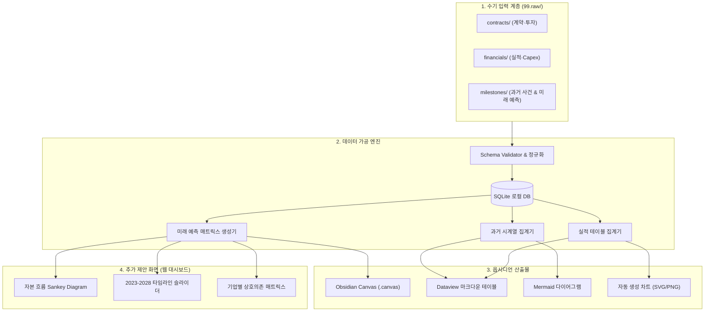

# [요건정의서] Memory Claude: AI·반도체 자본·기술 흐름 추적 및 예측 시스템
**문서 버전**: v1.0.0  
**작성일자**: 2026-09-10  
**프로젝트 코드명**: `b_0910_memory_claude`  
**기반 문서**: [docs/human.md](file:///Users/chansoojeon/Library/CloudStorage/Dropbox/03_code/b_0910_memory_claude/docs/human.md)

---

## 1. 프로젝트 비전 및 추진 배경

### 1.1 배경
`human.md` 원문에서 도출된 핵심 문제의식:

> *"각각의 회사들의 실적과 또 각각 회사의 계약을 통해서 2026, 2027, 2028년의 업황과 자본과 기술의 흐름을 읽어낼 수 있을까"*

- 2026년 하이퍼스케일러의 Capex는 **767억 달러** 규모에 달하며, HBM과 AI 칩이 가장 큰 비중을 차지합니다.
- 구글-앤트로픽(2000억 달러), 아마존-앤트로픽(120억 달러) 등 초대형 계약이 체결되고 있으며, 이 자본이 반도체·메모리·광통신 밸류체인 전체로 흘러갑니다.
- 단편적인 뉴스에 매몰되지 않고, **기업 간 계약과 실적을 정량화·시계열화**하여 미래 업황을 읽는 시스템이 필요합니다.

### 1.2 핵심 목표
`human.md`에서 직접 명시한 6가지 요구사항:

| # | 요구사항 (원문 기반) | 시스템 기능 |
| :---: | :--- | :--- |
| 1 | *"99.raw에는 사용자가 수기로 데이터를 넣을것이고"* | **수기 데이터 입력 파이프라인** (`99.raw/`) |
| 2 | *"실적 데이터를 정리하고"* | **실적 매트릭스 테이블** 자동 생성 |
| 3 | *"과거의 각각의 시간을 정리하는 테이블"* | **과거 시계열 타임라인** 테이블 |
| 4 | *"미래의 사건을 예측하는 테이블"* | **2026~2028 미래 예측 매트릭스** |
| 5 | *"옵시디언에 뿌려주는 그림들"* | **옵시디언 캔버스·다이어그램** 연동 |
| 6 | *"그리고 추가적인 화면과 데이터 제안"* | **인터랙티브 웹 대시보드** 제안 |

---

## 2. 추적 대상 기업 (human.md 언급 기업 정리)

`human.md`에서 직접 언급되거나 문맥상 파악되는 기업들을 밸류체인 계층별로 분류합니다.

| 계층 (Layer) | human.md 언급 | 대상 기업 | 밸류체인 내 역할 |
| :--- | :--- | :--- | :--- |
| **AI 프론티어 랩** | *"앤트로픽"*, *"오픈ai"* | **Anthropic (앤트로픽)**, **OpenAI** | AI 프론티어 모델 개발, 컴퓨트 수요 진원지 |
| **하이퍼스케일러** | *"구글"*, *"아마존"*, *"마이크로소프트"*, *"오라클"* | **Google**, **Amazon**, **Microsoft**, **Oracle** | 2026 Capex 주도, 대규모 AI 인프라 투자 |
| **컴퓨팅 & 가속기** | *"엔비디아"* | **NVIDIA** | GPU 공급, 하이퍼스케일러·네오클라우드 공급계약 |
| **파운드리 & 장비** | *"대만 업체, tsmc, asml"* | **TSMC**, **ASML** | 선단공정 파운드리, EUV 노광장비, 독점공급계약 |
| **메모리 & 스토리지** | *"삼성전자"*, *"샌디스크"* | **삼성전자**, **SanDisk/WDC** | HBM, DRAM, NAND 플래시 |
| **광통신** | *"광업체 - 마블, 노발리등"* | **Marvell**, **Coherent (Novali)** | 광트랜시버, CPO, 데이터센터 인터커넥트 |
| **인프라 & 특수** | *"스페이스 엑스"*, *"소프트뱅크"*, *"애플"* | **SpaceX**, **SoftBank**, **Apple** | 위성통신, AI 펀딩, 온디바이스 AI |

> **총 16개사** — `human.md`에서 직접 언급된 기업만을 대상으로 합니다.

---

## 3. 시스템 아키텍처 및 데이터 흐름

---

## 4. 상세 기능 요건 (Functional Requirements)

### 4.1 FR-01: 원천 데이터 수기 입력 (`99.raw/`)

**근거**: *"99.raw에는 사용자가 수기로 데이터를 넣을것이고"*

- 사용자가 부담 없이 텍스트·표 형태로 입력할 수 있는 **하이브리드 구조(Markdown Frontmatter + CSV)** 지원.
- 디렉터리 구성:
  - `99.raw/contracts/`: 기업 간 계약 (구글-앤트로픽 2000억$, 아마존-앤트로픽 120억$ 등)
  - `99.raw/financials/`: 분기·연도별 실적 (Capex, 매출, 영업이익, HBM 비중)
  - `99.raw/milestones/`: 과거 주요 사건 및 2026~2028 미래 이벤트
- **데이터 검증기**: 기업 코드 일치 여부, 금액 단위(USD 기준 정규화), 시점(YYYY-QN 또는 YYYY-MM) 자동 검증.

---

### 4.2 FR-02: 실적 데이터 정리 테이블

**근거**: *"실적 데이터를 정리하고"*

- **하이퍼스케일러 Capex 매트릭스**: 구글, 아마존, 마이크로소프트, 오라클의 연도별 Capex 합계 추이.
- **반도체 기업 실적**: 삼성전자 예상 2026 실적, 엔비디아 데이터센터 매출, TSMC/ASML 실적.
- **계약 금액 집계**: 구글-앤트로픽(2000억$), 아마존-앤트로픽(120억$), 엔비디아 GPU 공급계약 등 정량적 규모.
- 출력: `docs/financials_matrix_table.md` (옵시디언 Dataview 호환)

---

### 4.3 FR-03: 과거 시간 정리 테이블

**근거**: *"과거의 각각의 시간을 정리하는 테이블"*

- 2023~2025년 주요 사건을 시간순으로 정렬:
  - 주요 계약 체결일
  - 제품 출시 (GPU 세대, HBM 규격, 파운드리 공정 노드)
  - 실적 발표 및 가이던스 변경
- 출력: `docs/past_timeline_table.md`

---

### 4.4 FR-04: 미래 사건 예측 테이블

**근거**: *"미래의 사건을 예측하는 테이블"*

- **2026년**: 하이퍼스케일러 Capex 767억$ 집행, 삼성전자 HBM4 양산, 엔비디아 차세대 GPU 출하
- **2027년**: 1.6T 광통신 본격 채택, 차세대 AI 모델 학습 클러스터 완공 예측
- **2028년**: AGI 도달 시점 가설, 데이터센터 에너지 병목 시나리오
- 출력: `docs/future_prediction_table.md`

---

### 4.5 FR-05: 옵시디언 연동 산출물

**근거**: *"옵시디언에 뿌려주는 그림들"*

- **옵시디언 캔버스 (.canvas)**: 16개 기업을 계층별 카드로 배치, 자본·부품 흐름 화살표 연결.
- **Mermaid 다이어그램**: 기업 간 관계 네트워크, 시계열 간트 차트.
- **자동 생성 차트 이미지**: Capex 추이 바차트, HBM 점유율 파이차트 등 SVG/PNG.
- **Dataview 호환 태그**: `#contract`, `#capex`, `#hbm` 등 옵시디언 필터링용 프론트매터.

---

### 4.6 FR-06: 추가 화면 및 데이터 제안

**근거**: *"그리고 추가적인 화면과 데이터 제안"*

human.md에서 명시적으로 요청한 "추가 제안" 영역입니다:

1. **자본 흐름 Sankey Diagram**:
   - [하이퍼스케일러 Capex 767억$] → [엔비디아 GPU] → [TSMC 파운드리] → [삼성 HBM / 마벨 광통신]
   - 계약 금액 기반으로 자본의 폭포수를 시각화.

2. **2023~2028 타임라인 슬라이더**:
   - 시간 축을 드래그하면 기술 규격(GPU, HBM, 공정, 통신)이 동적으로 전환.

3. **공급망 병목 시뮬레이터**:
   - "전력 부족 시?", "HBM 수율 병목 시?" 등 시나리오별 수혜/피해 기업 도출.

4. **기업별 팩트시트 팝업**:
   - 각 기업 클릭 시 실적·계약·역할 요약 카드.

---

## 5. 핵심 데이터 항목 (human.md 기반 추출)

`human.md`에서 직접 언급된 정량적 데이터 포인트:

| # | 데이터 포인트 | 출처 표현 | 값 |
| :---: | :--- | :--- | :--- |
| 1 | 하이퍼스케일러 2026 Capex | *"2026년 capex 767억 달러"* | **$76.7B** |
| 2 | Capex 최대 비중 항목 | *"여전히 hbm과 칩이 가장 큰 비중"* | HBM + AI 칩 |
| 3 | 구글-앤트로픽 계약 | *"구글 엔트로픽과 2000억 달러 계약"* | **$200.0B** |
| 4 | 아마존-앤트로픽 계약 | *"아마존 앤트로픽과 120억 달러 계약"* | **$12.0B** |
| 5 | 삼성전자 실적 | *"삼성전자 예상 2026년 예상실적"* | 별도 수집 필요 |
| 6 | 엔비디아 공급계약 | *"하이퍼스케일러 GPU 공급계약, 네오클라우드 공급계약"* | 별도 수집 필요 |
| 7 | 오픈AI-아마존 계약 | *"오픈ai 아마존과 계약"* | 별도 수집 필요 |
| 8 | TSMC-ASML 독점 | *"tsmc, asml 과 독점공급계약"* | 별도 수집 필요 |

---

## 6. 비기능 요건 (Non-Functional Requirements)

1. **로컬 우선 (Local-First)**: 모든 원천 데이터와 산출물은 로컬 파일 시스템 내 마크다운·CSV·SQLite로 저장. 외부 서버 의존 없음.
2. **옵시디언 네이티브**: 생성되는 모든 마크다운은 옵시디언에서 즉시 열람 가능한 형식.
3. **이식성**: Python CLI 스크립트로 실행 가능, 추가 DB 서버 설치 불필요.
4. **심미성**: 웹 대시보드는 다크모드 기반 하이테크 테마, 데이터 시각화의 몰입도 극대화.

---

## 7. 산출물 로드맵

| 단계 | 목표 | 주요 산출물 |
| :--- | :--- | :--- |
| **Phase 1** | 요건정의 및 데이터 구조 정립 | `docs/requirements_spec.md`, `docs/db_architecture.md`, `docs/data_sources.md` |
| **Phase 2** | `99.raw/` 표준 템플릿 및 초기 샘플 데이터 | `99.raw/` 내 16개 기업 기초 데이터 작성 |
| **Phase 3** | 파서 & 테이블 생성기 개발 | 실적 테이블, 과거 타임라인, 미래 예측 매트릭스 생성 스크립트 |
| **Phase 4** | 옵시디언 캔버스 & 다이어그램 연동 | `.canvas` 파일, Mermaid 그래프, 차트 이미지 자동 생성 |
| **Phase 5** | 인터랙티브 웹 대시보드 구축 | Sankey, 타임라인 슬라이더, 병목 시뮬레이터 |

---

## 📌 연동 산출물 색인
1. **요건정의서**: [docs/requirements_spec.md](file:///Users/chansoojeon/Library/CloudStorage/Dropbox/03_code/b_0910_memory_claude/docs/requirements_spec.md)
2. **DB 아키텍처 설계서**: [docs/db_architecture.md](file:///Users/chansoojeon/Library/CloudStorage/Dropbox/03_code/b_0910_memory_claude/docs/db_architecture.md)
3. **데이터 소스 정의서**: [docs/data_sources.md](file:///Users/chansoojeon/Library/CloudStorage/Dropbox/03_code/b_0910_memory_claude/docs/data_sources.md)
