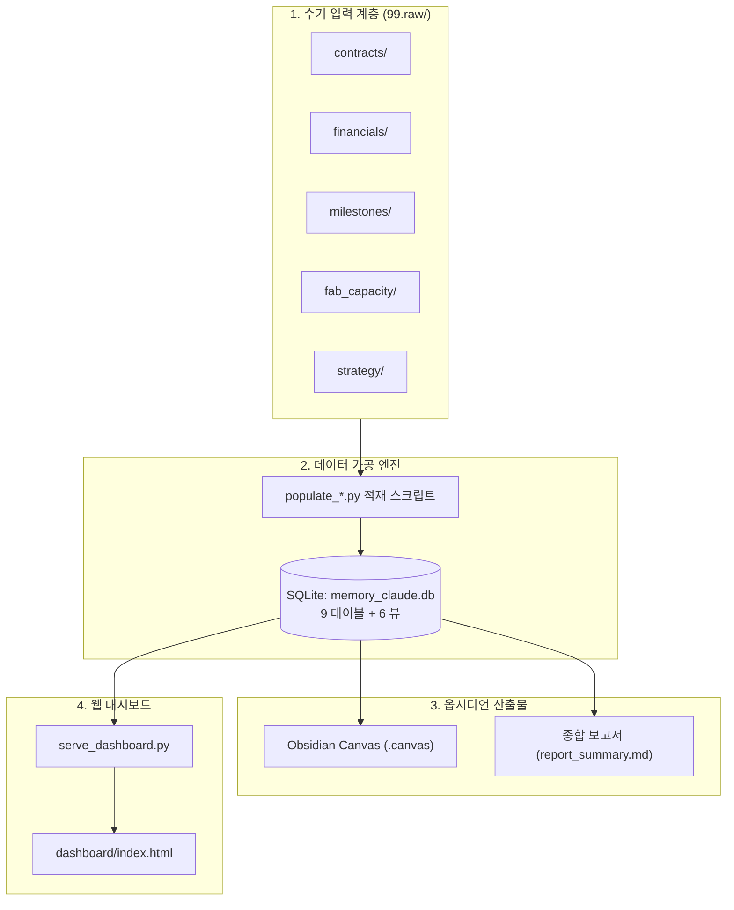
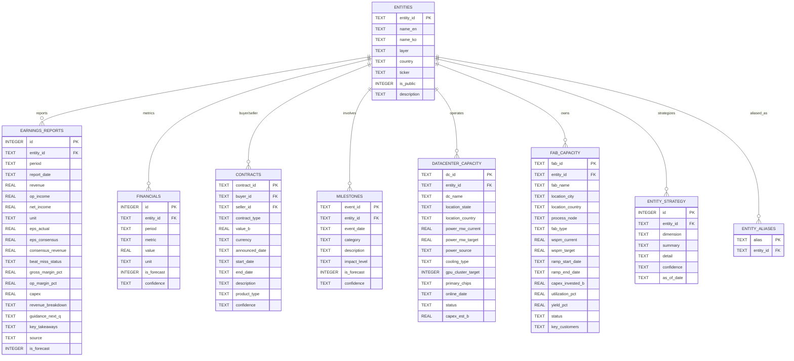

# [요건정의서] Memory Claude: AI·반도체 자본·기술 흐름 추적 및 예측 시스템
**문서 버전**: v2.0.0  
**작성일자**: 2026-09-10 (v1.0) → 2026-09-11 (v2.0 갱신)  
**프로젝트 코드명**: `b_0910_memory_claude`  
**기반 문서**: [docs/human.md](file:///Users/boon/Dropbox/03_code/b_0910_memory_claude/docs/human.md)  
**변경 이력**: [Gap Analysis](file:///Users/boon/.gemini/antigravity-ide/brain/93d58685-ba75-4677-a83b-9e7ca967d87d/requirements_gap_analysis.md)

---

## 1. 프로젝트 비전 및 추진 배경

### 1.1 배경
`human.md` 원문에서 도출된 핵심 문제의식:

> *"각각의 회사들의 실적과 또 각각 회사의 계약을 통해서 2026, 2027, 2028년의 업황과 자본과 기술의 흐름을 읽어낼 수 있을까"*

- 2026년 하이퍼스케일러의 Capex는 **767억 달러** 규모에 달하며, HBM과 AI 칩이 가장 큰 비중을 차지합니다.
- 구글-앤트로픽(2000억 달러), 아마존-앤트로픽(120억 달러) 등 초대형 계약이 체결되고 있으며, 이 자본이 반도체·메모리·광통신 밸류체인 전체로 흘러갑니다.
- 단편적인 뉴스에 매몰되지 않고, **기업 간 계약과 실적을 정량화·시계열화**하여 미래 업황을 읽는 시스템이 필요합니다.

### 1.2 핵심 목표
`human.md`에서 직접 명시한 6가지 요구사항 + 구현 과정에서 도출된 3가지 추가 요건:

| # | 요구사항 | 시스템 기능 | 구현 상태 |
| :---: | :--- | :--- | :---: |
| 1 | *"99.raw에 수기 데이터 입력"* | **수기 데이터 입력 파이프라인** (`99.raw/`) | ✅ 구조 |
| 2 | *"실적 데이터를 정리하고"* | **분기 실적 테이블** (`earnings_reports`) + **메트릭 KPI** (`financials`) | ✅ 208건 |
| 3 | *"과거 시간 정리 테이블"* | **마일스톤 시계열** (`milestones`) | ✅ 21건 |
| 4 | *"미래 사건 예측 테이블"* | **미래 예측 매트릭스** (`milestones`, `is_forecast=1`) | ✅ |
| 5 | *"옵시디언에 뿌려주는 그림들"* | **옵시디언 캔버스·다이어그램** | ✅ .canvas |
| 6 | *"추가적인 화면과 데이터 제안"* | **인터랙티브 웹 대시보드** | ✅ dashboard/ |
| 7 | *"공장 증설 데이터 추가"* (ask.md) | **팹 캐파·증설 추적** (`fab_capacity`) | ✅ 11건 |
| 8 | *"데이터센터 현황 정리"* (ask.md) | **데이터센터 인프라 추적** (`datacenter_capacity`) | ✅ 13건 |
| 9 | *"회사 전략적 부분 추가"* (ask.md) | **기업 전략 차원 관리** (`entity_strategy`) | ⚠️ 테이블만 |

---

## 2. 추적 대상 기업 (21개사)

`human.md`에서 직접 언급된 기업 16개사 + 밸류체인 완결성을 위해 추가된 5개사.

| 계층 (Layer) | DB Layer 코드 | 대상 기업 (entity_id) | 밸류체인 내 역할 |
| :--- | :--- | :--- | :--- |
| **AI 프론티어 랩** | `L1_AI_LAB` | **Anthropic** (`ANTHROPIC`), **OpenAI** (`OPENAI`) | AI 프론티어 모델, 컴퓨트 수요 진원지 |
| **하이퍼스케일러** | `L2_HYPERSCALER` | **Google** (`GOOGLE`), **Amazon** (`AMAZON`), **Microsoft** (`MICROSOFT`), **Oracle** (`ORACLE`), **Meta** (`META`) ⬅ 추가 | 2026 Capex 주도, AI 인프라 투자 |
| **컴퓨팅 & 가속기** | `L3_COMPUTE` | **NVIDIA** (`NVIDIA`), **AMD** (`AMD`) ⬅ 추가, **Broadcom** (`BROADCOM`) ⬅ 추가 | GPU/ASIC 공급, 네트워킹 |
| **파운드리 & 장비** | `L4_FOUNDRY` | **TSMC** (`TSMC`), **ASML** (`ASML`) | 선단공정 파운드리, EUV 노광장비 |
| **메모리 & 스토리지** | `L5_MEMORY` | **삼성전자** (`SAMSUNG`), **SK하이닉스** (`SK_HYNIX`) ⬅ 추가, **Micron** (`MICRON`) ⬅ 추가, **WDC** (`WDC`) | HBM, DRAM, NAND |
| **광통신** | `L6_OPTICAL` | **Marvell** (`MARVELL`), **Coherent** (`COHERENT`) | 광트랜시버, CPO |
| **인프라 & 특수** | `L7_INFRA` | **SpaceX** (`SPACEX`), **SoftBank** (`SOFTBANK`), **Apple** (`APPLE`) | 위성통신, AI 펀딩, 온디바이스 AI |

> **총 21개사** — entity_aliases 테이블을 통해 한글명·영문명·약칭 등 25개 별칭도 지원.

---

## 3. 시스템 아키텍처 및 데이터 흐름

---

## 4. 상세 기능 요건 (Functional Requirements)

### 4.1 FR-01: 원천 데이터 수기 입력 (`99.raw/`)

**근거**: *"99.raw에는 사용자가 수기로 데이터를 넣을것이고"*

- 디렉터리 구성:
  - `99.raw/contracts/`: 기업 간 계약·투자 데이터
  - `99.raw/financials/`: 분기·연도별 실적, Capex
  - `99.raw/milestones/`: 과거 주요 사건 및 미래 이벤트
  - `99.raw/fab_capacity/`: 팹 증설·캐파 데이터 ← **v2.0 추가**
  - `99.raw/strategy/`: 기업별 전략 차원 메모 ← **v2.0 추가**
- **데이터 검증**: `entity_aliases` 테이블을 통한 기업명 유연 매핑 지원.
- **보호 정책**: `99.raw/` 내 기존 파일의 수정·삭제 금지 (AGENTS.md 준수).

---

### 4.2 FR-02: 실적 데이터 정리 (2-Track 체계)

**근거**: *"실적 데이터를 정리하고"*, *"실적 발표를 분기별로 저장하고 최소한 매출, 영업이익, 순익"*

구현 과정에서 실적 데이터를 **두 트랙**으로 분리 관리하는 설계가 확립되었습니다:

#### Track A: `earnings_reports` (분기 실적 원본) — 208건 적재
| 컬럼 | 설명 |
| :--- | :--- |
| `revenue`, `op_income`, `net_income` | 매출·영업이익·순이익 (USD B) |
| `eps_actual`, `eps_consensus` | 실제 EPS, 컨센서스 EPS |
| `consensus_revenue`, `beat_miss_status` | 컨센서스 매출, 실적 판정 (BEAT/MISS/INLINE) |
| `gross_margin_pct`, `op_margin_pct` | 매출총이익률, 영업이익률 |
| `capex` | 자본지출 |
| `revenue_breakdown` | 매출 구성 비중 (텍스트) |
| `guidance_next_q` | 차기 분기 가이던스 (텍스트) |
| `is_forecast` | 0=확정, 1=전망 |

#### Track B: `financials` (메트릭 단위 KPI) — 33건 적재
- **EAV(Entity-Attribute-Value) 모델**: `entity_id × period × metric`
- 유연한 메트릭 확장 가능: `REVENUE`, `CAPEX`, `OP_INCOME`, `HBM_REVENUE`, `GPU_REVENUE`, `CLOUD_REVENUE` 등
- `confidence` 등급 (C1~C4)으로 신뢰도 명시

---

### 4.3 FR-03: 과거 시간 정리 테이블

**근거**: *"과거의 각각의 시간을 정리하는 테이블"*

- `milestones` 테이블에서 `is_forecast = 0`인 레코드
- 카테고리: `EARNINGS`, `PRODUCT_LAUNCH`, `FAB_MILESTONE`, `REGULATION`, `PARTNERSHIP`, `RESTRUCTURING`, `PRICE`
- `v_milestones_timeline` 뷰로 시간순 조회

---

### 4.4 FR-04: 미래 사건 예측 테이블

**근거**: *"미래의 사건을 예측하는 테이블"*

- `milestones` 테이블에서 `is_forecast = 1`인 레코드
- `confidence` 등급으로 예측 신뢰도 구분
- 동일 `v_milestones_timeline` 뷰에서 `타임라인 = '미래전망'`으로 필터

---

### 4.5 FR-05: 옵시디언 연동 산출물

**근거**: *"옵시디언에 뿌려주는 그림들"*

- **옵시디언 캔버스**: [memory_claude_value_chain.canvas](file:///Users/boon/Dropbox/03_code/b_0910_memory_claude/docs/memory_claude_value_chain.canvas) — 21개 기업을 계층별 카드로 배치
- **종합 보고서**: `docs/generated/report_summary.md` — DB 전체 데이터 기반 마크다운 리포트
- **생성 스크립트**: [generate_canvas.py](file:///Users/boon/Dropbox/03_code/b_0910_memory_claude/scripts/generate_canvas.py), [export_report.py](file:///Users/boon/Dropbox/03_code/b_0910_memory_claude/scripts/export_report.py)

---

### 4.6 FR-06: 인터랙티브 웹 대시보드

**근거**: *"추가적인 화면과 데이터 제안"*

- **대시보드**: [dashboard/index.html](file:///Users/boon/Dropbox/03_code/b_0910_memory_claude/dashboard/index.html) — 다크모드 하이테크 테마
- **서빙**: [serve_dashboard.py](file:///Users/boon/Dropbox/03_code/b_0910_memory_claude/scripts/serve_dashboard.py) — Python HTTP 서버, SQLite 직접 쿼리
- **기능**: Chart.js 기반 실적 차트, 기업별 카드, Capex 추이

---

### 4.7 FR-07: 데이터센터 인프라 추적 ← **v2.0 신규**

**근거**: *"데이터 센터 현재 상황"* (ask.md)

- `datacenter_capacity` 테이블 — 13건 적재
- 추적 항목: 데이터센터명, 위치, 전력(MW 현재/목표), 전력원(원전PPA/SMR/그리드), 냉각방식, 가속기 수량, 주력칩, 가동시점
- 상태: `OPERATING` / `CONSTRUCTION` / `PLANNED`
- `v_datacenter_summary` 뷰로 조회

---

### 4.8 FR-08: 팹 증설 및 캐파 추적 ← **v2.0 신규**

**근거**: *"공장 증산에 대한 데이터 추가 공장사이즈 fab"* (ask.md)

- `fab_capacity` 테이블 — 11건 적재
- 추적 항목: 팹명, 위치, 공정노드, 유형(FAB/PACKAGING), WSPM(현재/목표), 증설 일정, 투자규모, 가동률, 수율, 주요 고객
- 상태: `OPERATING` / `CONSTRUCTION` / `PLANNED` / `EXPANDING`
- `v_fab_summary` 뷰로 조회

---

### 4.9 FR-09: 기업 전략 차원 관리 ← **v2.0 신규**

**근거**: *"각 회사들의 전략적인 부분을 추가"* (ask.md)

- `entity_strategy` 테이블 — 스키마 구현 완료, 데이터 미적재
- 차원(dimension): AI 전략, 메모리 로드맵, 파운드리 전략 등
- `confidence`, `as_of_date`로 시점별 전략 변화 추적

---

## 5. 데이터베이스 스키마 (v2.0)

### 5.1 테이블 구성 (9개 테이블)

| # | 테이블명 | 역할 | 레코드 수 |
| :---: | :--- | :--- | :---: |
| 1 | `entities` | 기업 마스터 | 21 |
| 2 | `earnings_reports` | 분기 실적 원본 | 208 |
| 3 | `financials` | 메트릭 단위 KPI (EAV) | 33 |
| 4 | `contracts` | 기업 간 계약·투자 | 10 |
| 5 | `milestones` | 과거 사건 + 미래 전망 | 21 |
| 6 | `datacenter_capacity` | 데이터센터 인프라 | 13 |
| 7 | `fab_capacity` | 팹 증설·캐파 | 11 |
| 8 | `entity_strategy` | 기업 전략 차원 | 0 |
| 9 | `entity_aliases` | 기업명 별칭 매핑 | 25 |

### 5.2 뷰 구성 (6개 뷰)

| # | 뷰명 | 용도 |
| :---: | :--- | :--- |
| 1 | `v_earnings_summary` | 분기 실적 종합 조회 (한글 컬럼명) |
| 2 | `v_financials_matrix` | 메트릭 KPI 피벗 조회 |
| 3 | `v_contract_summary` | 계약 금액순 정렬 조회 |
| 4 | `v_milestones_timeline` | 시간순 마일스톤 타임라인 |
| 5 | `v_datacenter_summary` | 데이터센터 현황 조회 |
| 6 | `v_fab_summary` | 팹 증설 현황 조회 |

### 5.3 ERD (실제 구현 기준)

### 5.4 DDL 참조
- 전체 스키마: [scripts/init_db.sql](file:///Users/boon/Dropbox/03_code/b_0910_memory_claude/scripts/init_db.sql)
- 실적 테이블 추가: [scripts/add_earnings_table.sql](file:///Users/boon/Dropbox/03_code/b_0910_memory_claude/scripts/add_earnings_table.sql)
- 데이터센터 테이블 추가: [scripts/add_datacenter_table.sql](file:///Users/boon/Dropbox/03_code/b_0910_memory_claude/scripts/add_datacenter_table.sql)

---

## 6. 핵심 데이터 항목

### 6.1 human.md 기반 데이터 포인트 (적재 완료)

| # | 데이터 포인트 | 값 | DB 테이블 | 상태 |
| :---: | :--- | :--- | :--- | :---: |
| 1 | 하이퍼스케일러 2026 Capex | $76.7B | `financials` | ✅ |
| 2 | 구글-앤트로픽 계약 | $200.0B | `contracts` | ✅ |
| 3 | 아마존-앤트로픽 계약 | $12.0B | `contracts` | ✅ |
| 4 | 21개 기업 분기별 실적 (2020~2026) | 208건 | `earnings_reports` | ✅ |
| 5 | 데이터센터 13개소 현황 | 13건 | `datacenter_capacity` | ✅ |
| 6 | 팹 11개소 증설 현황 | 11건 | `fab_capacity` | ✅ |

### 6.2 데이터 신뢰도 정책

현재 DB 데이터의 신뢰도와 한계에 대한 투명한 기록:
- 상세 가이드: [2026-09-11_data_source_reliability.md](file:///Users/boon/Dropbox/03_code/b_0910_memory_claude/docs/2026-09-11_data_source_reliability.md)
- 쿼리 가이드: [2026-09-11_db_query_guide.md](file:///Users/boon/Dropbox/03_code/b_0910_memory_claude/docs/2026-09-11_db_query_guide.md)

---

## 7. 비기능 요건 (Non-Functional Requirements)

| # | 항목 | 규칙 |
| :---: | :--- | :--- |
| 1 | **로컬 우선** | 모든 데이터와 산출물은 로컬 파일 시스템 내 Markdown·CSV·SQLite로 저장. 외부 서버 의존 없음. |
| 2 | **옵시디언 네이티브** | 생성 마크다운은 옵시디언에서 즉시 열람 가능한 형식. |
| 3 | **이식성** | Python CLI 스크립트로 실행 가능, 추가 DB 서버 설치 불필요. |
| 4 | **심미성** | 웹 대시보드는 다크모드 기반 하이테크 테마. |
| 5 | **데이터 신뢰도 투명성** ← v2.0 | `is_forecast`와 `confidence` 플래그로 확정/전망 구분 필수. AI 추정 데이터는 반드시 한계를 고지. |
| 6 | **시점 규칙** ← v2.0 | 기준 시점 2026-09-10. `is_forecast=0`: 2020-Q1~2026-Q2, `is_forecast=1`: 2026-Q3 이후. |
| 7 | **환율 환산** ← v2.0 | KRW·TWD 실적은 해당 분기 평균 환율 기준 USD 환산. |
| 8 | **마이그레이션 정책** ← v2.0 | 스키마 변경 시 DDL 스크립트(`scripts/add_*.sql`)를 먼저 작성·검증 후 반영. |
| 9 | **통화 단위** ← v2.0 | USD Billion (십억 달러) 고정. 분기 표기: `YYYY-QN`. |

---

## 8. 산출물 로드맵

| 단계 | 목표 | 주요 산출물 | 상태 |
| :--- | :--- | :--- | :---: |
| **Phase 1** | 요건정의 및 데이터 구조 정립 | `requirements_spec.md`, `db_architecture.md`, `data_sources.md` | ✅ |
| **Phase 2** | `99.raw/` 구조 및 초기 데이터 | `99.raw/` 5개 서브디렉터리 | ⚠️ 구조만 |
| **Phase 3** | 데이터 적재 스크립트 개발 | `populate_quarterly_earnings.py`, `populate_datacenter_capacity.py`, `populate_fab_and_milestones.py` | ✅ |
| **Phase 4** | 옵시디언 캔버스 & 보고서 | `memory_claude_value_chain.canvas`, `report_summary.md`, `generate_canvas.py`, `export_report.py` | ✅ |
| **Phase 5** | 인터랙티브 웹 대시보드 | `dashboard/index.html`, `serve_dashboard.py` | ✅ |
| **Phase 6** | `99.raw/` → DB 자동 파서 | `validator.py` — 수기 입력 자동 적재 | ❌ |
| **Phase 7** | 외부 API 연동 | SEC EDGAR, DART, Yahoo Finance 자동 수집 | ❌ |
| **Phase 8** | 기업 전략 데이터 적재 | `entity_strategy` 테이블 데이터 채우기 | ❌ |
| **Phase 9** | 전체 파이프라인 자동화 | `pipeline.py` — 일괄 실행 CI/CD | ❌ |

---

## 📌 연동 산출물 색인

### 기획·설계 문서
1. **요건정의서**: [requirements_spec.md](file:///Users/boon/Dropbox/03_code/b_0910_memory_claude/docs/requirements_spec.md) ← 본 문서
2. **DB 아키텍처 설계서**: [db_architecture.md](file:///Users/boon/Dropbox/03_code/b_0910_memory_claude/docs/db_architecture.md)
3. **데이터 소스 정의서**: [data_sources.md](file:///Users/boon/Dropbox/03_code/b_0910_memory_claude/docs/data_sources.md)
4. **데이터 신뢰도 가이드**: [2026-09-11_data_source_reliability.md](file:///Users/boon/Dropbox/03_code/b_0910_memory_claude/docs/2026-09-11_data_source_reliability.md)
5. **DB 쿼리 가이드**: [2026-09-11_db_query_guide.md](file:///Users/boon/Dropbox/03_code/b_0910_memory_claude/docs/2026-09-11_db_query_guide.md)

### 산출물
6. **종합 보고서**: [2026-09-11_report_summary.md](file:///Users/boon/Dropbox/03_code/b_0910_memory_claude/docs/2026-09-11_report_summary.md)
7. **옵시디언 캔버스**: [memory_claude_value_chain.canvas](file:///Users/boon/Dropbox/03_code/b_0910_memory_claude/docs/memory_claude_value_chain.canvas)
8. **웹 대시보드**: [dashboard/index.html](file:///Users/boon/Dropbox/03_code/b_0910_memory_claude/dashboard/index.html)

### 스크립트
9. **DB 초기화**: [init_db.sql](file:///Users/boon/Dropbox/03_code/b_0910_memory_claude/scripts/init_db.sql)
10. **실적 적재**: [populate_quarterly_earnings.py](file:///Users/boon/Dropbox/03_code/b_0910_memory_claude/scripts/populate_quarterly_earnings.py)
11. **DC 적재**: [populate_datacenter_capacity.py](file:///Users/boon/Dropbox/03_code/b_0910_memory_claude/scripts/populate_datacenter_capacity.py)
12. **팹 적재**: [populate_fab_and_milestones.py](file:///Users/boon/Dropbox/03_code/b_0910_memory_claude/scripts/populate_fab_and_milestones.py)
13. **보고서 생성**: [export_report.py](file:///Users/boon/Dropbox/03_code/b_0910_memory_claude/scripts/export_report.py)
14. **캔버스 생성**: [generate_canvas.py](file:///Users/boon/Dropbox/03_code/b_0910_memory_claude/scripts/generate_canvas.py)
15. **대시보드 서버**: [serve_dashboard.py](file:///Users/boon/Dropbox/03_code/b_0910_memory_claude/scripts/serve_dashboard.py)
